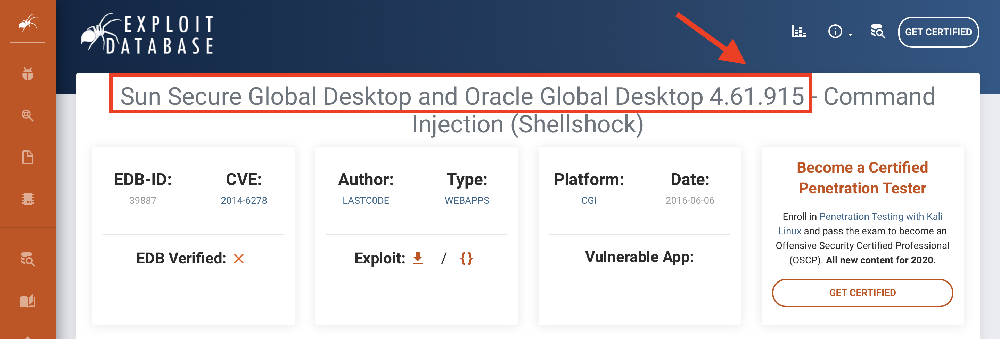
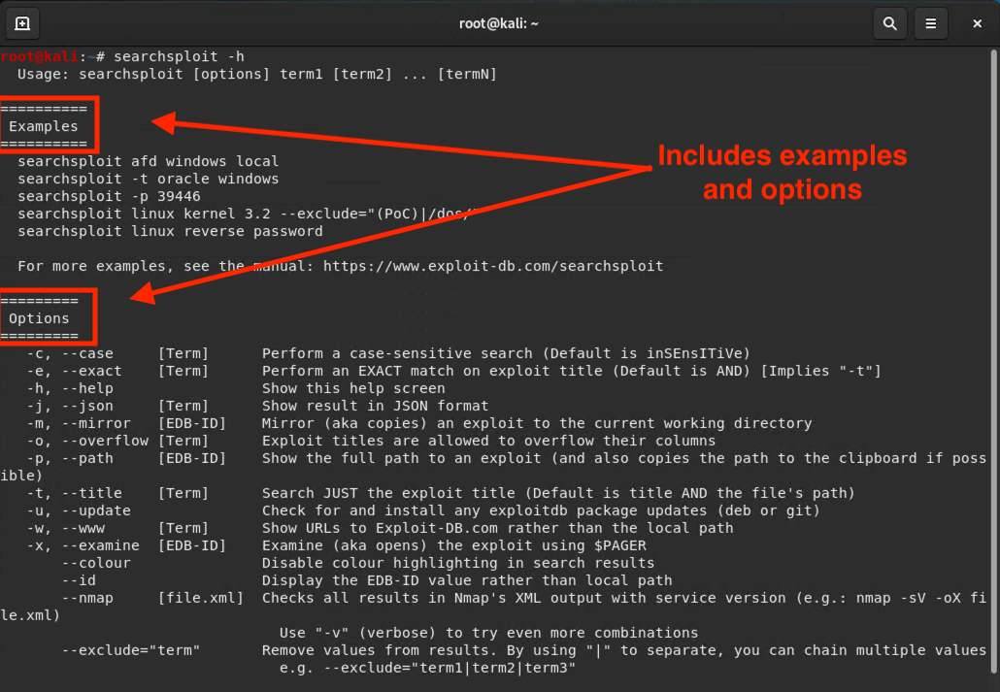

## 16.3 Student Guide: Exploiting Vulnerabilities

#### Overview

 In today's lesson, we will continue our penetration engagement by exploiting a vulnerability called Shellshock. The class will also participate in a review of the concepts and tools covered throughout the pen testing unit. 


#### Class Objectives

By the end of class, you will be able to:

- Run scripted Shellshock exploits.

- Consult the Exploit-DB database to research publicly disclosed exploits.

- Search for exploits and shellcode using SearchSploit.


### Lab Environment 

You will use Azure online VMs to teach today's lesson:

  - Kali Linux
  - SearchSploit 
  - Metasploitable

To launch the labs, log in to Azure and launch the Penetration Security machine.

- Once you are connected to that machine, launch the Pen Testing Hyper-V machine and start it to boot up Kali Linux.

   - Credentials:  `root:toor`


### Slideshow 

The lesson slides are available on Google Drive here: [16.3 Slides](https://docs.google.com/presentation/d/1ycoIWfJmzFYjBlP3oZ36WqV3XDwinbKFxxGkMaK0JCw/edit)


____


### 01. Understanding Shellshock 

In this lesson, we will be moving into the third stage of a pen testing engagement: gaining access through exploitation. 

We've been moving through this logical progression of penetration phases: 

1. Planning and Reconnaissance
2. Scanning
3. Exploitation
4. Post Exploitation
5. Reporting

After scanning networks for vulnerabilities, we know which exploits an organization is vulnerable to and can now execute those exploits.

In today's class we will go over a few specific exploits to understand this process.

For this first part of class, we will focus on exploiting a vulnerability called **Shellshock**, also known as the **Bash Bug**.

#### Shellshock

Shellshock is a **remote code execution (RCE)** vulnerability that allows attackers to execute arbitrary Bash code on vulnerable targets. 

With Shellshock, attackers can perform almost any Bash command, including:

- Download sensitive data.
- Send and receive shells to and from the target.
- Backdoor the victim.

Shellshock is made possible by a vulnerability in how servers parse HTTP requests:

- One way that websites are served is through a **Common Gateway Interface (CGI)**, which defines a set of rules, or standards, that allow web clients to run scripts on a server. 

- If a client requests a script, such as `/cgi-bin/status.sh`, the server will run the script `status.sh`. Then it will send the output back in an HTTP response.

- Sometimes, the server needs to use HTTP headers to run CGI scripts. 

- Servers will load HTTP request headers as Bash environment variables and run the CGI scripts. The scripts can then access the HTTP headers by reading the variables. 

- For example, sending the following request results in the server creating an `HTTP_USER_AGENT` variable equal to `curl`:

  ```bash
  GET /index.html HTTP/1.1
  Host: example.com
  User-Agent: curl
  Connection: keep-alive
  ```

However, Bash does not sanitize headers before loading them as environment variables. This means it loads whatever value is sent in the header. 


- For example, the request below results in `HTTP_USER_AGENT` being set to `() { :;};`. This is cryptic, but in vulnerable versions of Bash, this creates a code function that does nothing.

  ```bash
  GET /index.html HTTP/1.1
  Host: example.com
  User-Agent: () { :;};
  Connection: keep-alive
  ```

Bash interprets the value of this header as code. This allows us to execute arbitrary code on the target.

- Shellshock can be exploited when we include malicious code after the seemingly useless `() { :;};` string. 

- For example: the modified request below will run `echo "haxxed"`.

  ```bash
  GET /index.html HTTP/1.1
  Host: example.com
  User-Agent: () { :;}; echo "haxxed"
  Connection: keep-alive
  ```

Some malicious codes can open TCP connections back to your machine or show user passwords.

   - For example: 

   ```bash
   GET /index.html HTTP/1.1
   Host: example.com
   User-Agent: () { :;}; /bin/bash -c 'cat /etc/passwd'
   Connection: keep-alive
   ```

Note the syntax. Shellshock payloads are often executed with the following template:

- `/bin/bash -c 'command'` runs the string `'command'` as a Bash command. This is different from passing a command directly because of how Bash handles the output. 

- Using `/bin/bash -c` helps preserve `stdout` more consistently.

Take a moment to address any remaining questions before proceeding.


### 02. Shellshock Payloads Activity

- [Activity File: Shellshock Payloads](activities/02_Shellshock_Payload/Unsolved/README.md)


### 03. Shellshock Payloads Activity 


- [Solution Guide: Shellshock Payloads](activities/02_Shellshock_Payload/Solved/README.md)


### 04.  SearchSploit 

In the previous activity we created a custom payload for Shellshock. In this section, we will explore tools that allow us to search for and find existing exploit information from libraries. 

Today we will use a tool called **SearchSploit** to locally store a library of exploit information on our Kali machine, as well as the scripts needed to execute the exploits. 

**Exploit Database (Exploit-DB)** is a popular online database that contains publicly disclosed exploits, cataloged according to their Common Vulnerability and Exposure (CVEs) identifier.

- For example, Oracle Global Desktop 4.61.915 is an exploit listed on the Exploit-DB website.

   

- Notice the CVE number assigned to this particular vulnerability is 2014-6278.

- CVE numbers typically start with the year in which the vulnerability was discovered. In this case the year was 2014.

Exploit-DB's catalog of exploits is constantly updated as software developers patch their systems.


#### SearchSploit Overview

SearchSploit is a command-line utility for Exploit-DB that allows you to take an offline copy of the Exploit Database with you wherever you go.

SearchSploit allows security professionals to perform detailed offline searches of hundreds of exploit scripts through their local copy of the repository.

- This capability is useful if you are working on a security assessment with an air-gapped, segregated network that lacks internet connectivity.

- If you anticipate that you will not have internet connectivity during an assessment, update your local repo by checking out and downloading the most recent Exploit-DB repository while you still have access to the internet.

SearchSploit, as indicated by its name, will search for all exploits and shellcode contained within the Exploit-DB repository.

- SearchSploit comes preinstalled on Kali Linux, but should be updated prior to each use and on a weekly basis. 

#### SearchSploit Demonstration

We will be using SearchSploit on the Kali VM.

- We will use this VM to run a Shellshock exploit on the Shellshock VM, which is an intentionally vulnerable machine designed to test the Shellshock exploits.

In this demonstration, we will:

- Run through some basic help commands that are useful when searching for exploit scripts. 

- Discuss the various file formats associated with SearchSploit exploit scripts.

- Break down the command syntax for the typical `searchsploit` command.
  
1. Begin by updating the local SearchSploit repo. This will ensure that you have the latest updates.
  
   - Run `searchsploit -u`
    
      - `searchsploit`: The command that launches the SearchSploit program.
      - `-u`: The option that syncs the remote repo with the local repo on your hard drive.

      

2. SearchSploit also has a built-in help option. The `-h` flag provides information about proper command syntax, flags, and options.

   - Run `searchsploit -h`

   The help menu provides a summarized view of syntax examples and command options.

    This is useful when exploring ways to speed up or streamline your workflow.

      

3. As the name suggests, SearchSploit is a search tool. Let's perform a basic search:
  
   - Run `searchsploit ftp remote file`

   This command will search the exploit database for the three terms: `ftp`, `remote`, and `file`.

      - **Note**: SearchSploit uses an **and** operator by default.

      


4. By default, SearchSploit includes the title and path of the exploit in its query. Searches can be restricted to specific titles with the `-t` option. 

   - Run `searchsploit -t oracle windows`

      
      

    The `wc -l` option will return the number of exploits in the search:     

   - `searchsploit -t oracle windows | wc -l`
   
    Without the `-t` option, the command will search for results containing `oracle` **and/or** `Windows`. 
   
   - `searchsploit oracle windows | wc -l`   
   
   
     


5. We can leave out unwanted results with the `--exclude` option. We can remove multiple terms by separating the term values with a pipe `|`.


   - `searchsploit linux kernel 4.4 --exclude="(PoC)|/DCCP/"`


      - `--exclude="(PoC)|/DCCP/"`: Leaves out all lines that contain both `PoC` and `DCCP`.

 

      

6. To access more exploit metadata, such as setup files, vulnerability mappings, screenshots, and tags, we need to access the exploit-db.com website. The `-w` option will provide the website in the results. 

   - Run `searchsploit mysql 6.0 -w`

      The search query returns URLs of the webpage of the associated exploit.

      

   - Open the first link in a web browser and observe the results.

      - In the example below, we observe the results for EDB-ID: 40465 (Exploit DB ID #40465).

      - Exploit-DB provides expanded search results that contain more exploit details.

      - Scroll down the webpage to see the full details of the exploit. 

      
   
7. SearchSploit exploit scripts come in a variety of file types, such as .rb, .py, .sh, .html, and .txt.

   - .rb are scripts written in Ruby.
   - .py in Python.
   - .sh in Bash.
   - .html in HTML.
   - .txt in a text editor.
   
   Run the following command: 
   
   - `searchsploit -t java`
   
     
   

  If we wanted to run the following exploit script `exploits/windows/remote/43993.py`, we would need to use the Python command as follows:
         
   - `python exploits/windows/remote/43993.py payload=bind rhost=172.168.0.10 rport=1234`
     
      - `python`: Command required to run Python scripts.
      - `exploits/windows/remote/43993.py`: Name of the Python exploit script.
      - `payload=bind`: The payload setting. In our example, our payload is a **bind** payload. 
          - We use a bind payload when we know the IP address of the target. We’ll discuss the specifics of bind shells and payloads in the next unit.
      - `rhost=172.168.0.10`: IP address of the remote host.
      - `rport=1234`: Port number of the remote host. 

Summary: 

- SearchSploit is a command line utility for Exploit-DB that allows you to take an offline copy of the entire Exploit Database with you wherever you go.

- Security professionals can perform detailed offline searches of hundreds of exploit scripts from Exploit-DB using the locally checked-out copy of the online repository.

- SearchSploit comes preinstalled on Kali Linux and should be updated regularly. 


### 05.  SearchSploit and Shellshock Activity


- [Activity File: SearchSploit and Shellshock](activities/05_Searchsploit_and_Shellshock/Unsolved/README.md)


### 06. Review SearchSploit and Shellshock Activity 

- [Solution Guide: Searchsploit and Shellshock](activities/05_Searchsploit_and_Shellshock/Solved/README.MD)


### 07.  Nmap Review 

We’ve covered a lot in the past three classes. Briefly review: 

- We gathered intelligence that allowed us to perform social engineering campaigns to gain elevated privileges in an organization. 

- With this elevated access, we performed scanning and enumeration techniques, many of which required `sudo` privileges. 

- With the help of specialized tools and databases, we weaponized found vulnerabilities. 


While this unit only covered the first three stages of a penetration test, we’ll have  more time in the next unit to explore the next steps, additional exploits, and advanced penetration engagement.

Before we move on to those advanced subjects, let’s take some time to review the many concepts, tools, and skills covered throughout this unit. 

#### Scanning and Nmap Review

We used Nmap to perform port scans on targets. Attackers will often scan the network for other live hosts in a process known as **host discovery**.

- One of the most important methods for host discovery is the **ping sweep**.

- Ping sweeps send a ping request to every IP address in the target range. Only live hosts will respond.

Open a terminal and run a ping sweep with the following command: 

- Run `nmap -sn 192.168.12.0/24`

  - The `-sn` flag tells Nmap to ping every machine in `192.168.12.0/24`. This command does not perform a port scan.

Host discovery is followed by **port scanning**: 

  - Port scanning is the process of attempting to connect to every port on a target machine and keeping track of which connection attempts are successful.

  - Nmap is the most important tool for scanning ports.

Review the following concepts about using Nmap for port scanning:

  - The default scan type is a **SYN Scan**. In a SYN scan, Nmap sends TCP flags to a target port with the SYN flag set. 
  
  - If the target port is open, it responds with a packet with the SYN/ACK flags set. Nmap does not respond, leaving the target port half open.

  - Nmap can also perform TCP connect scans, where it responds to the SYN/ACK packet from the target.

  - Nmap can perform UDP scans with the `-sU` flag.

  - You can specify which ports to scan with the `-p` option.

With the following commands, we can perform the above capabilities:

  - `nmap -sS -p 445 192.168.12.50` performs a SYN scan against port `445` on `192.169.12.50`.

  - `nmap -sT -p 445 192.168.12.50` performs a TCP connect scan against port `445` on `192.169.12.50`.

  - `nmap -sU -p 53 192.168.12.50` performs a UDP scan of port `53` on `192.168.12.50`.

  - `nmap -sS -p U:53,T:53 192.168.12.50` scans UDP port `53` and TCP port `53`. Uses a SYN scan on the TCP port. 


#### OS and Service Fingerprinting

After identifying open ports on a target machine, we need to determine which operating system is running on each target and which services are running on each open port.

  - While many protocols are typically associated with certain ports, such as HTTP/`80` or HTTPS/`443`, in reality, any service can run on any port. This is why it's crucial to verify which services are running on all open ports, even the common ones.

Review the following Nmap flags that allow you to profile both operating systems and services:

  - The `-sV` flag enables **service and version detection**. This causes Nmap not only to determine if a target port is open, but also to determine which service is running on that port.

  - The `-O` flag enables **passive OS detection**. Nmap attempts to determine the target machine's operating system based only on the data it collects during a normal port scan. In other words, it does not send specially-crafted packets to determine the target operating system.

  - The `-A` flag enables **active OS detection**.  Nmap sends additional packets meant to specifically trigger responses revealing the OS of the target. This method is much noisier than the `-O` flag and more likely to be detected by an IDS.

  - OS and service version information can be used to identify potential exploits and attack vectors.

  - Both OS detection flags require that you also use `-sV`.

Review how to use these flags by using the following commands:

  - `nmap -sV -p 80,443 192.168.12.50` performs a service scan of ports `80` and `443` on `192.168.12.50`. Does not determine the OS.

  - `nmap -O -sV -p 80,443 192.168.12.50` performs a service scan of ports `80` and `443` on `192.168.12.50` and determines the OS through passive methods.

  - `nmap -A -sV -p 80,443 192.168.12.50` performs a service scan of ports `80` and `443` on `192.168.12.50` and determines the OS through active methods. This is noisier than the `-O` option.

The information gathered from these scans can be used to select exploits from Exploit-DB or Metasploit to escalate the engagement.

#### Network Mapping

- Finally, **network mapping** is the process of collecting all the information gathered into a single document (a network map).

- There are tools for generating graphical network maps, such as **Maltego**. However, maps drawn by hand often work just as well.

- Drawing a map yourself helps clarify attack tactics and requires you to use all the information collected during the intelligence gathering phase.

### 09. Nmap and Scanning Review Activity


- [Activity File: Nmap and Scanning Review](activities/09_Nmap_Scanning_Review/Unsolved/Readme.md)


### 10. Review Nmap and Scanning Activity

- [Solution Guide: Nmap and Scanning Review](activities/09_Nmap_Scanning_Review/Solved/Readme.md)

### 11. Wrap-Up

Review the five steps of penetration engagement: 

1. Planning and Reconnaissance
2. Scanning
3. Exploitation
4. Post Exploitation
5. Reporting

So far, we've completed the first three phases of a penetration test. Next week we will explore more Exploitation techniques before moving through the remaining phases.

____

&copy; 2020 Trilogy Education Services, a 2U Inc Brand.  All Rights Reserved.
