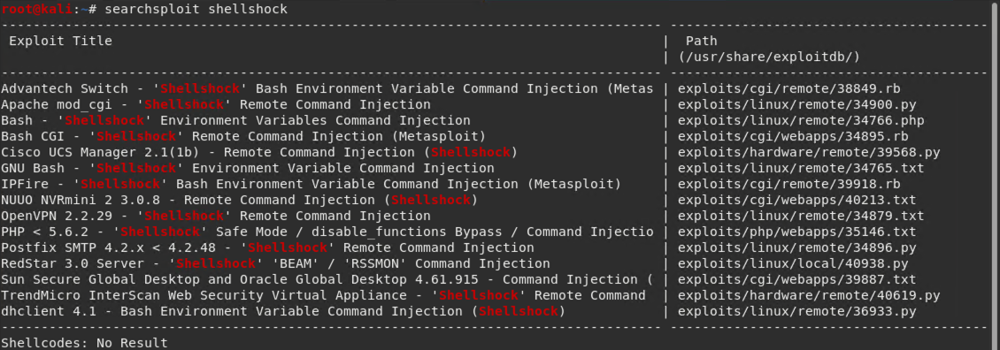

## Solution Guide: SearchSploit and Shellshock

In this activity, you ran scripted exploits using SearchSploit.

---

Log into your Kali Linux with the following credentials:
  - Username: `root`
  - Password: `toor`

1. Use Searchsploit to list all the available Shellshock scripts.

    - `searchsploit shellshock`

2. Identify the script that will exploit our webserver. 

   

    - This script is written to exploit Shellshock which abuses a bug contained within common gateway interfaces aka (CGIs).

    - This allows attackers to perform Remote Code Execution (RCE) on a breached target.

3. Run the command that initiates the Python exploit script.

   - `python /usr/share/exploitdb/exploits/linux/remote/34900.py payload=bind rhost=192.168.0.21 rport=80 pages=/cgi-bin/vulnerable`

     - Hint: If you are unsure of which port to use, try to do a service scan using nmap
       - Solution: Using `nmap -sV 192.168.0.21` will show us that port `80` is open. 

4. Was the script that you chose able to verify if the ShellShock machine was vulnerable? What would you recommend to a potential client? 

If executed successfully you should see the following:

Please note that the purpose of this activity was not to gain a backdoor into the Shellshock machine, but rather notify you if the machine is susceptible to the ShellShock vulnerability. 

   - **Solution**: The script `34900.py` confirms that the ShellShock machine is vulnerable, and indeed grants a user shell on the target machine. Because ShellShock affects version of Bash older than 4.3, the client should:
     - Determine which version of bash is running on every one of their production servers
     - Update the bash installations on any server running bash older than `4.3`
     - Enable automatic security updates to acquire such patches automatically in the future.

____

&copy; 2020 Trilogy Education Services, a 2U Inc Brand.   All Rights Reserved.
