## 17.1 Student Guide: Introduction to Metasploit

### Overview

Today's class will introduce Metasploit, a popular command and control framework that automates and amplifies many of the important tools and processes of a penetration test. You will use Metasploit to perform exploits against the Shellshock and Heartbleed vulnerabilities. 

### Class Objectives

By the end of class, you will be able to:

- Use Metasploit to assist in various stages of a penetration test. 

- Use SearchSploit to determine if the targets are vulnerable to exploits. 

- Use exploit modules from the Metasploit framework to establish a reverse shell on a target.


#### Slideshow 

The lesson slides are available on Google Drive here: [17.1 Slides](https://docs.google.com/presentation/d/1qgv8e0p85GTmjnQa56tyfJMNehQRCTStF5fTOGSn3So/edit)

----

### 01. Introduction to Heartbleed

Last week we began to learn about the offensive security practice known as penetration testing.

- Penetration testers must have a broad understanding of the tools and techniques used to assess the security posture of client organizations. 

Review the five pen testing stages: 

1. Planning and Reconnaissance
2. Scanning
3. Exploitation
4. Post Exploitation
5. Reporting

Last week, we looked at many tools and techniques for the Planning and Reconnaissance stage, including passive and active reconnaissance. We explored the second stage, Scanning, with a lesson on vulnerability scanning. We also began the third, Exploitation, in which we ran scripted exploits using SearchSploit. 

Today, we will dive a bit deeper into the Exploitation stage and use Metasploit, a powerful, industry-standard tool suite with modules that perform a wide range of penetration tasks. As we learn about this tool, we will also learn of new vulnerabilities and exploits that these tools can be used against. 

In today's lesson we will:

- Study a vulnerability called Heartbleed.
- Use SearchSploit to scan systems for the Heartbleed vulnerabilities.
- Introduce a new framework called Metasploit and will use it to exploit the Heartbleed vulnerability.
- Use Metasploit to exploit Shellshock.

This will prepare us for the next class, where we will take a closer look at the post-exploitation phase.

#### Heartbleed

We've already looked at the Shellshock exploit. Today, we will focus on the **Heartbleed** bug. 

Like Shellshock, Heartbleed was a major vulnerability when it was discovered, affecting every device running OpenSSL. 

- However, Heartbleed differs from Shellshock in the following ways:

  - Unlike Shellshock, Heartbleed does not allow remote code execution.  
  
  - It's a **sensitive data exposure** vulnerability that allows attackers to dump confidential information from a victim's RAM.

  - This bypasses standard access controls and allows attackers to potentially read recently used data on the target's device, including passwords, private keys, etc.

Understanding and recognizing vulnerabilities is an essential skill for penetration testers.

- With the variety of threats and vulnerabilities present today, it is the responsibility of penetration testers to stay vigilant and aware of the many possible exploits. 

- Therefore, we will begin today's class with independent research on the Heartbleed vulnerability. 


### 02. Activity: Researching Heartbleed

- [Activity File: Researching Heartbleed](Activities/02_Research_Heartbleed/Unsolved/README.md)

### 03. Activity Review: Researching Heartbleed 

- [Solution File: Researching Heartbleed](Activities/02_Research_Heartbleed/Solved/README.md)

### 04. Heartbleed and SearchSploit

Let's dive a little deeper into the Heartbleed exploit: 

- Clients and servers use OpenSSL to encrypt information transported across a network.

- This process also involves the client sending "heartbeats" to servers. These heartbeats are essentially a call and response to make sure that the connection to the server is still alive.  

  - When the server receives the data, it mirrors the response and sends the same data back to confirm the connection is alive. 

    - For example: The client sends: `test-signal`. The server responds and confirms the connection by replying: `test-signal`. 

- These heartbeat messages are simplified to provide a conceptual understanding. In reality, these heartbeats contain the necessary headers and padding to transport and detail these messages from server to client and vice versa.  An important detail in the heartbeat is length. 

  - A heartbeat can be crafted to contain only 1 byte, but to tell the server that it contains 16K bytes. 

  - In an attempt to copy what the server believes is a 16K byte heartbeat, it will replicate the 1 byte that the attacker sent, and randomly copy 15.999K bites of data from its own RAM. 

  - This memory can be useless padding sent during transmissions. But it can also include valuable payloads like private encryption keys or user credentials. 


#### Searching for Exploits Demonstration

Now we'll demonstrate how to scan for more vulnerabilities: 

- Last week we used SearchSploit to show all available scripts with minor filtering. 

- In this demonstration, we will create more customized searches using SearchSploit.

This demonstration will use the Kali and Heartbleed VMs. 

1. We can use Searchsploit to identify vulnerabilities for specific services. In the Kali VM, list all Apache exploits on your machine by running the following command: 

    - `searchsploit apache | head`

        - `searchsploit`: The tool we are using to search for our local exploit scripts.
        - `apache`: The service that we are targeting.
        - `| head`: The pipe command that tells SearchSploit that we only want the top ten results.


    You can use these exploits to compromise targets without having to download additional tools. 

   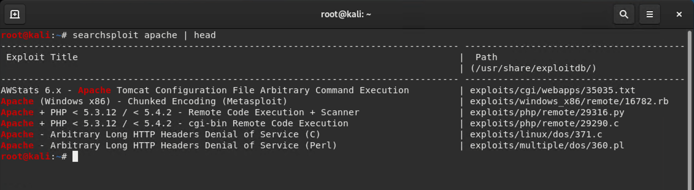


2. Let's look at the `exploits/php/remote/29316.py` exploit.  Read the source code of an exploit using the `-x` option: 

    - `searchsploit -x exploits/php/remote/29316.py`

     This command opens the code in `less`. It is similar to running `less` with the full path of the exploit: 
     - `less /usr/share/exploitdb/exploits/php/remote/29316.py`

     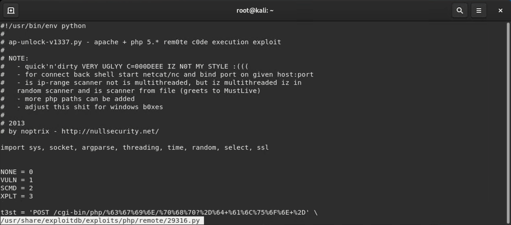


3. Navigate to the directory containing this exploit and run `python 29316.py`:

    -  `cd /usr/share/exploitdb/exploits/php/remote`

    -  `python 29316.py`

  Output should resemble the following: 

  ```bash
  $ python 29316.py
  --==[ ap-unlock-v1337.py by noptrix@nullsecurity.net ]==--
  usage:

    ./ap-unlock-v1337.py -h <4rg> -s | -c <4rg> | -x <4rg> [0pt1ons]
    ./ap-unlock-v1337.py -r <4rg> | -R <4rg> | -i <4rg> [0pt1ons]

  0pt1ons:

    -h wh1t3h4tz.0rg     | t3st s1ngle h0st f0r vu1n
    -p 80                | t4rg3t p0rt (d3fau1t: 80)
    -S                   | c0nn3ct thr0ugh ss1
    -c 'uname -a;id'     | s3nd c0mm4nds t0 h0st
    -x 192.168.0.2:1337  | c0nn3ct b4ck h0st 4nd p0rt f0r sh3ll
    -s                   | t3st s1ngl3 h0st f0r vu1n
    -r 133.1.3-7.7-37    | sc4nz iP addr3ss r4ng3 f0r vu1n
    -R 1337              | sc4nz num r4nd0m h0st5 f0r vu1n
    -t 2                 | c0nn3ct t1me0ut in s3x (d3fau1t: 3)
    -T 2                 | r3ad t1me0ut in s3x (d3fau1t: 3)
    -f vu1n.lst          | wr1t3 vu1n h0sts t0 f1l3
    -i sc4nz.lst         | sc4nz h0sts fr0m f1le f0r vu1n
    -v                   | pr1nt m0ah 1nf0z wh1l3 sh1tt1ng
  ```

- This output displays the list of options we can use with the exploit.


### 05.  Activity: Heartbleed and SearchSploit 

- [Activity File: Heartbleed and SearchSploit](Activities/05_Heartbleed_Searchsploit/Unsolved/README.md)


### 06. Activity Review: Heartbleed and Searchsploit

- [Solution Guide: Heartbleed and SearchSploit](Activities/05_Heartbleed_Searchsploit/Solved/README.md)


### 07. Introducing Metasploit

Identifying a vulnerability is only part of what you must do as a penetration tester. Once you've found an attractive vulnerability, you still need to find a way to exploit it.

Exploitation is a multi-step process. You must:

  1. Identify vulnerabilities.

  2. Identify specific exploits that correspond to that vulnerability.

  3. Prepare and test the exploit payload.

Not all exploits for a given vulnerability will work equally well and some won't work at all. You should expect many of their exploitation attempts to fail. This is okay: trial and error is part of the job!

Since we are working in the third stage of an engagement, we've already gone through a vulnerability assessment and know which vulnerabilities are available to exploit. This means that the next step is actually finding exploits to use.

 To do this, we will use a set of tools: Metasploit, Meterpreter, and MSFconsole.


**Metasploit** is a tool suite (a program comprised of multiple tools) for hacking servers and other networked devices. The main tools we'll focus on are:

  - **MSFconsole**: The main interface for Metasploit. Offers a centralized console to access all the options and modules. MSFconsole runs on your local machine, not on the machines you compromise.

  - **Meterpreter**: A Linux-style shell that Metasploit launches when you successfully break into a target machine. Unlike MSFconsole, Meterpreter runs on the machines you compromise, not on your local machine.

  - To reiterate, you will use MSFconsole to find vulnerable machines and gain access to them. After you've exploited them, you'll use Meterpreter on the compromised machine. 

Today, we will focus on MSFconsole and explore Meterpreter in depth during the next class.

- Remember MSFconsole is a unified interface for a variety of different functions. Each of these functions is called a **module**.

- MSFconsole has tools for port and service scanning as well as enumeration. In addition to exploitation, Metasploit lets you save the results of scans to a database for easy review.

    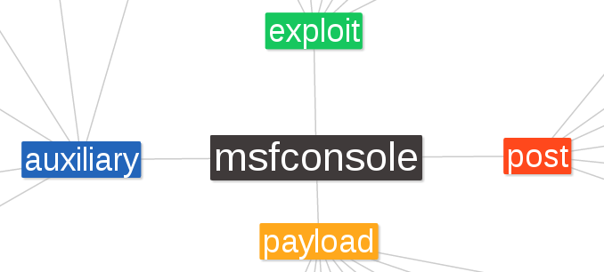

- There are five different kinds of modules that MSFconsole uses:

  - **Auxiliary modules**: Used for information gathering, enumeration, and port scanning. Can also be used for things like connecting to SQL databases and performing man-in-the-middle attacks.

  - **Exploit modules**: Generally used to deliver exploit code to a target system.

  - **Post modules**: Offers post-exploitation tools such as the ability to extract password hashes and access tokens. Provides modules for taking a screenshot, key-logging, and downloading files. You'll explore these during the next class. 

  - **Payload modules**: Used to create malicious payloads to use with an exploit. If possible, the aim is to upload a copy of Meterpreter, which is the default payload of Metasploit.

For today's lesson, we'll use auxiliary and exploit modules.

- Each module has additional attacks and information, as seen in the image below:


    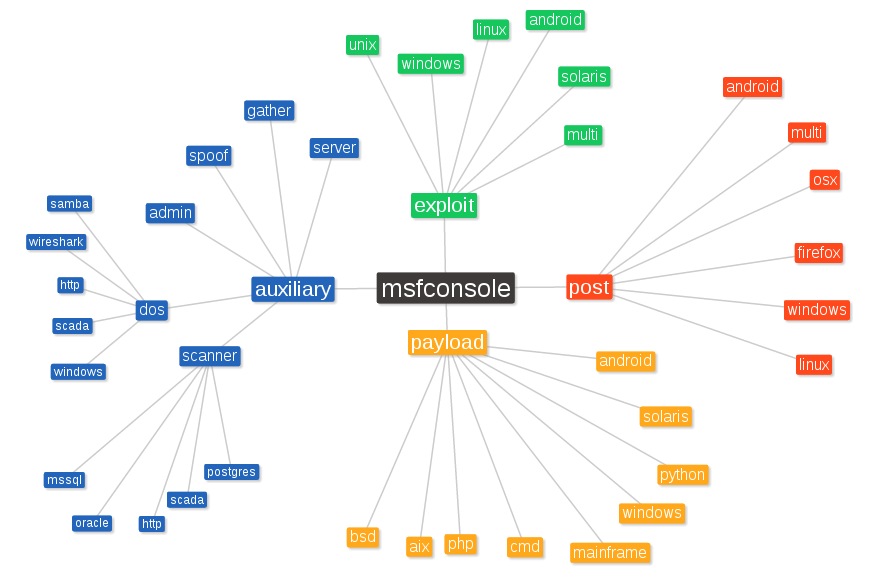


#### Metasploit Demonstration Setup 

In this demonstration, we will provide an overview of Metasploit. Specifically, we will:

- Initiate Metasploit.
- Interact with its interface.
- Use the built-in help menu system.
- Exploit a vulnerable Shellshock VM by loading modules and setting payloads. 

Log into the Kali Linux VM, which will serve as the attack machine. 

We will also use the Shellshock VM, which will serve as the vulnerable web server that you will exploit.


#### Metasploit Demonstration

1. Start Metasploit by running the following command: 

   - `msfconsole`

   This command will launch Metasploit's command-line interface.

      - **Note:** Ignore warnings regarding `No YAML Database`.

     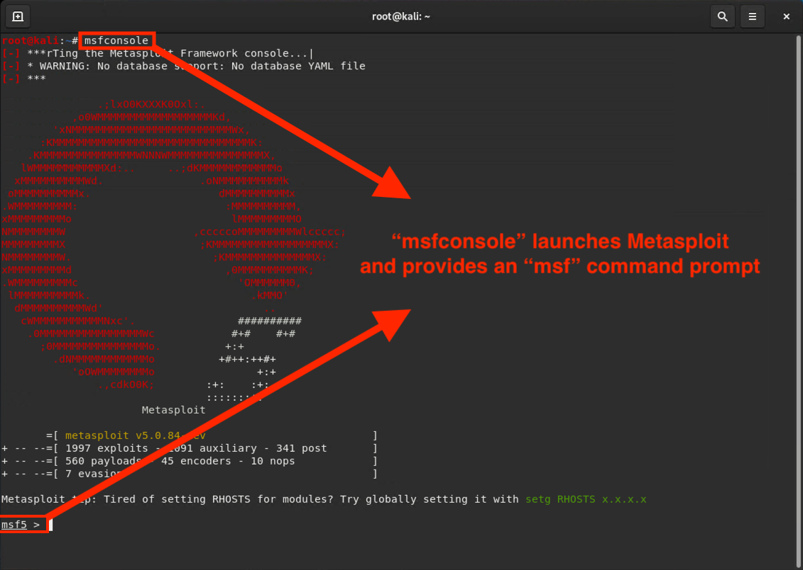

2. Metasploit has too many modules to list all at once, so it's better to specify a port, service, or program.

     For example, type the following command to find all modules related to Java:

     - `search java`

        - Metasploit uses the search command to locate specific modules within the modules library.


     Results will resemble the following: 
    
      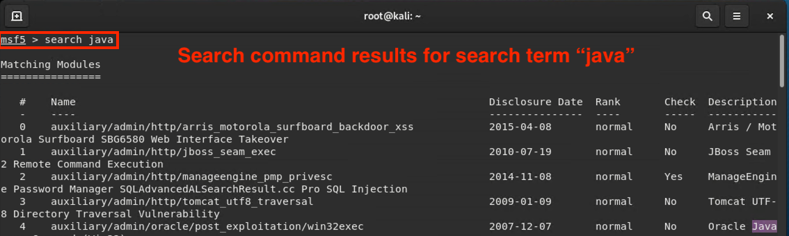
    
    - The first part of the module's path defines what type of module it is:
    
       - `exploit/windows/browser/java_cmm` is an exploit module, which delivers the exploit to the target system.
    
       - `auxiliary/scanner/misc/java_jmx_server` is an auxiliary module, used for tasks such as information gathering, enumeration, and port scanning.
    
       - `payload/firefox/gather/cookies` is a payload module.


​       
3. Since we want to exploit Shellshock, we'll search the `shellshock` library for the `auxiliary/scanner/http/apache_mod_cgi_bash_env` module.

   Type the following command:

     - `search shellshock`

    The output shows all of the available Shellshock modules:

     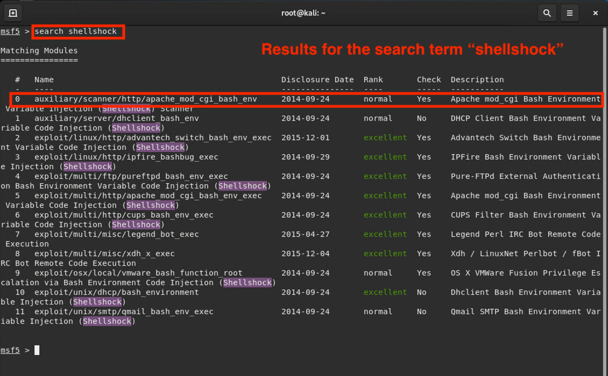


   We'll need to load the `auxiliary/scanner/http/apache_mod_cgi_bash_env` module before we can use it.

    - Run `use auxiliary/scanner/http/apache_mod_cgi_bash_env`
    
      - This loads the auxiliary module for use with the Shellshock exploit.

4. Now that the module is loaded, we need to see what options need to be configured.

    - Run `info`

       - This command shows us all of the available options and settings that can be configured for this particular module.

      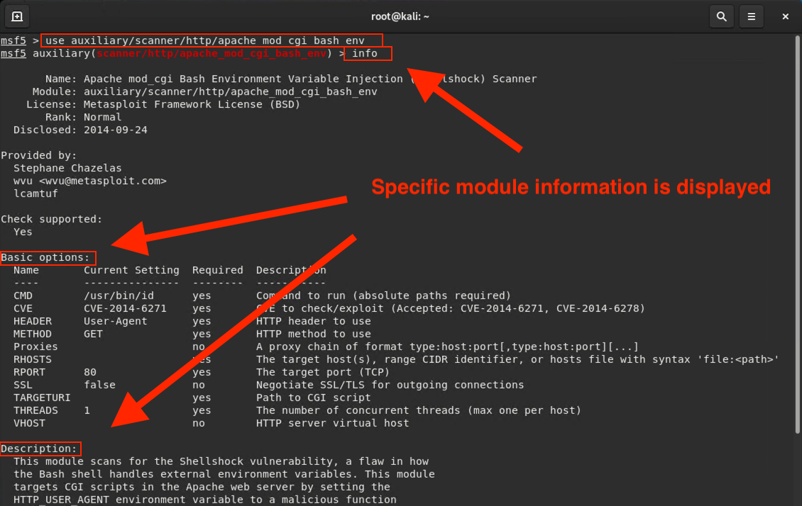

   Next, we need to get information about the module i.e., a list of configurable options specific to that module.

     - Run `options`

   Instead of modifying an exploit script, we modify fields within an existing module.

      - In the case of this module, options that are required are marked `yes` in the `Required` field under options.

      - Most modules come populated with default options. For this example, the only ones we need to set are `RHOSTS` and `TARGETURI`.

         - The options that you will need to set will change depending on the module.

      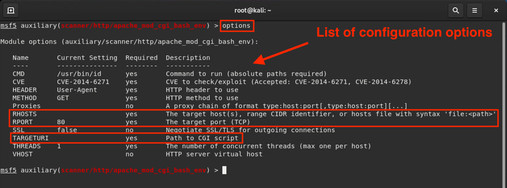


5. `RHOSTS` stands for "remote host." It indicates the target machine and almost always needs to be set.

    - Run `set RHOSTS 192.168.0.21`. `192.168.0.21` is the IP address of the Shellshock VM.

   For this module, we also need to set the `TARGETURI`, which is the path to the vulnerable CGI script. 

   - Run `set TARGETURI /cgi-bin/vulnerable`

   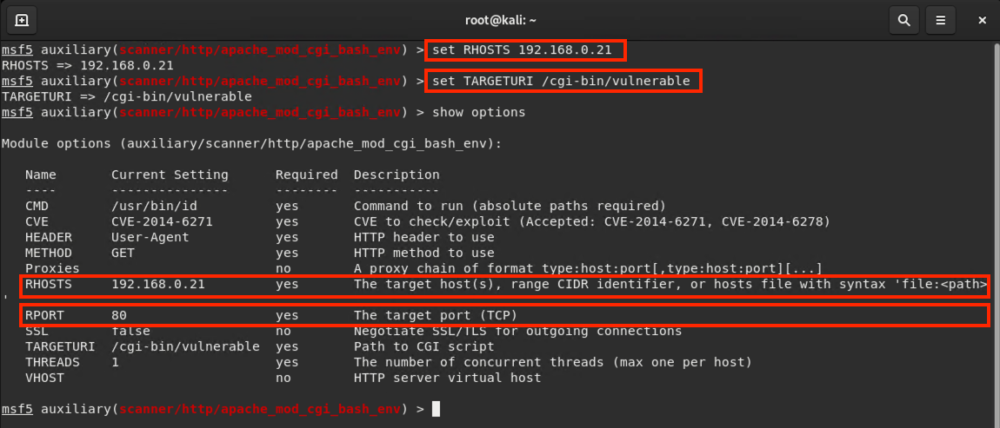

   Note the following: 

   - Commands inside of Metasploit are not case sensitive.

   - We can also use `setg` when configuring fields. `setg` stands for "set globally." It applies the settings to other modules, meaning once we set `RHOSTS`, we do not need to set it again. 
   
6. After successfully setting the fields, we can run the exploit. We can run this command in two ways:

    - Run either `run` or `exploit`.

   Upon successful execution, you should see the following results:

    - `[+] uid=33(www-data) gid=33(www-data) groups=33(www-data)`

     This output is the result of the `CMD` parameter being set to run the `id` command. 

      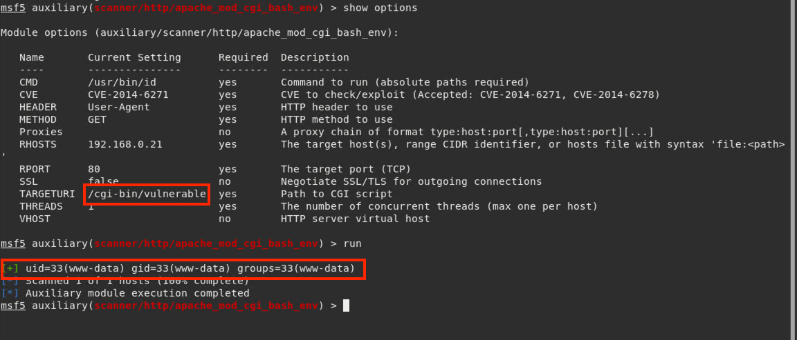

     - We can execute commands depending on the permissions of the user we pulled. For example, if the permissions allow, we can we could try to read /etc/shadow or try to add users.

### 08. Activity: Attacking Shellshock with Metasploit

- [Activity File: Attacking Shellshock with Metasploit](Activities/09_Attacking_Shellshock_Metasploit/Unsolved/README.md)


### 10. Activity Review: Attacking Shellshock with Metasploit 

- [Solution File: Attacking Shellshock with Metasploit](Activities/09_Attacking_Shellshock_Metasploit/Solved/README.md)


### 11.  Metasploit and Heartbleed

Now that we are familiar with Metasploit, we will use it to exploit other vulnerabilities. 

#### Heartbleed, Metasploit, and MSFconsole Demo

In the following demonstration, we will use the Kali machine to exploit the Heartbleed VM. 

1. In Kali, launch a terminal and run `msfconsole`.


2. We will use MSFconsole to identify Heartbleed exploits.
  
   - Run `search heartbleed`

    ```bash
    msf > search heartbleed

    Matching Modules
    ================

       Name                                              Disclosure Date  Rank    Check  Description
       ----                                              ---------------  ----    -----  -----------
       auxiliary/scanner/ssl/openssl_heartbleed          2014-04-07       normal  Yes    OpenSSL Heartbeat (Heartbleed) Information Leak
       auxiliary/server/openssl_heartbeat_client_memory  2014-04-07       normal  No     OpenSSL Heartbeat (Heartbleed) Client Memory Exposure
    ```

   - Auxillary modules are reconnaissance tools. They're used to scan networks and detect vulnerabilities such as Heartbleed.

    The first module, `auxiliary/scanner/ssl/openssl_heartbleed`, is used to test a host for the Heartbleed vulnerability.
  
   - Run `use auxiliary/scanner/ssl/openssl_heartbleed`

3. Now, we need to configure the modules before using them. 

    Check which parameters we need to set:

     - Run `show options`

    ```
    msf > use  auxiliary/scanner/ssl/openssl_heartbleed
    msf auxiliary(scanner/ssl/openssl_heartbleed) > show options

    Module options (auxiliary/scanner/ssl/openssl_heartbleed):

      Name              Current Setting  Required  Description
      ----              ---------------  --------  -----------
      DUMPFILTER                         no        Pattern to filter leaked memory before storing
      LEAK_COUNT        1                yes       Number of times to leak memory per SCAN or DUMP invocation
      MAX_KEYTRIES      50               yes       Max tries to dump key
      RESPONSE_TIMEOUT  10               yes       Number of seconds to wait for a server response
      RHOSTS                             yes       The target address range or CIDR identifier
      RPORT             443              yes       The target port (TCP)
      ...
    ```

### 11. Activity: Attacking Heartbleed with Metasploit 

- [Activity File: Attacking Heartbleed with Metaploit](Activities/12_Metasploit_Heartbleed//Unsolved/README.md)

### 12. Activity Review: Attacking Heartbleed with Metasploit Activity 

- [Solution Guide: Attacking Heartbleed with Metasploit](Activities/12_Metasploit_Heartbleed/Solved/README.md)

### 13. Wrap-Up 

Review the five pentesting stages: 

1. Planning and Reconnaissance
2. Scanning
3. Exploitation
4. Post Exploitation
5. Reporting

In the next class, we will explore the **Post Exploitation** stage of an engagement and set up backdoors into victim machines using the Metasploit tool Meterpreter. 

Ask class if there are any questions before dismissing class.

____

&copy; 2020 Trilogy Education Services, a 2U Inc Brand.   All Rights Reserved.
