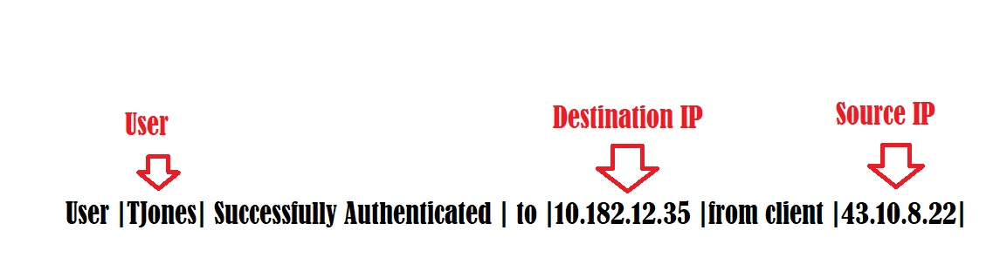
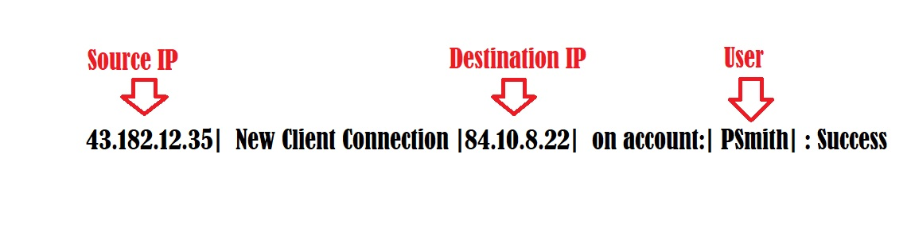
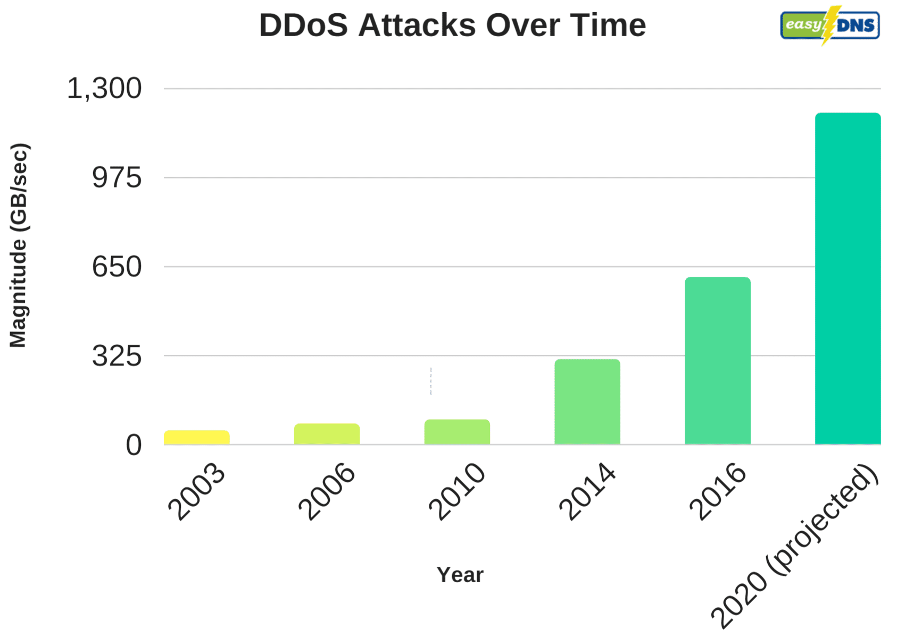

## 18.1 Student Guide: Introduction to SIEMs

### Overview

Today's unit marks the transition into defensive security topics with an introduction to SIEM technology. You will be introduced to various concepts of security monitoring, such as prioritizing threats and log aggregation and correlation, and then learn how to apply these concepts in a SIEM software.  

### Class Objectives

By the end of class, you will be able to:

- Analyze logs and determine the types of data they contain, as well as the types of security events they can help identify.

- Isolate, identify, and correlate fields across raw log files.

- Design a correlation rule that triggers a notification when an event occurs.

- Make informed decisions about which SIEM vendor is best for an organization. 

### Slideshow

The lesson slides are available on Google Drive here: [18.1 Slides](https://docs.google.com/presentation/d/1vER5UBuHL_STOOpZ-O8E1_owh6T2bvWHn3GkkBC2ua4/edit?ts=5eb95034#slide=id.g4789b2c72f_0_6)

-------

### 01. Introduction to SIEM Week 

Over the next two weeks you will learn about a technology called SIEM (system information and event management). 

Remember the three primary cybersecurity goals of an organization are confidentiality, integrity, and availability.

- Organizations must constantly determine whether these cybersecurity goals are being compromised.

  - For example, if an adversary were attempting to brute force their way into an an online auction company's administrative website to steal privileged information, the company would need to identify the activity before sensitive data and confidentiality were breached.

- Over the next two weeks we will cover SIEM (pronounced SIM) technology, which organizations use to solve the challenge of monitoring and identifying security incidents. 

In this week's exercises, we will be playing the role of a security operations center (SOC) manager at an online military products organization called Omni Military Products (OMP).

  - OMP recently experienced several security-related events that put their organization at risk.

  - As the new SOC manager, you will have to use SIEM tools and technologies to protect OMP from a variety of security events.

### 02. Introduction to Continuous Monitoring

Modern organizations have many networked devices and data assets, creating a large attack surface that can be targeted by many attackers.

  - There is a general acceptance in the information security industry that a prepared and resourced attacker will be able to bypass security controls. In other words, despite security controls, attacks still occur. 
  
  - Therefore, organizations focus on detecting attacks in order to quickly respond and minimize their potential impact.
  
Organizations detect attacks against their information security assets with a concept called **continuous monitoring**, or more specifically, **information security continuous monitoring (ISCM)**.

  - ISCM is the processes and technologies used to detect information security risks associated with an organization's operational environment in real time.

  - "In real time" means that ISCM detects issues as soon as they occur.

  - ISCM provides real-time insight into:

    - The current state of an organization's networked assets.

    - Vulnerabilities and threats that attack an organization's networked assets.

    - How well security controls are protecting an organization's networked assets.
    
Organizations have many networked devices and data assets, and with these come a variety of attack methods. For example:

  - An employee can accidentally download malware onto their laptop, which can spread to an organization's network.

  - A script kiddie can launch a denial of service attack against a webserver.

  - A nation state can attempt a code injection attack against an application.
    
Organizations cannot protect against every single potential attack, as they may be limited by:
  - Financial limitations: For example, most modern monitoring tools and technologies are very expensive to install, deploy, and run. Organizations often have strict budgets that they have to maintain.

  - Staffing limitations: While many monitoring tools have automated features, they often require humans to monitor and respond to detected issues.
     
Due to these limitations, organizations need to make business decisions that prioritize the types of security risks they will monitor against.

#### Prioritizing Risks

Organizations consider the following factors when determining security risk priorities: 

- Compliance: Depending on the industry a business is in, they may be required to monitor and analyze certain applications and systems activity.

  - For example, to remain PCI-compliant, financial businesses that work with credit cards may be required to monitor their applications that manage financial data.

- Financial impact: How a system breach or shutdown would impact the financial performance of an organization. 

  - For example, a business like eBay would likely prioritize monitoring their customer-facing application, since the cost of this being compromised and taken offline would significantly affect their revenue.

- Reputational impact: How an incident would affect the organization's reputation with their customers.

  - For example, an online banking provider would monitor the security controls of their customer financial data. If their customer data were breached, their reputation could be significantly affected.

- Likelihood of attack: While there are many types of security risks that *can* occur, some are more likely than others.
  - For example, politically-associated businesses that have public-facing websites are particularly at risk of denial of service attacks. Given this higher likelihood, these organizations should prioritize monitoring for DOS attacks.
      
Organizations must decide for themselves which factors to consider when prioritizing risks.     
      
- In the first activity of the day, you will play the role of a newly hired SOC manager at an organization experiencing a variety of information security events.  

- You will use the the above factors to help prioritize risks for monitoring.

### 03.  Monitoring Assets Activity

- [Activity File: Monitoring Assets](activities/03_Monitoring_Assets/Unsolved/README.md)

### 04. Review Monitoring Assets 

- [Solution Guide: Monitoring Assets](activities/03_Monitoring_Assets/Solved/README.md) 
  

### 05.  Log, Logs, and More Logs 

We just discussed how organizations have to prioritize what risks they will monitor against.

-  After these organizations determine what to monitor, they need to determine how they will do so.

-  **Logs** are the most common organizational method for monitoring.

Introduce logs by covering the following: 
- A log is a record of an event occurring within a device or a network.

- Logs contain **entries**, which represent specific events occurring on a device or network.
  
While log entries were originally designed to assist with troubleshooting system issues, they later proved useful to security professionals as a source of insight into:  
  - The state of a device or a network.
  - Who has access to a device or a network.
  - User activities on a device or a network.

Organizations have many devices and assets, which produce a lot of logs. Therefore, security professionals need to understand the types of devices and assets that create logs in order to successfully identify security events. 

#### Log Types

There are four main log types used by information security professionals:

1.  **Operating system logs** are created on devices such as Linux and Windows systems. 
    
    Security events that can be identified by these logs include:
     - Security access events: For example, an unauthorized user attempts to view privileged data, such as a company payroll file.

     - Security permissions events: For example, a user attempts to give themselves permissions to view and edit a privileged file.
    
2. **Application logs** are created by devices such as Apache and IIS (Internet Information Services) servers.
  
   Security events that can be identified by these logs include:
      
      - Application access events: For example, a brute force attempt to log into an administrative account on a web application.
      
      - Fraud events: For example, a user on a financial application attempts to transfer a large sum of funds to a suspicious external account.
  
3. **Networking device logs** are created on devices such as routers, switches, and DHCP/DNS servers. 
  
    Security events that can be identified by these logs include:
    
    - Administrative events: For example, a network administrator accidentally opens a port allowing unauthorized traffic into a network.
    
    - Network security events: For example, a DHCP starvation attack occurs in which the DHCP server receives thousands of requests in a short period of time, consuming all available IP addresses.
    
4. **Security device logs** are created on devices such as IDS/IPS, firewalls, endpoint devices, and honeypots. 
  
    Security events that can be identified by these logs include:
      - Endpoint events: For example, a user accidentally downloads malware onto their laptop from a phishing email.

      - IDS signature events: For example, a packet with an illegal TCP flag combination is identified by an IDS.

While this is not a complete list of all the possible logs that security professionals use, we should be familiar with these types of logs and the types of security events they can help identify.

### 06.  What is this Log? Activity

- [Activity File: What is this Log?](activities/06_What_is_This_Log/Unsolved/README.md)
- [Log Files](resources/logfiles.zip)

### 07. Review What is This Log? Activity 

- [Solution Guide: What is This Log?](activities/06_What_is_This_Log/Solved/README.md)

### 08. Log Aggregation and Normalization 

Organizations can use many log sources to identify security events.

- While it is beneficial to have access to so many logs, it can be overwhelming to deal with the incoming information from various sources.  

  - For example, if a business wants to monitor suspicious logins on their Linux servers, they may have to monitor a variety of Linux servers and distributions.

  - Therefore, they will want to identify all the Linux server logs available and collect them in a single destination.
  
The first step security professionals would take to address this challenge is **log aggregation**.

-  Log aggregation is the identification and collection of logs from multiple computing sources.

Ideally, each device would create logs in the exact same format. Unfortunately, that's not the case. Logs from different sources, even if they are logging similar data, are often created in different formats.

- For example, the following are two ways a system may log server access:
  
  - Log 1: `User TJones Successfully Authenticated to 10.182.12.35 from client 43.10.8.22` 

  - Log 2: `43.182.12.35 New Client Connection 84.10.8.22  on account: PSmith: Success`
     
- While each system is identifying the same type of data, the structure and format of each log is significantly different.

Therefore, we need to parse and normalize our logs.

#### Parsing and Normalizing Logs

As seen in the previous example, logs often provide data in a single string:
    
 - `User TJones Successfully Authenticated to 10.182.12.35 from client 43.10.8.22`
            
**Log parsing** is the process of converting the single string of data into fields of structured data.

Using the same example: 

- Log 1:  `User |TJones| Successfully Authenticated | to |10.182.12.35 |from client |43.10.8.22|`

- Log 2: `43.182.12.35|  New Client Connection |84.10.8.22|  on account:| PSmith| : Success`
    
- If we separate the values, we can categorize each field and rearrange them to match a uniform structure, a process known as **log normalization**.

- Cyber professionals will need to have a general understanding of the data in the logs to accurately parse them and determine each field.    
        
      
Next, we perform log normalization in order to compare common attributes between the two logs.

- Log normalization is the process of standardizing fields in data from different sources and formats so it can be analyzed together.

- In the example above, log normalization would identify the common attributes between the two logs and define them into fields so they can be analyzed together.

- For example, the following common fields can be identified between the two logs:
  - User
  - Source IP
  - Destination IP

- Next, the fields would be aligned with each log record:
    
  - **Log 1**    
      
      

         
  - **Log 2**   

      
        
        
- Normalizing logs sometimes involves modifying the format that fields are displayed in.
  - For example, one log may log time in military time (23:12) and another may log it in standard 12-hour time (11:12 PM).

  - Normalizing would change all times to a single format.
      
### 09. Log Aggregation and Normalization

- [Activity File: Log Aggregation and Normalization](activities/10_Log_Aggregation/Unsolved/README.md)
- [Web Server Log Files](resources/webserver_logs.txt)

### 10. Review Log Aggregation and Normalization Activity   

-  [Solution Guide: Log Aggregation and Normalization](activities/10_Log_Aggregation/Solved/README.md) 

### 11. Log Correlation  

Note that we just discussed how there are many types of logs available for information security professionals. Within these logs are many fields that contain multiple data points.
  
With all of the data contained in an organization's logs, security professionals are often faced with a big data challenge:

  - We often have the data we need to learn about certain security events, but are unable to find and use it due to the vast amount of total data.

Therefore, we use **log correlation** to detect security events.  

  - Individual log entries often do not indicate security events alone.

  - Analyzing multiple log entries *together* can help us detect security events and patterns of suspicious behavior.

  - Log correlation connects multiple log entries to make raw data into useful information.

  - Different log entries can come from the same source or different sources.
  
For example, while the following log entry may look like a single, unsuspicious bad login:

       [10/12/2019 04:32:03 PM]   41.34.54.233  user=testerA "Login Failed" 
 
The following logs entries correlated together indicate a potentially suspicious security event:

       [10/12/2019 04:32:03 PM]   41.34.54.233  user=testerA "Login Failed" 
       [10/12/2019 04:32:04 PM]   41.34.54.233  user=testerA "Login Failed" 
       [10/12/2019 04:32:05 PM]   41.34.54.233  user=testerA "Login Failed" 
       [10/12/2019 04:32:07 PM]   41.34.54.233  user=testerA "Login Failed" 
       [10/12/2019 04:32:08 PM]   41.34.54.233  user=testerA "Login Failed" 
       [10/12/2019 04:32:09 PM]   41.34.54.233  user=testerA "Login Failed" 
       [10/12/2019 04:32:10 PM]   41.34.54.233  user=testerA "Login Failed" 
       [10/12/2019 04:32:11 PM]   41.34.54.233  user=testerA "Login Failed" 
       [10/12/2019 04:32:12 PM]   41.34.54.233  user=testerA "Login Failed" 
       [10/12/2019 04:32:13 PM]   41.34.54.233  user=testerA "Login Failed"` 

- The above log entries correlated together could identify a single potential attacker trying to brute force their way into an account.

Log correlation identifies security events by using **correlation rules**.
  - Correlation rules are the logic used to identify security events.

  - Correlation rules look at a sequence of events that can identify a potential security issue.

  - Correlation rules are often dynamic, which means they can change depending on how effective they are.
  
It is easier to ideate correlation rules in plain English before they are converted into a code or script.

- For example, for the logs above, a correlation rule that could detect an attempted brute force attempt is:
  
  Detect:
    - More than three "Login Failed" 
    - From the same user
    - From the same IP address
    - Within a five-minute period
 
- With the above correlation rule, the brute force attempt would have been detected.

#### Correlation Alerts

The next decision for a security professional is how a system will respond to a correlation rule after detecting a security event.

The most common response is an **alert**.

- A correlation alert is a notification that correlation rules have been met and an event was detected. 

- Correlation alerts can have multiple delivery methods, including:

  - Displays on the screen at an SOC.

  - Notifications sent via phone calls, text messages, or emails.

- Alerts are often designed to notify multiple individuals for faster response.

- Alerts typically provide high-level details of the reason for the alert.

For the example above, the alert delivery method could be added to the correlation rule, as such:
- If the following are detected:
  - More than three "Login Failed"
  - From the same user
  - From the same IP address
  - Within a five-minute period

- Send a:
  - Phone call to the SOC manager 
  - Email message to the SOC email distro list 
    
  
### 12.  Rule Correlation Activity

- [Activity File: Rule Correlation](activities/13_Rule_Correlation/Unsolved/README.md)

### 13.  Review Rule Correlation Activity

- [Solution Guide: Rule Correlation](activities/13_Rule_Correlation/Solved/README.md)

Answer any questions that remain before proceeding to the next section.
  

### 14. Instructor Do:  SEM + SIM =  SIEM 

We've discussed how organizations use monitoring to protect against security events with the following steps:

1.  Organizations decide what to monitor by prioritizing the risks to their business.

2.  Organizations decide how to monitor, which is typically accomplished by logs.

3.  Organizations aggregate, parse, and normalize logs so that they can be analyzed together.

4.  Organizations correlate these logs with rules to alert when a security event or suspicious activity is detected.
  
One challenge is how to manage these processes for monitoring multiple security events across an organization.

Security professionals use a technology called **security information and event management (SIEM)** (pronounced "sim") to simplify and manage monitoring security events.

  - SIEM is made up of two types of software:

    - Security information management (SIM), which is primarily focused on log management and involves collecting logs in a central location for later analysis. 

    - Security event management (SEM), which is primarily focused on event monitoring and involves identifying, evaluating, and correlating logs to determine security events and create alerts.

 - SIEM combines the technologies of SIM and SEM to collect, organize, and analyze logs to detect security-related events across an organization's technology infrastructure.

 - SIEM can also be used to visualize data related to security events in order to simplify data interpretation.

    - For example, a SIEM can help a SOC employee develop a simple chart to present to senior management that illustrates how often their organization experienced DDOS attacks in the last month.
    
    
    
 -  SIEM is basically a single technology solution that security departments use to manage their multifaceted security monitoring operations.
 
 #### SIEM Benefits
 
 SIEM can help organizations move through the steps discussed today in order to implement an effective monitoring solution. 
 
1. Organizations need to decide **what to monitor** by prioritizing the risks to their business.
  
    How can SIEM help?
     
     - SIEM can look at historical data to determine how often a security event has occurred. This data can help an organization prioritize their monitoring decisions.

2.  Organizations must then decide **how to monitor**, which is typically accomplished by logs.

    How can SIEM help?
    
     - SIEM tools are smart devices that assist security departments with forwarding and collecting logs from various sources.

     - The process of collecting logs will be covered further in the next class.

3.  Organizations need to **aggregate, parse, and normalize** logs so they can be analyzed together.

    How can SIEM help?
    
      - One of the greatest strengths of SIEM tools is their ability to automate the aggregation, parsing, and normalization process.

      - When logs are loaded into SIEM software, they are automatically parsed and normalized, with all the field headers identified.

      - This significantly reduces the manual work of parsing and identifying all fields. 

4. Organizations must **correlate** these logs with correlation rules to trigger an alert when a security event or suspicious activity is detected.

   How can SIEM help?

     - Most SIEM software has an easy-to-use rule correlation designer, which makes it simple for SOC employees to manage the creation, editing, and viewing of correlation rules.

     - SIEM software also has many options for how to respond when correlation rules are identified, such as alert generations, report creations, and custom visualizations. 

#### Choosing a SIEM Vendor

We have just covered how SIEM technology is used by organizations to monitor their security environment.
 
As with other security vendors, there are many SIEM vendors and products available, each offering different solutions.

  - Therefore, security departments must determine which SIEM vendor is right for their organization. 
  
A security department will review the following criteria to select their SIEM vendor:

- Cost: While cost is always a consideration when selecting a SIEM vendor, how an organization is billed can also be a consideration.
   - For example, one SIEM vendor may charge based on the number of logs and another may charge based on the number of devices monitored.
  
- Ease of implementation and use: Organizations should research how challenging a SIEM vendor's solutions will be to set up and manage.

- Log compatibility: Organizations should confirm that the SIEM vendor is able to accommodate every type of log the business is required to monitor.

- SIEM features: While every SIEM vendor will claim to have the most advanced and user-friendly features, such as AI, machine learning, dashboards, and custom visualizations, organizations should review each vendor's features and assess which will best serve their business goals.
  
       
### 16. Choosing a SIEM Vendor Activity & Lab Setup

- [Activity File: Choosing a SIEM Vendor](activities/16_Choosing_A_Vendor/Unsolved/README.md)

#### Next Class Lab Introduction

- In the next class, we will be working hands on with a Splunk application that resides within the Ubuntu Vagrant Distribution.

- Follow the provided instructions to get prepared for our next class.

  - [Instructions](resources/splunk_lab_setup.md)
  
:warning: **Heads Up**: If you have any difficulty accessing the Splunk application, be sure to attend office hours before the next class for assistance.  
  
  
-------

© 2020 Trilogy Education Services, a 2U, Inc. brand. All Rights Reserved.  
