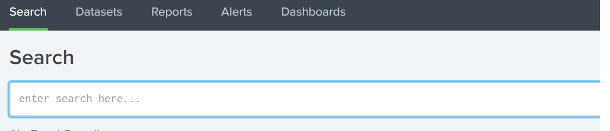

## 18.2 Student Guide: Splunk Searches

### Overview

In today's class, we will explore Splunk's interface. You will learn how to design complex search queries using Splunk's search processing language. 

### Class Objectives

By the end of class, you will be able to:

- Explore and select Splunk add-ons and apps based on project needs.

- Upload logs into a Splunk repository.

- Write complex SPL queries to analyze specific security situations.

### Slideshow

The lesson slides are available on Google Drive here: [18.2 Slides](https://docs.google.com/presentation/d/1BtBKJYZIxzLZsTpVJyeTFxO_eT-M5XW_SoFDVtwS3Io/edit)

---

### 01. Welcome to Splunk

Today we will discuss a powerful SIEM tool offered by the software company Splunk.

Before we introduce Splunk and its capabilities, let's review the concepts taught in the last class:

- Organizations use **continuous monitoring** to monitor risks to the confidentiality, integrity, and availability of their technical assets.

- Organizations use **logs** that contain **log entries** to monitor against these risks.

- Organizations **aggregate**, **parse**, and **normalize** multiple logs so they can be analyzed together.
- Organizations correlate these logs with **correlation rules** to alert when a security event or suspicious activity is detected.
- **SIEM** software is a security tool that can assist with all the above processes.

We also discussed how there are many SIEM vendors available, each with different features, strengths, and weaknesses.

For the next two units we will focus on one of the most popular SIEM vendors, Splunk.

We will not only be learning about Splunk and its features, but also doing hands-on activities within Splunk that security professionals do every day.

### 02. Splunk Capabilities

A common misconception is that Splunk is a SIEM tool.

- Splunk is the vendor name of a big data software solution, and the SIEM tool is just one of the thousands of features Splunk provides.

  - Note that Splunk's specific SIEM product is called **Splunk Enterprise Security**, which will be covered in Day 5 of this SIEM unit.

- Splunk is a software tool that searches, analyzes, and monitors big data with an easy-to-use interface.

- Splunk can capture large amounts of incoming data, which can be used to create visualizations, reports, and alerts.

- Splunk has a base product that is designed to conduct basic tasks such as searching and reporting.

While our focus this week is on Splunk's benefits to the infosec industry, Splunk is useful for a variety of industries, such as:

- Finance
  - For example, financial organizations can use Splunk to analyze mortgage rates to determine future rate changes.

- Utilities
  - For example, gas companies can use Splunk to monitor customer use levels.

- Healthcare 
  - For example, medical researchers can use Splunk to create reports and metrics for analyzing successes of medical trials.
  
Splunk can be used for these additional capabilities by adding the following to the base product: 

  - **Splunk apps**: Applications that users can add to their Splunk base product that have custom searches and features, with their own interface.

  - **Splunk add-ons**: Smaller components that provide additional functionality without their own interface.

  - **Splunk suites**: Collections of apps with a single focus, such as an industry or technology.
    - We will not be reviewing Splunk suites in this class.

Splunk has so many of these apps and add-ons that they are broken up by technology, vendor, or industry type:
  - As a technology example, there are apps and add-ons specific to cloud servers.

  - As a vendor example, there are apps and add-ons specific to the security vendor Rapid7.

  - As an industry example, there are apps and add-ons specific to manufacturing organizations.

Next we will explore the various apps and add-ons with the following scenario:

  - Your manager has notified you that the organization has purchased a web application filter by the vendor F5. 

  - Your manager would like you to find the appropriate Splunk app to assist with monitoring this product.


#### Splunk Apps and Add-On Walkthrough

Begin by navigating to the following URL: splunkbase.splunk.com.

This page, called **Splunkbase**, is a central repository for the various Splunk apps and add-ons.

Scroll down to the section titled **Browse by Category**.

  - This section shows the various categories of Splunk apps and the number of apps available:

    - DevOps: 169 Apps
    - Security, Fraud & Compliance: 1085 Apps
    - IT Operations: 1061 Apps
    - Utilities: 784 Apps
    - Business Analytics: 168 Apps
    - IoT & Industrial Data: 142 Apps
 
Since we need to find a security product, we will select the **Security, Fraud & Compliance** icon.

     

- This page is focused on apps and add-ons for the information security industry.

  - The top of the page shows the popular, featured security apps.
 
We want to see a more comprehensive list of the security products available, so click the  **See all Security, Fraud & Compliance apps** button.
  
  - This page is an easy-to-use search tool to find the best apps and add-ons.
  
      
  
- Since we are looking for an app for F5 WAF, we will enter "F5 WAF" in the search field.
  - The F5 WAF Security app should display.
  
      
  
  
- Click on the app and view the details.  

     
  
- Scroll down and note the summary of the app and the features:
  ```
    The app "F5 WAF Security for Splunk by Nexinto" analyzes attacks on your web infrastructure prohibited by F5 ASM.

    Features:

      - Displays attacks based on GeoIP
      - Displays attacks based on Type
      - Displays attacks based on Violation, Signature
      - Displays attacks based on Country
      - Displays attacks based on IPs
      - Heatmap for Attack Type Distribution by Type, Country, Violation
      - Security Stats table for displaying chronological attack requests and locations
  ```  
- Select the **Details** tab and note that the page provides guidance on installation and setup.

    

Since this looks like the most appropriate app for our product, we will add this app to our Splunk account.

  - The button to download is on the right-side of the page. You will only be able to download after creating a free account and logging in.
  
To summarize:
  - Splunk is a software product designed to search and analyze big data.

  - Splunk has features that can be used for a variety of industries, technologies, and vendors.

  - Splunk has an assortment of add-ons and apps to provide these features.

  - Splunkbase is a website where you can easily search for the best apps and add-ons.

### 03. Activity: Splunk Features

- [Activity File: Splunk Features](activities/03-Splunk-Features/Unsolved/README.md)


### 04. Activity Review: Splunk Features Activity

- [Solution Guide: Splunk Features](activities/03-Splunk-Features/Solved/README.md) 

### 05. Tour of Splunk and Splunk Setup

The best way to learn how to use the Splunk product is to dive right in and start using the application.
  
#### Logging In

The first step to using Splunk is to log into the application.

- Run `sudo /splunk/splunk.sh` and choose the option to start Splunk for the first time.

- Run `sudo docker ps` to determine if the container is running.

Once the container is running, Splunk can be accessed at http://localhost:8000 on the Ubuntu VM through a web browser.

  - Credentials are:
    - Username: `admin`
    - Password: `cybersecurity`
  
   
  
  - If any pop-up windows appear, exit out of them. There is no need for any additional updates if prompted.
  
This first welcome screen is called Explore Splunk Enterprise, from which we can navigate to:

  - **Product Tours**: Tours of the various features within Splunk for beginners.
      - If you're interested, you can learn more about Splunk by going through these tours after class.
  - **Add Data**: The option for adding the data into the Splunk repository.
    - This will be covered in the next lesson.
  - **Explore Data**: Feature designed to work with a big data program called Hadoop.
    - This feature will not be covered in this class.
  - **Splunk Apps**: The app search feature that we covered in the previous section. 
    - Here the feature is available directly within the Splunk interface.
    
        
  
    
We will not be selecting any of those options at this time. Select the **Search & Reporting** option on the left-side of the screen.

    

   - This will take us to the base Splunk search application.

   
#### Search & Reporting Page Administrative Options
   
This is the main Search & Reporting page where most of the data analysis within the Splunk application takes place.
  
       
      
There are many options, sub-options, and features on this page. 

  - There are a lot of options on this page. Over the course of this week, we will discuss most of them.
  
We will start by just showing the basic administrative options.

We are at the Search & Reporting page, which itself is a Splunk app designed to conduct searches.

  - Click on the **App: Search & Reporting** link on the top-left of the page.

  - If you had different applications running within Splunk, this is where you could switch between them.
   
   
  
Next, select **Administrator** from the top toolbar and note the three options: 

- **Account Settings**: Where you can change your username, email, or update your password.

- **Preferences**: Where your Splunk application choices are set, such as the default time zone, or default application that you see upon login.

- **Log out**: Select this when you are ready to log out of the application.

  
    
This page also contains documentation pages and tutorials if you need help learning about the features on the Search & Reporting page.    
   - Search through these documents after class to practice and learn how to use Splunk.
    
   
        

### 06. Adding Data into Splunk

To use the various search capabilities of Splunk, we need to first add the data to search against.
  
#### Splunk Architecture Basics        
        
Before we add data, it is important to have a general understanding of Splunk's architecture and how it handles incoming data:

  - Splunk architecture contains two primary components: 
    - The indexer
    - The search head
          
When Splunk receives incoming data, it transforms the incoming data into **events**.
  - Splunk adds these events into repositories called **indexes**.
  - **Indexers** are used to add events into indexes and search through the indexed data. 

The **search head** is Splunk's GUI component that we interact with to conduct searches. 

  - The search head manages search requests to the indexer and provides the search results from the indexer back to the user.
    
#### Splunk Data Addition Methods

In order to add data to Splunk on the Add Data page, we use either of the following paths:

1. From the Welcome page, go to **Explore Splunk Enterprise** and select **Add Data**.

2. From the Search & Reporting app, select **Settings** and then **Add Data**.
  
    
  
The Add Data page prompts you to either add data by data source, or add data by a specific method.
    
1. Adding data by data source allows us to upload various types of data. 
    - For example, a Splunk user may want to add Palo Alto Firewall logs into Splunk.

    - The Palo Alto option under Networking is an example of a data type. 

    - Based on the option selected, an add-on may be provided or settings configured.


2.  Adding data by method allows you to add data by one of the following methods: 

    -  **Monitor**: Splunk monitors logs from a system, device, or application that it has direct access to.       
       - This method is commonly used by businesses to monitor their production environment.

    - **Forward**: Install a program called a forwarder on the system from which logs are collected.
      - Forwarders forward logs from a device into the Splunk system.  

    - **Upload**: Manually upload logs directly into your Splunk repository.
  
In this walkthrough, we will use the following scenario to upload data into Splunk:

  - Your manager has reported some suspicious login activity on your Linux servers.

  - They have provided you with the login activity from your Linux servers.

  - You must upload them into Splunk so they can be analyzed.

**Data Upload Walkthrough**

1. The first step is to select the **Add Data** option within Splunk.

   - Within the Search and Reporting App, select **Settings**  >  **Add Data**.
  
2. Since we will be uploading the provided log file, we will select the **Upload** option.

   - Click on **Select File**.

      

   - Select the `Linux_login.csv` file located in the `/splunk/logs` directory.

   - Click the green **Next** button on the top-right.
  
     
  
3. We will be brought to a page called **Set Source Type**.

    - Here we see how the data is indexed and separated.

    - Splunk recognizes the fields and headers and then automates the parsing and normalizing of the logs.

    - No configurations need to be changed on this page. 
    
    - Select **Next** again.
  
     
  
4. We'll be brought to a page called **Input Settings**.
   - This page contains optional settings for how the data is input.

   - In the field called **Host field value**, Splunk uses a random value to name the machine or device that generated the logs.

  - Update the value to "Linux_Server" and then select **Review**.
  
      
  
5. At the **Review** page, we will verify that we chose the correct settings.  

   - Select **Submit** to proceed with uploading your data into Splunk.
  
     
  
6. Once the file has successfully uploaded, you will see a screen saying **File has been uploaded successfully.**

     

This completes the steps to upload data into the Splunk repository. 

To summarize:
  - Splunk has two primary components that assist in loading and searching data: indexers and search heads.

    - An indexer loads and searches for events in repositories called indexes.

    - A search head is a Splunk component that makes the search requests and receives the search responses from the indexer.

  - Splunk users can add data by source type or by method.

  - The primary three methods to add data are monitoring, forwarders, or uploads.
  

### 07. Activity: Uploading Data Into Splunk
- [Activity File: Uploading Data Into Splunk](activities/06-Uploading-Data-Into-Splunk/Unsolved/README.md)
- [Log Files: `logs.zip`](resources/logs.zip)


### 08. Activity Review: Uploading Data Into Splunk

- [Solution Guide: Uploading Data Into Splunk](activities/06-Uploading-Data-Into-Splunk/Solved/README.md) 
    
### 09. Break

### 10. Splunk Searching

So far we have introduced several basic Splunk administrative processes as well as how to upload data files into the Splunk repository.

We will now focus on Splunk's most popular feature: searching.

- Searching in Splunk allows users to query uploaded and monitored data.

- Splunk queries can be customized to look only for specific data or to manipulate how the data is displayed.

Security professionals can use Splunk queries to determine specific helpful data during a security event. 

For example: 
  - Determine the primary IP  that is attacking during a DDOS attack.
  - Determine the user ID being used in a brute force attack.

It's important to understand that Splunk searching is almost always a **time-based search**.
  - All events have associated time stamps. To search for events, we must designate a time range or real-time period.

On the right-side of the search, a user can select the following:
  - **Real-time search**: Returns a window of real-time data as it is happening and continues to update as the events occur.
  - **Relative search**: Returns data by date, date range, time, or time range. Results will not change even if more events occur.
  - **All time**: Returns all available data based on the search.
  
      
    
Once the time period has been selected, a Splunk query can be designed to conduct a search.

- Splunk queries are designed using a coding language called
**Splunk processing language (SPL)**.
- SPL queries are submitted on the Search page, in the search field indicated below:
  
     
    
Similar to other coding languages, SPL has a specific syntax.

#### SPL Key-Value Pairs

**Key-value pairs** are the most common method used to search for data.
  
- Key-value pairs match keywords with specific information (values). 

  - For example, if you want to find a user named `jonathan` in your search results, you would design the following search: 
   
   -  `user=jonathan` 
      
       
      
        - `user=` is the **key** and `jonathan` is the **value**.
        - `user=jonathan` is a key-value pair that would find the user named jonathan.
        - In Splunk, keys are considered **field names**.  
    
  - If the search value has a space, comma, or pipe, it needs double quotes around the value.
    - For example, if you are searching for one person named Mary Ann, you would use the following search: `user="mary ann"`
      
#### Wildcards      

Similar to other programming languages, SPL uses wildcards: 

- When used with a wildcard symbol (`*`), the search results return the search term followed by any character or string in place of the wildcard symbol. 
  - For example, `user=mary*` would return:
      - mary ann
      - mary beth
      - mary belle

- Wildcards can also be used to find a value surrounded by any character.

  - For example, `user=*beth*` would return: 
      - mary beth
      - bethanny
      - elizabeth
      
**Boolean Expressions**        
    
SPL uses the boolean expressions of `AND`, `OR` and `NOT` to assist in searching for specific data.

- `AND` can be used to combine two key-value searches.
  - For example, to find a user named `jonathan` that has the activity of `login`: 
    -  `user=jonathan AND activity=login`

    - Both of these key-value pairs would have to be in the same event to appear in the search results.
           
  - An additional point of clarification is that the `AND` expression doesn't always need to be added. If no expression is used, the `AND` expression is assumed:
    - For example `user=jonathan  activity=login` is equivalent to `user=jonathan  AND activity=login`.
            
- `OR` can be used to look for multiple separate instances of a key-value pair.
  - For example, to find a user named `jonathan` or a user named `beth` in your search results:
    -  `user=jonathan OR user=beth`
           
- `NOT` can be used to exclude certain values from search results.
  - For example, to find a user named `jonathan` and not include `logout` activity in the search results:
    -  `user=jonathan  NOT activity=logout`
             
In the next demonstration, we will use the following scenario: 

  - Your manager has reported some suspicious login activity on your Linux servers.

  - She would like you to write a query to look at these login activities, specifically for logins coming from the source IP  `10.11.36.17`, as she believes this IP is from a machine infected with malware.
    - **Note:** `src_ip` is the field name for the source IP.
  
#### Searching Demonstration

1. Continuing where we left off in the previous demonstration, click the **Start Searching** button.

     

  - We are led to the search page containing a pre-filled search query of our uploaded data.

     

  - The three key-value pairs that are automatically populated: 
    - `source="Linux_login.csv"`: The file that was uploaded, called `Linux_login.csv`.

    - `host="Linux_Server"`: The name of the host we specified in the last walkthrough, called `Linux_Server`.

    - `sourcetype="csv"`: The type of source we uploaded, in this case a CSV file.
    
  - When a search runs, the count of events is returned in the search results. 

      

  - The raw log results are displayed on the bottom-right of the search page.

    - The fields on the left will be covered in the next section.

      
         
3. We'll create a search to find events from the source IP `10.11.36.17`.

    - Add `src_ip="10.11.36.17"` to the query. 

    -  The whole search should read: `source="Linux_login.csv" host="Linux_Server_" sourcetype="csv" src_ip="10.11.36.17"`

4. Run the query.

    - The results will return five events. We can summarize that there were five attempted logins into the Linux server with the source IP of `10.11.36.17`.
  
   

    
### 11. Activity: SPL Search

- [Activity File: SPL Search](activities/10-SPL/Unsolved/README.md)
- [Log File: nessus.txt](resources/nessus.txt)


### 12. Activity Review: SPL Search

  - [Solution Guide: SPL Search Activity](activities/10-SPL/Solved/README.md)
  
### 13. Searching Fields with Splunk

So far, we have had to manually type out the keys and values for our SPL queries.

- The more complex the queries become, the more time consuming this task will be. 
  
- Additionally, sometimes we don't know the values or the format of the values that exist in the search results. 

Each server and application creates their own key and value names.

  - For example, if we need to find users that logged into a machine, the key can vary depending on the server or application. It might be any of the following:
      - `Activity`
      - `Event_type`
      - `User_activity`

  - The value can also vary:
      - `Login`
      - `Logon`
      - `Logged In`
    
Fortunately, Splunk can address these challenges.

#### Splunk Fields

When files are uploaded and parsed, the data is separated out into fields, as shown on the left side of the search page: 
  
 

Fields are divided into **default fields** and **interesting fields**.

- Default fields are the fields that appear in every log event.

- Interesting fields are fields that appear in at least 20% of the log events.

On the right of each field is a number indicating the count of different values for that field.
  - For example, there are 44 different values for the  `src_ip` field. 
  
     

Once we see how many values for each field is returned, we can dig deeper to see what these values actually are:

  - Click on field `src_ip`.

  - This window displays:  
    - The top 10 values.
    - The number of events that the value appears in.
    - The percent that each value appears.
    - Options for custom reports, which will be covered later.   

 
 
This data can be used for security issues.

  - For example, if you need to determine the source IP that most frequently appears in events, we can see that this is `10.11.36.17`.
 
 #### Creating Queries by Selecting Fields
 
 We can use these same fields and values to easily design queries without having to type them out.

 - Let's use the same example as last activity: We need to create a search to find events from the source IP `10.11.36.17`.
     
 - Click on the IP `10.11.36.17`.   
 
   
 
 - The key-value pair is automatically added to the search. 
 
    
 
- We can continue to add additional key-value pairs by repeating this process.

    

### 14. Activity: Searching Fields with Splunk

- [Activity File: Searching Fields with Splunk](activities/13-Splunk-Fields/Unsolved/README.md)
- [Log File: winevent_logs.csv](resources/winevent_logs.csv)


### 15. Activity Review: Searching Fields with Splunk

- [Solution Guide: Searching Fields with Splunk](activities/13-Splunk-Fields/Solved/README.md) 

### 16. Advanced Searches with Piping

There will be times when we will need to modify or adjust the way data is displayed in search results.

  - This is often accomplished by **piping** in the SPL queries.
  
  - SPL piping uses the `|` symbol in the search queries.

  - Piping works in Splunk as it does in Linux: the data is modified from left to right as it flows through the pipeline.

  - Piping can be used to modify or adjust the display of the results or to create custom reports.
  
We will continue with the same logs from the previous demonstrations to show how piping can modify the search results.

  - For this demonstration, our manager would like to only see the first 20 records and sort the results by source IP address.

  - We will use piping with three new commands: `head` , `tail`, and `sort`.
  
#### Using Pipes Demonstration

1. Run the original SPL query to display all the results:

   -  `source="Linux_login.csv" host="Linux_Server" sourcetype="csv"`

    
 
2. Display only the first 20 records:

   - Enter the following command in your search field:
  
    `source="Linux_login.csv" host="<servername>" sourcetype="csv" | head 20`
  
   - Splunk will take the results from the first query and pipe the results to the next command called `head`.

   - `head` will take those results and modify them by only displaying the first 20 results.
  
3.  Run the query and note that it returns the first 20 results based on time they occurred. 
  
     
 
    - We can replace the `head` command with `tail` to view the last 20 records.
  
4. Sort the results by the source IP address:

    - Enter the following command in your search field:
  
    `source="Linux_login.csv" host="Linux_Server" sourcetype="csv" | head 20 | sort src_ip`
  
   - After piping the results into `head`, it will take those 20 results and sort them by source IP address. 

   - Run the query and note that 20 results will display, starting with the first source IP, `10.11.36.2`. The second result in the search is `10.11.36.3`.
    
      
    
The order of the piping can impact the results.
  
  - For example, if we switched the order of the `head` and `sort` commands, such as:
    - `source="Linux_login.csv" host="Linux_Server" sourcetype="csv" | sort src_ip | head 20`  `
     
  - It will still display 20 results, but the results will be first sorted by IP address, with the top 20 rows of those sorted results displayed.
    
  - Run this query. Now the first record has the source IP address of `10.11.36.1`.
  
    
   
To summarize:
  - SPL query results can be modified or adjusted by using piping in the SPL queries.

  - With piping, data changes from left to right as it flows through the pipeline.

  - Changing the order of the commands in the pipeline can change the search results.
  
     

### 17. Activity: Advanced Searches with Piping

- [Activity File: Advanced Searches with Piping](activities/16-Advanced-Searches/Unsolved/README.md)
- [Log File: `winevent_logs_2.csv`](resources/winevent_logs_2.csv)


### 18. Activity Review: Advanced Searches with Piping

- [Solution Guide: Advanced Searches with Piping](activities/16-Advanced-Searches/Solved/README.md)

---

© 2020 Trilogy Education Services, a 2U, Inc. brand. All Rights Reserved.  
