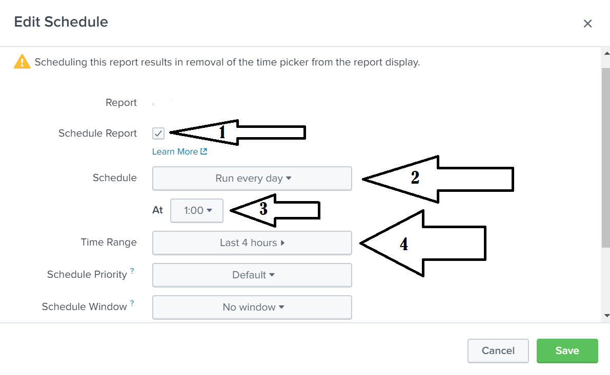
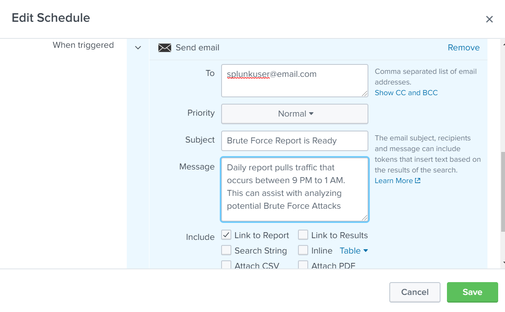

## 18.3 Student Guide: Splunk Reports and Alerts

### Overview

In today's class, you will expand your knowledge of Splunk to create more robust searches, reports, and alerts. 

### Class Objectives

By the end of class, you will be able to:

- Use SPL commands `stat` and `eval` to create new fields in Splunk. 

- Schedule statistical reports in Splunk. 

- Determine baselines of normal activity in order to trigger alerts. 

- Design and schedule alerts to notify if an attack is occurring. 

### Slideshow 

The class slides are available on Google Drive here: [18.3 Slides](https://docs.google.com/presentation/d/1UNsBSMVFMW-mJ9Bm1qHGUsVNIg3yFwFJ1hz7bYEykrk/edit#slide=id.g77f51f26e0_0_0)

-------

### 01. Review Splunk Concepts

Today we will continue to learn about Splunk's capabilities.

 First, let's review what was covered in the last class:

- Splunk provides software utilities that search, analyze, and monitor big data with an easy-to-use interface.

- We can add additional functionality to Splunk with apps and add-ons for specific vendors and industries.

- Splunk has three primary methods for accessing data:
  - Monitoring logs from a system, device, or application that it has direct access to.

  - Forwarding logs from devices into Splunk.

  - Uploading logs directly into your Splunk repository.

- Splunk's primary feature is searching, which uses a coding language native to Splunk called SPL.

- Splunk uses time-based search, in which each event or log has a time associated with it.
  
For today's activities, you will continue to play the role of SOC manager at Omni Military Products (OMP).  You will be tasked with designing more complex SPL queries to identify security issues.

### 02. Activity: Splunk Warm Up

- [Activity File: Splunk Warm Up](activities/02-Warm-Up/Unsolved/README.md)
- [Fortinet Logs](resources/fortinet_IPS_logs.csv)

### 03. Activity Review: Splunk Warm Up
- [Solution Guide: Splunk Warm Up](activities/02-Warm-Up/Solved/README.md)

### 04. Introduction to Splunk Statistics

Security professionals often need to present their Splunk search results to non-technical audiences using simple formats. 

- For example, if we need to illustrate the top 10 IP addresses from a DOS attack, the following results page could be confusing to a non-expert: 

  

Fortunately, Splunk has the ability to display search results in an easy-to-read format using the **Statistics** feature.

  - Splunk uses the Statistics feature to display specific data points from your search results in a simple spreadsheet.

  -  The `stats` command is the most basic Splunk command to create a statistical report, though there are other commands and methods we can use to create statistical reports.

#### Splunk Statistics Demonstration
    
We will use the `stats` command to demonstrate how to create a simple statistical report of the top account names (`Account_Name`) being targeted in a brute force attack.
 
1. Begin by uploading the file [statsreport.csv](resources/statsreport.csv).
 
2. After the file has loaded, run the following command in the Splunk search field:
  
  - `source="statsreport.csv" | stats count by Account_Name`

      - `source="statsreport.csv`: The search being conducted, pulling the source of Windows event security logs.

      - `| stats count by Account_Name`: Pipes the search results, creates a statistical report of the `Account_Name` field and shows the number of events that each `Account_Name` appears in.

3. The results should display in the Statistics tab.
   - There are two columns in this spreadsheet: the `Account_Name` and the count for each result. 
   - We can sort each column by clicking on the up or down arrow. 
    
   
    

We can also create similar statistical reports by organzing results by top values.

- Return the main search page by clicking **Events**.
  - Note: Be sure to clear out your previous search.

- Click the **Account_Name** field and select the report **Top values**.

    

- This will automatically create a statistical report of the top 20 values of the selected field.
  - Note: You may have to click over to the **Statistics** tab.

   

  - This method will only display the top values of the report as indicated by the `limit=<number>` command.

  - 20 is the default limit.

  - The count and the percentage are automatically displayed with the `top` command.
 
#### Creating Fields with eval

We can use Splunk to create new fields and add them to a statistical report. 

- For example, suppose we are analyzing logs for potential brute force attempts.

- Contained in our logs is an event code (`EventCode`) field that assigns numerical codes to events. `EventCode 4740` indicates a user is locked out. 

- Since every user lockout is a potential identifier of a brute force attack, we can create a new field to identify events that contain this event code. 

  -  If the `EventCode` field has a value of `4740`, the field value will be `Potential Brute Force`.

  - If the field does not have a value of `4740`, the field value will be `Not Brute Force`.

We can use the `eval` command to create fields.

  - The `eval` command calculates an expression (such as `if then`) and places the resulting values into a search field.
  
  - If the search field doesn't exist, it creates a new search field.
  
  - If the search field does exist, it overwrites the field with the new values.
     
Enter the following SPL query in your search bar:
 
- `source="statsreport.csv"  | eval BruteForce = if('EventCode'="4740","Potential Brute Force", "Not Brute Force")`

  - `source="statsreport.csv"`: Searches through all the results from the `statsreport.csv` file.

  - `eval BruteForce`: Creates a new field called `BruteForce`.

  - `if('EventCode'="4740",`: States the expression, If the event code field has a value of 4740.

  - `"Potential Brute Force",`: Continues the statement with, If true, name this value `Potential Brute Force`. This is the value to display if the expression for the event is true.

  - `"Not Brute Force"`: Continues the statement with, If false, name this value `Not Brute Force`.
  
Run the script and note that a new field has been created called `BruteForce`.

  - This field shows that all events fall into one of the two values: `Potential Brute Force` or `Not Brute Force`.

    

This is just one example of how to use the `eval` command. If you are interested in learning more about the various ways `eval` can create fields and values, visit [Splunk: eval Documentation](https://docs.splunk.com/Documentation/Splunk/8.0.1/SearchReference/Eval).
  
#### Summary
  
The search feature in Splunk is a powerful tool for data analysis. It is particularly useful for manipulating how data is returned or displayed. 

  - The `stats` and `top` commands can display data in an easy-to-consume format, similar to a spreadsheet.

  - The `eval` command creates additional fields to be added to a statistical report.
  

### 05. Activity: Splunk Statistics

- [Activity File: Splunk Statistics](activities/05-Splunk-Stats/Unsolved/README.md)

### 06. Activity Review: Splunk Statistics
- [Solution Guide: Splunk Statistics](activities/05-Splunk-Stats/Solved/readme.md)

  
### 07. Introduction to Splunk Reports

There are times when statistical reports need to be run at a specific or reoccurring times.
  - For example, if an organization is experiencing suspicious network attacks around 12 a.m., they would want to analyze their network traffic every night at that time.
  
With Splunk, we can create and schedule custom reports to automate this task. 

  - Additionally, Splunk reports can be used to save a search to be run again at a later time.

In the following demonstration, we will create and schedule a report using the same scenario of monitoring brute force attacks: 

  - We were notified that the most recent brute force attacks have happened around 12 a.m. Therefore, we will run a report at 1 a.m. each night to view activity for the past several hours.

  - We'll also automate an email linking to the report after it runs.
  
#### Creating and Scheduling Reports Demonstration

1. Enter the SPL query:
   
   - `source="winevent_logs.csv" | stats count by Account_Name`

2. Select **Save As** > **Report**.

    

3. A window prompts us to title the report:
    - Title it "Brute Force by Account_Name Report."
    - Leave the optional description blank.
    - The content field indicates that the  data is saved as a Statistics Table.
    - The Time Range Picker indicates that we will select a time range to run the report.
    
       
    
4. The next window confirms that the report was created and offers additional settings. 
  
   - Select the **Schedule** option.

      

5. In this window, we will schedule the report:
    - Check the box titled **Schedule Report**.
    - Fill out the schedule as follows:
      - Every day
      - At 1 a.m.
      - From the last four hours
    
      

5. On the bottom of this page, select **Add Actions** to determine what happens after the report runs. 
    - Select **Send email**.
      - Note that the email will not actually send in this test environment.
  
      
   - Configure the email by entering the following: 
      - Priority: Normal
      - Email Subject: "Brute Force Report is Ready"
      - Message: "Daily report pulls traffic that occurred between 9 p.m. and 1 a.m."
      - Include:  Link to Report
          - **Note:** It is not recommended to send raw results in an email, as they may contain privileged information.
            - The link will require authentication of the individual before they can access the report.
      - Select **Save**.
  
     
    
### 08. Activity: Splunk Reports

- [Activity File: Splunk Reports](activities/08-Splunk-Reports/Unsolved/README.md)

### 09. Activity Review: Splunk Reports

- [Solution Guide: Splunk Reports](activities/08-Splunk-Reports/Solved/README.md)

### 10. Break 
  
### 11. Introduction to Splunk Alerts  

So far we have covered how Splunk statistics and reports can help information security professionals identify security issues.

This process can be further improved through the use of **alerts**. 

 - Splunk alerts are designed to automatically notify an individual or individuals when a specific condition, known as a **trigger condition**, is met.

 - Splunk alerts are automatic. Once they are created, Splunk's software checks the trigger condition.

 - SOC analysts are commonly tasked with monitoring and responding to alerts.

A Splunk user selects a trigger condition based on the security event they are trying to monitor.
   
   - For example, if an organization wants to identify if a brute force attack is occurring, they would select a trigger condition that monitors the number of login attempts on a Linux server.

Trigger conditions contain the following:
- **Search/Report results:** Indicate which criteria to check.
  - For example: 300 logins have been attempted.

- **Time parameters:** Indicate the time period to check.
  - For example: Within last 24 hours.

- **Schedule:** Determines the frequency by which these criteria are checked. 
  - For example: Every day at 12 p.m.

When the condition is met, a **trigger action** is executed to alert the Splunk user.
  - For example: Send an email to soc_manager@acme.com.

In summary, the complete alert would be:

  - Every day at 12 p.m., check if at least 300 logins have been attempted within the last 24 hours. If this condition is met, send an email to soc_manager@acme.com.
  

#### Baselining 

A required skill for designing strong alerts is avoiding false positives and false negatives.

**False positives** occur when conditions are met and an alert is triggered, but the security situation being monitored did not actually occur.
  - For example, an alert is created to detect suspicious login activity on our Linux server.

  - The chosen criteria checks activity every hour and creates an alert when 10 login attempts occur within an hour.

  - Several alerts were triggered per these conditions, but further research determined the alerts were set off by normal user activity.

  - SOC realizes that 10 login attempts within an hour is not very suspicious. 

**False negatives** occur when the condition is met and an alert is not triggered, meaning the security situation occurred undetected. 

- For example, an alert was created to detect suspicious login activity on our Linux server.

- The chosen criteria checks activity every hour and creates an alert when 500 login attempts occur within an hour.

- Suspicious login activity did occur on the server when an attacker tried to brute force the linux server with 400 attempts, but no alerts were triggered. 

Security professionals can avoid these false results by using **baselines** to design their alerts. 
    
- Baselining is a method of looking at historical data to determine what is considered normal activity.

- The more historical data available, the more accurately we can determine a baseline. 
   
#### Baselining Walkthrough

1. Upload and open the following logs in Splunk: [alertlogs.txt](resources/alertlogs.txt).
   
    - That these logs are for one of the servers we need to monitor login activity on.

    - If a security professional wants to create a good alert to notify for suspicious activity on this server, they would look at past login data to determine a normal activity level.

    - These logs are only 24 hours of normal activity. In a more realistic scenario, we would want to look at a larger date range.

2. Normal activity ranged from 4 to 22 logins per hour.

    

3. If possible, we also want to compare normal activity to suspicious activity.
   
    - For example, you were told that past suspicious activity had 50 login attempts in an hour. (This isn't illustrated in these logs).
    
4. We would then determine the level or count where the normal activity becomes suspicious.
   - For this example, we could determine that an appropriate level of login attempts per hour is 30, after which it becomes suspicious.

   - This level is called the threshold.
  
The **threshold** is the condition that triggers an alert.

  - Creating thresholds to design good alerts is a common task for SOC professionals.

  - There is often no perfect threshold, as the data being monitored is typically dynamic.

  - Thresholds are constantly adjusted as false positives or false negatives occur.
  
#### Alert Fatigue
    
Another challenge we face when creating alerts is **alert fatigue**.

- Alert fatigue occurs when security professionals receive so many alerts that they are prevented from adequately responding to each one.

- Even when an organization builds good alerts and an alert gets triggered, security professionals will need to research and respond to it.

- If an organization has too many alerts triggered, even if they are good alerts, security professionals will often miss issues as they get lost in the noise.
 
Consider the following example of how alert fatigue can have a major impact on organizations:

- in 2014, a breach at Target cost the company $252 million and led to the resignation of its CIO and CEO.  

- One of the company’s security products actually detected the breach. 

- However, due to the high quantity of alerts and the frequency of false alerts, the company’s IT security team ignored it.
   
To prevent alert fatigue:
  - Limit the quantity of your alerts to a manageable level for your organization.

  - Provide indicators in the alerts of the severity, so alerts can be prioritized, such as critical vs. low priority alerts.
     

### 12. Activity: Baselining

- [Activity File: Baselining](activities/13-Baselining/Unsolved/README.md)
- [Windows Server Logs](resources/windowsrawlogs.txt)

### 13. Activity Review: Baselining

- [Solution Guide: Baselining](activities/13-Baselining/Solved/README.md)
  

### 14. Creating and Scheduling Alerts

We just covered how baselining is used by security professionals to determine thresholds to create good alerts.

Now that we can determine accurate baselines, we can continue with our scenario and design the alerts.

  - We will design an alert to trigger when at least 30 login attempts occur in an hour.

  - We will run this alert to check the count every hour. 

  - Once the alert is triggered, an email will be sent.
  
#### Alert Creation Walkthrough

1. Open up the logs from the previous baselining walkthrough: [alertlogs.txt](resources/alertlogs.txt).

2.  Select **Save As** > **Alert**.

    - This will use the search we have saved as the alert.
  
     

3. Title the alert "Log Validation Alert."
  
4. Indicate that we want the alert to check the condition every hour. 
  
   
  
5. Scroll down to the **Trigger Conditions** section.
    - Here, we will indicate that the alert  is triggered when the number of results is greater than 30.

    - Remember, 30 was the threshold we determined in the previous walkthrough.

    - There are many options we can use for the trigger, such as greater than, less than, drops by, and rises by.  

    

5. At the bottom of this page, select **Add Actions** and **Send email**.
  
   
  
7. Fill out the following fields:
   - Priority:  Normal
   - Email:  soc@acme.com  (Note: In this test environment, the email will not actually send.)
   - Email Subject: "Log Validation Report" 
   - Message: "Logs surpassed 30 attempts with an hour. Please investigate."
   - Select **Link to Report**.
   - Select **Save**.
  
   

### 15. Activity: Creating and Scheduling Alerts

- [Activity File: Creating and Scheduling Alerts](activities/16-Alerts/unsolved/readme.md)
- [Bonus Logs](resources/bonus_logs.txt)

### 16. Activity Review: Creating and Scheduling Alerts

- [Solution Guide: Creating and Scheduling Alerts](activities/16-Alerts/solved/readme.md) 

-------

© 2020 Trilogy Education Services, a 2U, Inc. brand. All Rights Reserved.  
