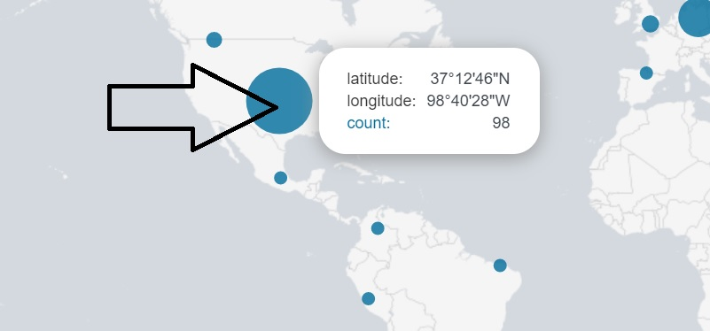

## 19.1 Student Guide: Splunk Dashboards and Visualizations

### Overview

In today's class, you will create dashboards that display useful visualizations of your Splunk searches.  

### Class Objectives

By the end of class, you will be able to:

- Create visualizations of single and multiple value searches. 

- Use the `geostats` and `iplocation` commands to add location-based visualizations to searches. 

- Combine multiple visualizations in a single dashboard. 

- Modify dashboards with time range input and drilldown capabilities.

### Lab Environment

During this class, we will use the Splunk instance inside the Ubuntu VM.

- To launch, move into the `/splunk` directory and run the following script: 

  - `sudo ./splunk.sh`
  
  - On the first time running, select option 1.
  - All subsequent times, select option 2.

- Once the script completes, pull up your web browser in the Ubuntu VM and enter in the following URL: 

  - `localhost:8000/`

- At the Splunk Login Page, use the following credentials:
    - User: `admin`
    - Password: `cybersecurity`
  
- The logs for each lesson and activity are located in the `/splunk/logs` directory. 

### Slideshow

The class slides are available on Google Drive here: [19.1 Slides](https://docs.google.com/presentation/d/13rAkh97wywEBWrNe90WOVdnQnUWvkafPbNk-iY_oTcI/edit#slide=id.g4789b2c72f_0_6)

-------

### 01. Welcome Back and Unit Recap

Today you will learn how Splunk's visualization capabilities are used by security professionals to identify and mitigate security issues.

Let's review what we covered in the last class:

- Splunk uses the Statistics feature to display specific values from search results in an easy-to-read spreadsheet.

- The `eval` command is used to design new fields or modify existing fields.

- Splunk uses reports to save searches and run them at designated times.

- Splunk alerts are designed to send automatic notifications when a specific condition, known as a trigger condition, is met.

- Designing poor alerts can cause two types of issues: false positives and false negatives.

  - False positives occur when conditions are met and an alert is triggered, but the security situation being monitored did not actually occur.

  - False negatives occur when the condition is met and an alert is not triggered, meaning the security situation occurred undetected.
  
- Baselining is a method of looking at historical data to determine how much activity is considered "normal."

- Security professionals use baselining to determine a threshold.

  - A threshold is the condition or level that, when met, triggers an alert.

- Security professionals may encounter the challenge of alert fatigue. This occurs when they receive so many alerts that they cannot adequately respond to each one.

### 02. Introduction to Visualizations

In previous classes, we learned how to visualize statistics with charts. Today we will expand our Splunk capabilities to include adding more contextualized and informative visuals. These can assist with analysis and research of system and security issues. 

- For example, the following table shows the the number of logins per minute into a web application:
  
  

- The following gauge visualization contextualizes that number by including the severity of the login count.
  
  
      
Splunk uses visualizations to make complex data easier to understand and analyze:

- Splunk visualizations allow interactivity and offer more in-depth details.

- These visualizations range from simple bar and column charts to more complex horizon charts and punchcards. 

Splunk visualizations can display single values, such as total count of attacks, and multiple values, such as a chart of attacks correlated by attack type. 
  
#### Single Value Visualization Walkthrough

In this demonstration, we'll use a radial gauge visualization.

- **Radial gauges** are similar to the RPM dial found in the dashboard of a car. 

  - RPM (revolutions per minute) is a single value visualized in the dial.

  -  The dial includes a red section that indicates when the level is too high.
 
In this demonstration, we will use event data from a Fortinet Firewall Attack Log to create a radial gauge measuring the Oracle.9i.TNS.OneByte.DoS attack over a one hour period. 

1. Log into Splunk and open the Search & Reporting app.

2.  Load the following Splunk File: fortinet_IPS_logs.csv

3. Create the search value and enter the following search:

    - `source="fortinet_IPS_logs.csv"   attack_name="Oracle.9i.TNS.OneByte.DoS"`
    
    Specify a specific one-minute period by double-clicking the bar representing data from 4:24 PM (or another time of your choice)

    - While we are selecting a one-minute period as an example, a real SOC would make their own determination of which time period to monitor. This will depend on their own environment and the attacks they have seen in the past.

    
    
4. Turn this minute count into a single value by piping the SPL search into a `stats count as total` field:

   - Add `| stats count as total` to the end of the search and run the search again. 

   - Make sure the search spans the past 1 minute.

  

   **Note:** Your results may vary.

5. Next, we will turn this single value into a radial gauge. 

   - Select **Visualization** and then select the **Radial Gauge** option.

   

   - The different color values in this radial gauge were created by default by Splunk:
      - Green: 0-30
      - Yellow: 30-70
      - Red: 70-100

6. We can customize these ranges and colors based on our needs and preferences.
 
    - To edit, select **Format** > **Color Ranges** > **Manual**.

     

   - In this example, the value of that minute is 10 events, which we may consider the top of a normal level.

   - Change the ranges to:
      - Green: 0-10
      - Yellow: 10-20
      - Red: 20-30
  
      
  
7. Now the radial gauge displays the 10 events at the top of the green range.

    - Save this radial gauge by selecting **Save As** >  **Report** > **Choose a Title**.

    - Select the radial gauge icon under **Content**.
  
     
   

### 03. Activity: Single Value Visualizations

- [Activity File: Single Value Visualizations](activities/03-Single-Value-Visualization/Unsolved/README.md)

### 04. Activity Review: Single Value Visualizations

  - [Solution Guide: Single Value Visualizations](activities/03-Single-Value-Visualization/Solved/README.md)
  

### 05. Multiple Values Visualization

We just created a visualization with a single value. Now, we will use visualizations to display multiple values. 

  The following is an example of a scenario in which multiple value visualizations are useful:

  - A business is experiencing brute force attacks against a web application. They want to visualize the list of users being attacked and the number of attacks experienced by each user.
  
Note that these statistics will still display in a spreadsheet.

  
However, we can convert these spreadsheets into simple and interactive visualizations:

- For example, below is the data found in the spreadsheet displayed in a column chart visualization.

  

- Note the interactivity: when the mouse is hovered over a user, a count of the attacks experienced by this user is displayed. 

  
  
#### Multiple Value Visualization Walkthrough
In this demonstration, we will use event data from Windows event logs to create a pie chart of top user logins. 

 - Load the following Splunk File: demo_winlogs.csv
  
1. Run the following search:  

   - `source="demo_winlogs.csv" subject="An account was successfully logged on"`
   
   - **Note: Your values and counts may differ from the screenshots.**
 
   

2. Create a report of the top values. 

    - Click the **User** field and select **Top values**. 

   
 
3.  Modify the top value to display the top 10 values.
    -  Click **Search** to update the results.
 
      
 
4. Under **Visualization**, select the pie chart icon under the **Bar Chart** heading.
 
    
   
   - The top 10 users with login data are displayed as a pie chart.  
 
    
  
5.  Note the interactivity when moving your mouse over any piece of the pie. 
  
     - It shows the specific count and percentage of each user.
  
     
   
6. Save the pie chart by selecting **Save As** > **Report** > **Choose a Title**.

    - Select the pie chart icon under **Content**.
  

### 06. Activity: Multiple Values Visualization

- [Activity File: Multiple Value Visualizations](activities/06-Multiple-Value-Visualization/Unsolved/README.md)

### 07. Activity Review: Multiple Values Visualization

- [Solution Guide: Multiple Value Visualizations](activities/06-Multiple-Value-Visualization/Solved/README.md)

### 08. Geographic Maps Visualization

We can use visualizations to gain further insight into our data, such as where in the world an attack or activity originates.

  - Organizations can monitor where users access their application from to help determine the source of security issues.

  - For example: A business knows that their application customers are primarily located in the United States. If they are notified that a significant number of users have started accessing their application from another place in the world, they will take this as a cue to investigate the activity.
  
Splunk can create location-specific reports with the `iplocation` and `geostats` commands. 

#### Geographic Maps Visualization Walkthrough

Load the following file: `demo_httplogs.csv`

1. Run the following SPL command in the Search & Reporting app :
    - `source="demo_httplogs.csv"`
  
   - This log shows HTTP activity.

2. Identify the field containing IP address. This will be used to determine the location. 
  
   - We'll use the source IP address, indicated by the field `src_ip`.
      - We can also use the destination IP (`dest_ip`).
  
   - To determine the location data of the IP, run the following SPL command:
     - `sourcetype="stream:http" | iplocation src_ip`
  
   - The `iplocation` command will output the city and country data of the `src_ip` field.
  
   - **Note:** To get the city and country results, you may have to select these fields from the **more fields** option below the field list.

      

3. Search for the **City** and **Country** fields. 

    - Check the box to add the fields.

       

    - The city and country should now appear on the **Selected Fields** list.

       

   - Click on the **Country** field to list the countries found based on the source IP address.

Next we will introduce the `geostats` command, which uses the location data found with the `iplocation` command to map latitude and longitude data for each event.
  
1. Use the `geostats` command by running the following search: 

    - `source="demo_httplogs.csv" | iplocation src_ip | geostats count`  
  
2. Next, go to the **Visualization** tab. 
   
   - Splunk has recommended a visualization called **Cluster Map** based on your search. 
   
  
        

   - Select the cluster map icon. This tool places our search results on a geographic map.

       

3. Hover over the circles to see the interactivity. It will display the latitude, longitude, and count of each circle.

   - The size of each circle indicates the count of events in each city.

       

   - Use the **+** and **-** buttons on the left of the map to zoom in and out on the map.

       

In summary, geographic maps within Splunk are powerful visualizations that can help security teams quickly understand where activity is coming from.

### 09. Activity: Geographic Maps Visualization

- [Activity File: Geographic Map Visualization](activities/09-Maps/Unsolved/README.md)

### 10. Activity Review: Geographic Maps Visualization

- [Solution Guide: Geographic Maps Visualization](activities/09-Maps/Solved/README.md)

  
### 11. Break

### 12. Introduction to Dashboards

So far, we've covered the following visualizations. 
 - Single value
 - Multiple values
 - Geographic maps
 
While each visualization is useful on its own, they are even more effective when grouped and displayed together. 

- For example, an organization that is monitoring a website may want to view all of the following at the same time:

  - The volume of successful logins on the website.
  - The volume of unsuccessful logins on the website.
  - A geographic map illustrating where the activity is coming from.
  - A pie chart displaying the specific pages of the website that are being accessed.
    
- Viewing all this information together can provide a security analyst with a complete picture of the state of their web application.

We can use a Splunk tool called dashboards to do just this.

- **Dashboards** are a collection of multiple visualizations in a single location.

- The visualizations are placed in different sections, called **panels**.

- Panels can contain:
  - Single value visualizations
  - Multiple value visualizations
  - Geographic maps
  - Statistical charts

- SOCs often have dashboards displayed on multiple screens in their operations room to provide availability and functionality across their staff.
   
   
     
#### Creating Dashboards Demonstration

We will demonstrate how to create a dashboard using the following scenario:

 - As a SOC manager, you would like to create a single three-panel dashboard to monitor your Windows server. You want the panels to include:

   - A radial gauge of successful logins.
   - A pie chart of users logging in.
   - A statistical chart of the data in the pie chart.

**Note: We will be using a log file for this demonstration which was already used:** `demo_winlogs.csv`
  - **There is no need to reload this file.**

We will still go through the process of creating each visualization. We'll start with the radial gauge.

1. Add the radial gauge with the following search: 
   - `source="demo_winlogs.csv"  signature="An account was successfully logged on" | stats count as total`

    - Design and format the radial gauge visualization as needed.

3. To add this radial gauge to a dashboard, select **Save As** >  **Dashboard Panel**.

   

4. Since we haven't created the dashboard yet, select the **New** dashboard option.
   - Name the dashboard "Windows Monitoring Dashboard."
  
    
  
   - Name the panel "Windows Login Count."

   - Select **Radial Gauge** under **Panel Content**.
  
    
  
   - Select **Save**.

5. Confirm that the dashboard has been created by selecting **View Dashboard**.
      - This dashboard has only one panel. Let's add the next panel. 

    
  
  

    
  
6. Next, we will add the pie chart. 

    - Return to the Search & Reporting app and add the following search:
      - `source="demo_winlogs.csv"| top limit=10 user`
  
    Select the pie chart as the visualization. Then select **Save As** > **Dashboard Panel** again.
    
7. Since we already created the dashboard, we just need to add the new visualization to it.

   - Select **Existing** > **Windows Monitoring Dashboard**.

    

   - Title the Dashboard Panel "Top 10 Windows Users."

   - Select **Save** > **View Dashboard**.

   - Now the dashboard has multiple visualizations.

    

8. Dashboards can be edited by selecting **Edit**.
   - Rearrange panels by  dragging the panel to a new location on the dashboard.

   

   

   - Select **Save** to save your changes to the dashboard.

9. The last step is to add the third panel to the dashboard.
     - Add the search:
       - `source="demo_winlogs.csv"| top limit=10 user`
    - Follow the same steps for adding this to the dashboard.
    - The completed dashboard should look like the following: 
    
      

### 13. Activity: Creating Dashboards

- [Activity File: Creating Dashboards](activities/13-Dashboard/Unsolved/README.md)

### 14. Activity Review: Creating Dashboards

- [Solution Guide: Dashboards](activities/13-Dashboard/Solved/README.md)
  
### 15. Drilldowns and Dashboard Interactivity

Similar to many other applications in Splunk, dashboards have advanced features that can help information security professionals with researching security issues. 

These include:
  - Direct input modifications within dashboards.
  - Drilldowns within panels for further analysis.

We will walk through how to configure these features by using the dashboard and scenario from the last section:

  - As a SOC manager, you created a three-panel dashboard to monitor your Windows server.

  - You will expand the functionality of this dashboard by:
    - Modifying the date and time ranges being analyzed directly on the dashboard.

    - Adding a drilldown into the visualizations to assist with further analysis.
    
#### Time Input Walkthrough
 
We will first walk through how to configure the dashboard to modify the date and time range.
 
1. Open the dashboard created in the last lesson:
    - Select **Dashboards** > **Windows Monitoring Dashboard**.
   
    
 
2. Select **Edit** to modify the dashboard.
   
   - Select **Add Input**, then select **Time**.

   - We can modify many features in the dashboard. Today, we will only cover the Time feature.
   
   
   
3. The top of the dashboard should now show a field where you can input time.
 
   - This feature will modify the time range of data displayed in each panel.

     
 
   
4. For the panels to work with this new feature, we have to reconfigure some settings for each panel.
   
   - To modify the first panel, select the magnifying glass icon to edit the search for the radial gauge.
 
     
 
   - Select **Shared Time Picker**.
     - This is the input that we just created.

   - Select **Apply**.
   
   
 
   - Repeat these steps for the other two panels.
 
   - Select **Save** to save the whole dashboard.
 
- There is now a working input on the dashboard where we can quickly change the time range of each panel.
 
  
   
#### Drilldown Walkthrough
 
Next, we will add a **drilldown** to help us research specific data from a panel. 

A drilldown is similar to a dropdown menu, and has a variety of functions. 
 
1. Select the **Edit** option to modify the dashboard.
  
2. On the pie chart, select the three vertical dots for more actions, then select **Edit Drilldowns**.

    - Select **Link to search** in the dropdown.
    - Keep **Auto** selected.
    - Click **Apply**.

   

     

   - Save the dashboard. 
  
3. We now have the ability to search for a specific piece of the pie chart.

   - Select one of the pieces of the pie. 

    

    - This creates a search based on what was selected.

    

This drilldown feature allows a SOC analyst to quickly analyze data directly from the dashboard.

### 16. Activity: Advanced Dashboards

- [Activity File: Advanced Dashboards](activities/16-Advanced-Dashboards/Unsolved/README.md)

### 17. Activity Review: Advanced Dashboards

- [Solution Guide: Advanced Dashboards](activities/16-Advanced-Dashboards/Solved/README.md)

  
---

© 2020 Trilogy Education Services, a 2U, Inc. brand. All Rights Reserved.  
