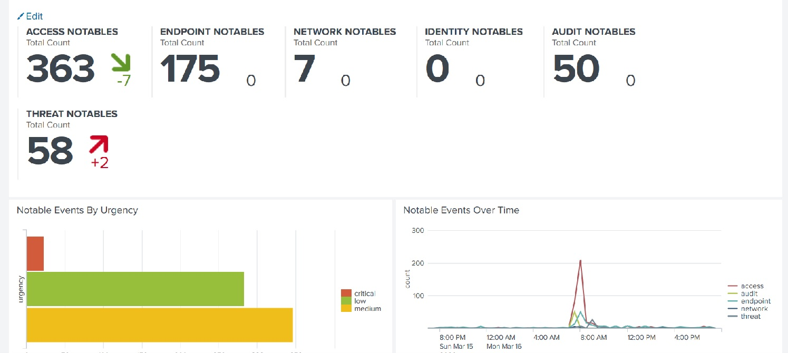
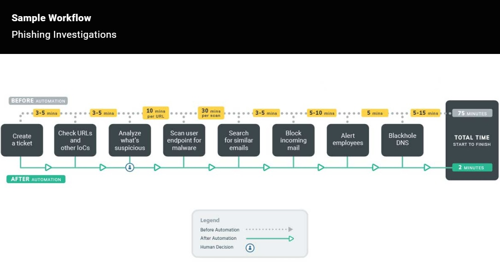
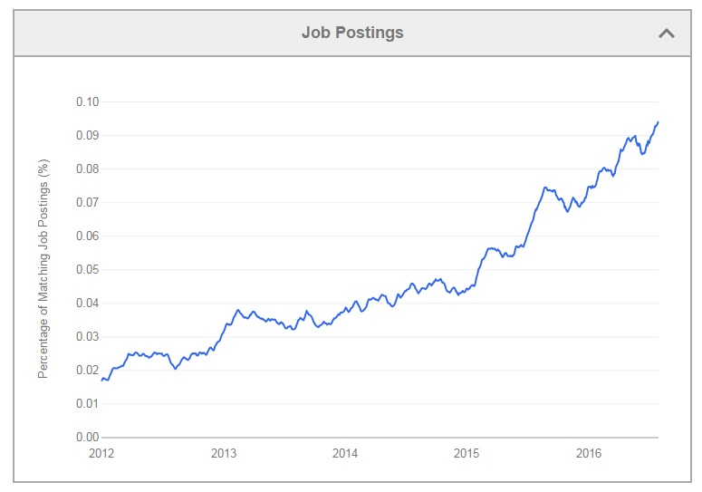

## 19.2 Student Guide: Advanced Security Monitoring Tools

### Overview

In today's class, you will learn about advanced monitoring tools security professionals utilize to monitor and analyze security events. Then, we will explore career paths and certifications related to Splunk and SIEM skills. The class will conclude by completing several modules of the Splunk Fundamentals Certification.

### Class Objectives

By the end of class, you will be able to:

  - Differentiate between various advanced security monitoring solutions, such as SOARs, UBAs, and UEBAs and determine which is most appropriate for a specific security situation.

  - Understand how knowledge of SIEM software and Splunk is valued in the information security job market.

  - Work towards a Splunk certification using the Splunk Fundamentals eLearning program. 

### Slideshow

The lesson slides are available on Google Drive here: [19.2 Slides](https://docs.google.com/presentation/d/12wxXlRDhhBY4YZo3aN8vK892Lk_eRAR8-w1RQfKgBPU/edit#slide=id.g4789b2c72f_0_6)

-------

### 01. Introduction to Advanced Security Monitoring Tools  (0:15)

Today we will be learning about other information security products used by security organizations.  

  - We will begin by briefly learning about Splunk's SIEM product, Enterprise Security, and explore several other security products available in the marketplace. 

  - Then, we will focus on security careers that require the knowledge and tools learned in the last five classes. 
  
  -  We will conclude by introducing and working towards the Splunk Fundamentals Certification.

## Splunk ES

Over the past five classes, we have covered many of Splunk's capabilities and add-on applications.

  - While these Splunk capabilities can assist in security investigations, Splunk has a SIEM product which is specifically designed to assist security professionals.

Splunk's SIEM product is called **Splunk Enterprise Security** or **Splunk ES**.
  - Splunk ES provides security professionals insights from machine-generated data, such as:
    - Network devices like routers and firewalls
    - Endpoint devices like antivirus solutions
    - Vulnerability management systems like Nessus

Splunk ES is one of the most popular add-on products for security professionals as it has pre-created dashboards, reports and built in features:

Splunk ES features allow you to:
  - Identify, prioritize, and investigate security events.
  - Gain insights into security events.
  - Monitor the status of your security environment.
  - Audit your security events.
  - Navigate these tasks with a pre-built, easy-to-use interface.
  
The following image illustrates how the Splunk ES Dashboard can be used to help monitor security events:

   
    
Learning the capabilities of Splunk ES is out of the scope of this class, but if you are interested in researching the capabilities offered by Splunk ES, you can explore the following resources on your own time:

   - [Splunk: ES Video Demo](https://www.youtube.com/watch?v=HN4zGIyi3PI)  
   - [Splunk: ES Documentation](https://docs.splunk.com/Documentation/ES)
   
## Advanced Security Monitoring Solutions  

While SIEM products such as Splunk ES provide many monitoring benefits, organizations are now integrating  **advanced security monitoring solutions** into their businesses to provide additional protection.
 
  
  - The core goal of all security monitoring solutions is to assist with detection of information security events.

  - Advanced security monitoring solutions provide additional benefits such as machine learning, artificial intelligence, automation and response.

  - The most popular advancements in the information security industry are:

    - User behavior analytics (UBA)
    - User and entity behavior analytics (UEBA)
    - Security orchestration, automation and response (SOAR) 
 

**UBA** is a security monitoring tool that  uses machine learning, artificial intelligence, and data processing to detect abnormalities in user activity.

  - UBA gathers information about typical user behaviors and creates baselines.
    - For example, UBA can gather information on the servers and systems that a user accesses as well as when and how frequently they do so. 

    - UBA can then create alerts for when a user's activity deviates from this typical behavior. 

    - If a user usually only logs onto a server between 9 a.m. and 5 p.m., Monday through Friday, UBA would create an alert if the user logged in on at 2 a.m. on a Saturday.

**UEBA** is a security monitoring tool similar to UBA, except it extends its monitoring to other "entities."
  - Entities can include routers, servers, and IoT (Internet of Things) devices.   

  - UEBA looks at normal user and entity behaviors, and creates alerts when users or entities show abnormal activity.
 
**SOAR**, comparable to a SIEM, automates security processes and responds to security incidents.
  - Examples of automating security processes include:
    - Creating logging.
    - Assigning priorities to security incidents.

  - Examples of responding to security incidents include:
    - Launching security investigations.
    - Threat mitigation.
   
  - Similar to a SIEM, SOAR gathers machine data from multiple entities and analyzes the data for security events.
    - SOAR uses **playbooks**, which detail the processes and response actions for specific event.

    - Playbooks are designed and configured by each organization.
      - For example, an organization can design a playbook to automate the response to a phishing incident.
        - The below image illustrates how SOAR uses a playbook to automate each step of the response.

        - This diagram also illustrates how using SOAR playbooks can decrease incident response time.

   
             
        
In the next activity, you will research the different vendors that offer these advanced security monitoring tools and learn about the different capabilities of each product.
 

### 02. Activity: Advanced Security Monitoring Tools (0:20)

- [Activity File: Advanced Security Monitoring Tools](activities/05-Advanced-Security-Monitoring/Unsolved/README.md)

### 03. Splunk Careers  (0:15)

We will now examine how the Splunk knowledge and tools learned over the past five days can apply to careers and certifications in the information security industry. 

  - Even if an employer doesn't use Splunk, many Splunk skills can be easily applied to other vendors and similar products.

  - For example, if a security professional who is familiar with Splunk ES takes a position at an organization that uses LogRhythm, they should be able to note the similar core capabilities and quickly adapt to the different software. 
    
Splunk skills is a desireable qualification for many infosec positions. For example: 

  - **SOC analysts** work in a Security Operations department alongside security engineers. Their positions involve detecting, containing, and potentially remediating information security threats. Most SOC analysts use SIEM products, such as Splunk ES, to monitor their environment.
  
  - **Cyber threat analysts** analyze an organization's networks and applications to protect organizations from cybercriminals. Cyber threat analysts often use Splunk products to make predictions about cybercriminals and what attacks they may conduct.
  
  - **Application security engineers** can use Splunk to fix web and mobile application vulnerabilities. AppSec engineers use Splunk to analyze their application logs to assist with creating and testing their remediation.
  
  - **Network security administrators** use products like Splunk to monitor suspicious network traffic, such as DDOS attacks. They can use the findings from Splunk logs to mitigate and prevent against future attacks.
  
  - **Incident response managers** can use Splunk to monitor the status of ongoing security investigations when an incident has occurred.
  
Some of these positions, such as the SOC and threat analyst, may use Splunk products as part of their primary responsibilities.

  - Other security positions, such as application security administrators, may only use Splunk for a small portion of their tasks.

  - Either way, understanding how to use Splunk is a valuable skill for information security professionals.
  
Splunk is already a required skill in many roles, and the industry demand is increasing every year.
  - Point to the following chart to illustrate the growth in demand.
  
   
   ([Source: Edureka](<https://www.edureka.co/blog/splunk-careers-big-data-jobs/>))
  
In the next activity, you will search through several job sites to find positions where Splunk is either a required skill or a primary responsibility.

### 04. Student Do: Splunk Careers (0:15)

- [Activity File: Splunk Careers](activities/09-Splunk-Careers/Unsolved/README.md)    

### 05.  SIEM Certifications  (0:15)

Similar to other domains in cybersecurity, Splunk skills are validated through certifications. These allow candidates to prove they have the required skills to assist an organization.

- Having a certification can help a cyber professional acquire a new position or receive a promotion, and can provide networking opportunities with professionals who have similar certifications. 

The following are certifications that Splunk offers:

- **Splunk Core Certified User**: Entry-level certification that demonstrates a user's basic ability to use the Splunk software.

- **Splunk Core Certified Power User**: Demonstrates a user's foundational skills with Splunk’s core software, in addition to more complex skills such as creating calculated fields and data models.

- **Splunk Core Certified Advanced Power User**: Demonstrates a user's capability to design reports, complicated searches, and dashboards.

- **Splunk Enterprise Certified Admin**: Focuses on an individual's ability to support daily administrative tasks using Splunk Enterprise software.

- **Splunk Enterprise Certified Architect**: Focuses on a Splunk administrator's role to support advanced troubleshooting, configurations, and deployments within Splunk Enterprise.

- **Splunk Enterprise Security Certified Admin**: Focuses on a Splunk administrator's role to support installation, advanced troubleshooting, configurations, and deployments with Splunk Enterprise Security environment.
  
**Note:** If you are interested in learning more about the tracks and certifications Splunk offers, check out the following link: 
  - [Splunk: Training](https://www.splunk.com/en_us/training.html)

Like many certifications in the infosec field, most of these certifications are expensive. Many of them cost over $2,000.
 
- Fortunately, Splunk offers the first certification class, **Splunk Fundamentals 1** for free. There is only an exam fee of approximately $100.
  
In the final activity of the day, you will:
  - Set up a Splunk account.
  - Register for the Splunk Fundamentals 1 eLearning Course.
  - Complete the first three modules of the course.

You will have to independently complete the remaining modules, sign up for the certification exam, and take the exam.

### 06. Splunk Certification Activity (1:00)

- [Activity File: Splunk Certification](activities/12-Splunk-Certifications/Unsolved/README.md)

### 07. Review Splunk Certification Activity  (0:05)

Note the following resources for taking the exam:

  - [Splunk: Journey to Getting Certified](https://www.youtube.com/watch?v=-faNAbfUPFE&feature=emb_logo)  (video)
  - [Splunk: Exam Registration Tutorial](https://www.splunk.com/pdfs/training/Exam-Registration-Tutorial.pdf)
  - [PearsonVUE: Splunk Exam Registration](https://home.pearsonvue.com/splunk)
  - [Splunk: Certification Study Guide](https://www.splunk.com/pdfs/training/Splunk-Certification-Exams-Study-Guide.pdf)

In the next class, we will wrap up the SIEM unit with a challenge activity that will incorporate everything you have learned about SIEM. 

    
-------

© 2021 Trilogy Education Services, a 2U, Inc. brand. All Rights Reserved.  
