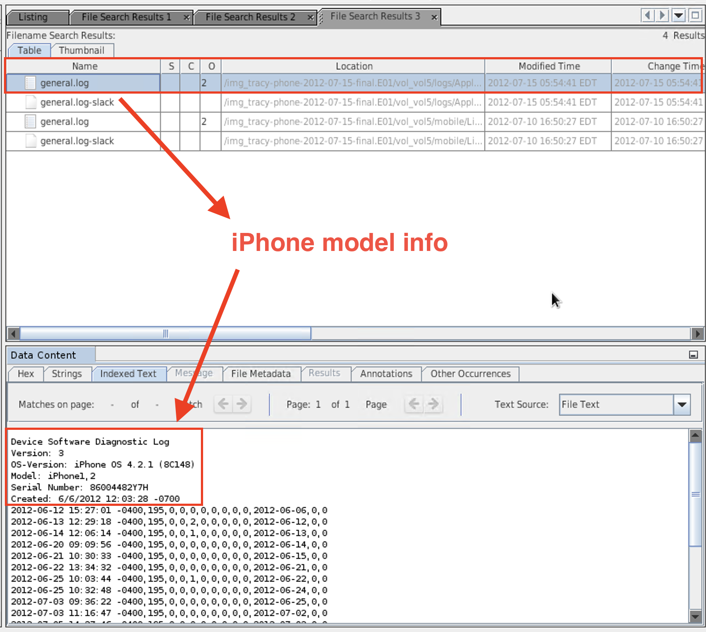
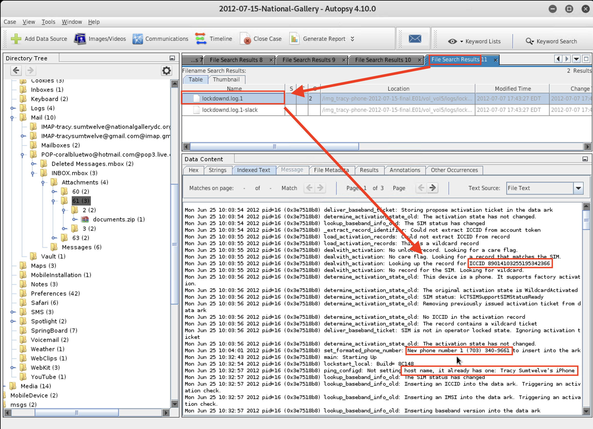
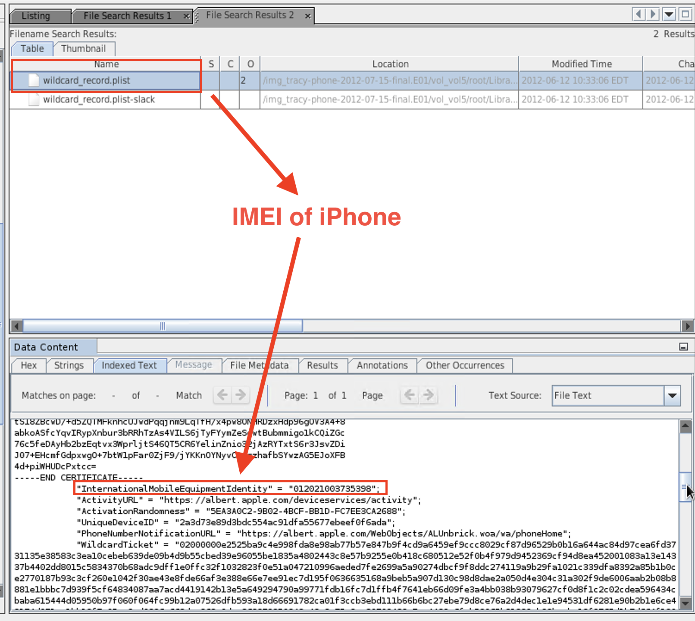
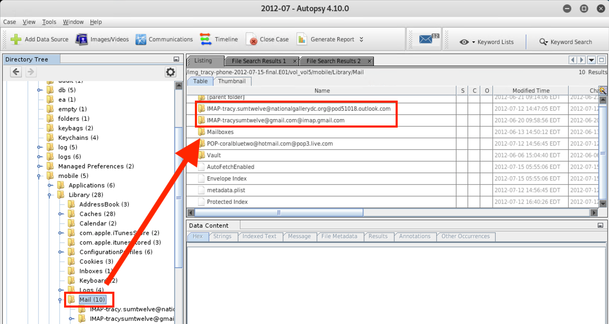

## Solution Guide: Mobile Forensics Evidence Analysis

In this activity, you practiced how to procure relevant case file data and established ownership of a device. 

---

- MD5 and SHA-265 hashes of the iPhone disk image: 

    - MD5 hash: `34c4888f095dc3241330462923f6fea5`
    
    - SHA-256 hash: `71aed05a86a753dec4ef4033ed7f52d6577ccb534ca0d1e83ffd27683e621607`
 
- Device Information:  

  - Device model: iPhone (1-2)
    - Autopsy was not able to successfully determine the version of the iPhone. It was between Version 1 and Version 2.   
  
  - Device host name: Tracy Sumtwelve’s iPhone
  
  - OS version #: iPhone OS 4.2.1 (8C148)
  
  - Install time: 6/6/2012 19:03:28
  
  - Device serial #: 86004482Y7H
 
     - Located In: `/mobile/Library/Logs/AppleSupport/general.log`
 
    
 
  - Integrated Circuit Card ID (ICCID) number: `89014103255195342366`
  
       - Located in: `/logs/lockdownd.log.1`
 
     
 
   - International Mobile Equipment Identification (IMEI) number: `012021003735398`
 
      - Located in: `/root/Library/Lockdown/activation_records/wildcard_record.plist`
 
      

- Tracy's information:
    - Tracy's phone number: (703) 340-9661
    
    - Tracy's email addresses: tracysumtwelve@gmail.com,  tracysumtwelve@nationalgallergydc.org
 
      - Located in: `vol5/mobile/Library/Mail`
 
     
 
#### Bonus
 
 Research the two types of IDs below and identify how they are used to identify mobile devices:
 
  - International Mobile Equipment Identification (IMEI) number
 
    - From [IMEI.com](https://www.imei.info/news/your-imei-number-will-tell-you-everything-about-your-iphone/):

      - Each Apple product is associated with its own unique identification number, known as an International Mobile Station Equipment Identity IMEI.

      - It bears detailed information about the phone, such as its model, brand, production date, and the manufacturer`s site.

      - Apple recently stopped printing the unique IMEI numbers on the back of each device, but they are still easily accessible in the About section of an iPhone's general settings.

      - These numbers can be used by phone companies to match a particular device to phone networks, aiding in the identification of callers. 
  
  - Integrated Circuit Card ID (ICCID)
 
    - From  [hologram.io](https://hologram.io/blog/whats-an-iccid-number-and-why-does-it-matter-for-cellular-iot/):
 
       - The integrated circuit card ID (ICCID) is a unqiue 19- or 20-digit number printed on a SIM card used to identify the card. 
 

----
 
&copy; 2020 Trilogy Education Services, a 2U Inc Brand.   All Rights Reserved.

