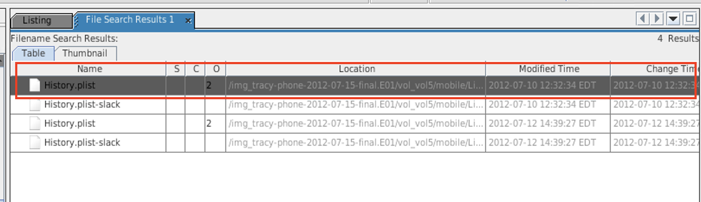
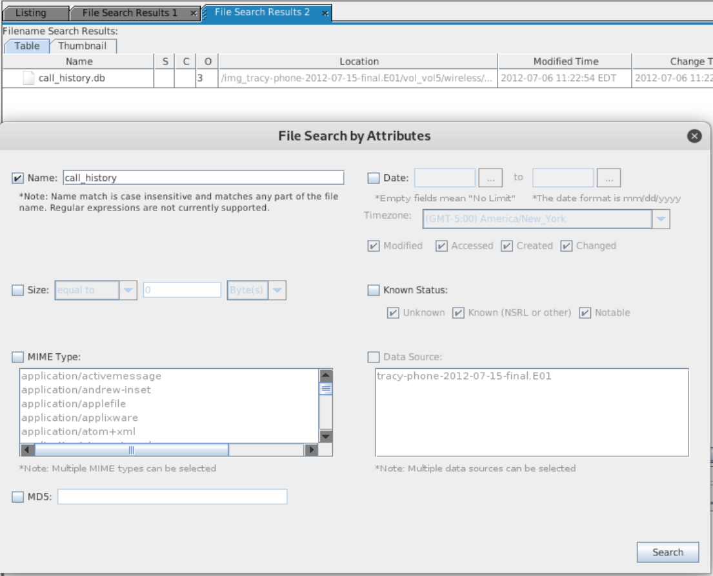

## 21.2 Student Guide: Autopsy and iPhone Forensics
 
### Overview
 
In the second day of our introduction to digital forensics, you will use Autopsy to analyze an iPhone image. 

### Class Objectives
 
By the end of the lesson, you will be able to:
 
- Identify the methods used in smartphone forensics investigations.
- Navigate the database and file structure of the iPhone's flash drive.
- Locate identifiable evidence on the iPhone in order to establish ownership.
- Use Autopsy to view and tag evidence in an iPhone image.
- Extract image content for offline viewing in other applications (logs, text, pictures, video, audio).
- Complete an investigation activity that analyzes the iPhone image for device information and examines email correspondence.
 
### Lab Environment

In this unit, you will be using the Forensics lab environment located in Microsoft's Azure Lab services. Within this environment, you will find a Windows RDP Host Machine containing a **Kali linux** machine. 

Using RDP, log into the environment with the following credentials:

  - Username: `azadmin`
  - Password: `p4ssw0rd*`

Today's lectures, demonstrations, student activities and reviews will be completed using the **Kali linux** VM. Use the following credentials to log into the **Kali linux** machine:

  - Username: `root`
  - Password: `toor`
  
The lab should already be started, so you should be able to connect immediately. 

- Refer to the [lab setup instructions](https://cyberxsecurity.gitlab.io/documentation/using-classroom-labs/post/2019-01-09-first-access/) for details on setting up the RDP connection.  
 
### Slideshow
 
- Slides for today's lesson can be found on Google Drive here: [21.2 Slides](https://docs.google.com/presentation/d/1UGL2eJeteWLQDshXw7CVS0NA1qR6KgptwwElUqL3L2M/edit#slide=id.g480f0dd0a7_0_1803).

---
 
### 01.  Welcome and Overview (0:05)
 
In the last session, we covered:
 
- Basic principles of digital forensic methodologies.
- Various skill sets required for a career in digital forensics.
- The proper approach to collecting, preserving, analyzing, and reporting forensic evidence.
- How to conduct a preliminary review for a forensic case.
- How to preserve and document evidence using Autopsy.

Today, we will focus on smartphone forensics and continue the National Gallery case by using Autopsy to view and tag evidence on an iPhone image. 
   
- You will also learn how to perform image searches without using the directory tree. Instead, they will use the following:

  - File Search by Attributes and Keyword Search.

  - Displaying text and file metadata. 

#### Where's the Data? File System and Data Storage
 
In this section, we will provide a high-level overview of the file structure and major directories of an iPhone.
  
An important aspect of mobile forensics is understanding where data is stored, how to access the data, and what data can be recovered.
 
- An iPhone does not have external storage. All data is stored in **flash memory** on the device.
 
  - Remember: Flash memory retains data without any external power and is used in SSDs and smartphones.

  - Flash memory on an iPhone exists until it is overwritten.

  - An iPhone (Flash memory) drive contains two disk partitions:
 
    - The **root** partition is used for the operating system and applications.

    - The **var** partition is used for user data.
 
- Data is first imaged using a **bit-level copy**. 

  - In an iPhone, this will recover deleted messages as well as GPS coordinates and cell tower locations.
 
- iPhones allow users to back up their data to the cloud, which can be another source of data in an investigation, especially when the device is not available.
 
  - What challenges does iCloud data present to a forensic investigator?
 
     - Isolating and securing the evidence is challenging when data is in multiple locations. Also, SLAs must be recognized when dealing with other companies, in addition to other legal issues.
 
#### Important Directories / Databases and Files
 
Now we'll look at directories, databases, and files in the iPhone image that you will investigate for evidence using Autopsy for the National Gallery case.
 
- The following directories contain evidence applicable to the Tracy iPhone investigation.
  
  - `/mobile`
  - `/Applications`
  - `/Library`
  - `/root`
  - `/Logs`
  - `/logs`
 

Since iPhone's iOS is based on Unix, the directory structure should be familiar. 
 
- Most information is in human-readable format within the Autopsy application.
 
- The iPhone stores user data in **SQL databases** and other files.

  - SQL stands for Structured Query Language, and is a language used to create, read, update, and delete (commonly abbreviated CRUD) database files.
  
- These are the main databases that applications such as mail, SMS, calendar, and the address book use:
 
  - `AddressBook.sqlitedb` contains contact information and personal data like name, email address, etc.

  - `AddressBookImages.sqlitedb` contains images associated with saved contacts.

  - `Calendar.sqlitedb` contains calendar details and events information.

  - `CallHistory.db` contains incoming and outgoing call logs including phone numbers and time stamps.

  - `sms.db` contains text and multimedia messages along with their time stamps.

  - `voicemail.db` contains voicemail messages.

  - `Safari/Bookmarks.db` contains saved URL addresses.

  - `Envelope Index` contains email addresses.

  - `consolidated.db` contains GPS tracking data.

  - `locationd` contains the Google coordinates of places.
 
 iPhones also have data stored in `plists`, or `property lists`. A `plist` stores configuration information, call history, and cache information (i.e., websites visited).
 
  - `Maps/History.plist` keeps track of location searches.

  - `Maps/Bookmarks.plist` contains bookmarks.

  - `Safari/History.plist` contains internet browsing history.
    - `/logs` and `/Logs` contain device information.
 
#### Demonstration: Evidence Analysis with Autopsy

This demo will walk through various methods for obtaining digital evidence related to the National Gallery case:
 
1. Start the Kali VM.
 
2. Open a terminal and navigate to: `/root/autopsy-files/autopsy-4.10.0/bin`
 
3. Launch Autopsy: 

   - Run `./autopsy` 
 
4. Open the case created in the last class: 
 
   - Case name: `2012-07-15-National-Gallery`
   - Case number: `1EZ215-P`
 
     

   - The Autopsy files end with the .aut file extension.
 
     
 
5. In the tree, you will see `tracy-phone-2012-07-15-final.EO1`, which is the iPhone image file.
  
   -  We'll spend most of our time exploring evidence in this directory tree.
 
6. After the file loads, click the **Encryption Detection** folder in the **Directory Tree** (left window pane).
 
7. Click on the `documents.zip` file in the **Data Source** window pane.
 
8. The `documents.zip` will expand its directory tree inside the left window pane.

#### Examine Browsing History
 
This example shows how to navigate an evidence file without using the directory tree. 

Clicking through directory trees is a long and cumbersome process. Instead, Autopsy has a built-in feature that allows for quicker and more thorough searches.

You will need the file name or file extension to perform a search.
 
  1. From the **Tools** menu, select **File Search by Attribute**.
  
  2. Click the box next to **Name** and type `History.plist`.
  
  3. Click the **Search** button.
 
  4. Select `History.plist` at the top of the **File Search Results 1** window.
 
      - The `History.plist` stores iPhone browsing history from the Safari web browser.
 
     
 
5. Select the **Indexed Text** tab in the **Data Content** pane.
 
   - Here you will see a list of searches that the owner of the iPhone performed.
 
     
 
 
#### Autopsy Main Panes
 
- Note the main panes in the user interface: **Directory Tree**, **Listing**, and **Data Content**.
 
 
 
#### File Metadata 
 
Next, we'll look at the file metadata. We need this information for our evidence reporting.
 
- Select the **File Metadata** tab in the **Data Content** pane.
 
- The importance of capturing file metadata using the **File Metadata** tab in the **Data Content** pane. Here we can find lots of information relevant to our investigation.
  
    - This data may include:
        - Image name
        - MIME type
        - File size
        - Creation date
        - Hash
 
     
 
#### Displaying Text
 
The **Indexed Text** tab is used to display human-readable text.
 
- This example displays the contents of one of Tracy's emails.
- The path to the file is displayed in the **Listing** pane.
 
   
 
#### File Search
 
 
- If you know the file name you're looking for, performing searches using the **File Search by Attributes** method is much faster than using the directory tree.
 
   - To get there, click **Tools** in the top menu bar and select **File Search by Attributes**.
 
   - Next to the **Keyword Search**, the **File Search by Attributes** is a highly efficient method for searching through file images.
 
     
 
 

### 02. Mobile Evidence Analysis Activity
 
- [Activity File: Mobile Evidence Analysis](Activities/02_Mobile_Evidence/Unsolved/README.md)

### 03. Review Mobile Evidence Analysis
 
- [Solution Guide: Mobile Evidence Analysis](Activities/02_Mobile_Evidence/Solved/README.md)
 
### 04. Tagging Evidence (0:10)
 
We'll continue our investigation by using Autopsy to tag evidence.

- **Evidence tagging** is the process of bookmarking evidence to keep critical details organized and easily accessible.

- We'll be tagging evidence throughout our investigation to help categorize and organize all digital evidence pertinent to the National Gallery case.
 
Autopsy includes a built-in feature to tag evidence, which allows investigators to easily locate evidence contained within Autopsy.
 
- Autopsy contains a set of pre-defined tags that include:
 
  - Follow Up
  - Notable Item
  - Child Exploitation
  - Uncategorized
  - Non-Pertinent
 
- Custom tags can be created and added to the tag database.
 
  - Having the ability to create custom tags provides forensic investigators with the capability to categorize and organize their evidence image file database according to specific case criteria. 
  
  - This process makes it easy for team members to continue working on a file that was previously worked by another investigator.
 
#### Demonstration: Evidence Tagging
 
Now we'll walk through how to tag and bookmark the SMS database. The SMS database contains sent and received iPhone messages.
  
First, we need to locate the `sms.db` file in the iPhone image using Files Search by Attributes.
 
  - Click on **Tools** on the top menu bar.
  - Select **Files Search by Attributes**.
 
   
 
  - Check the **Name** box and enter `sms.db`, then press Enter or click **Search**.
 
    
 
   - Click the `sms.db` entry in the **Listings** pane to highlight it.
 
   - Right-click and select **Add Tag** > **Bookmark**. The line containing the `sms.db` entry will turn yellow in the Listing pane.
 
      
  
      
  
The bookmark entry can be found in the **Directory Tree** under **Tags** > **Bookmark** > **File Tags**.
 
#### Creating Custom Tags
 
Organizations use various tagging schemes depending on the case they are investigating. Therefore, having the ability to create custom tags allows forensic investigators to categorize evidence according to specific criteria.
 
- Next, we'll preview how to create a new tag in the database.
 
   - Right-click on `sms.db` and select **Add File Tag** > **New Tag**.

     
 
   - The **Create Tag** window is displayed.
   - Enter the name of the new tag and provide a description. Click **OK**.   
 
     
  
- After you add your custom tag to the `sms.db` file you will see the new tag entry in the directory tree under **Tags**.
 
 - The next time you go to select a tag, you will see your custom tag listed as a selection.
 
   
 
 
### 05. Tagging Evidence 

- [Activity File: Tagging Evidence](Activities/06_Tag_Evidence/README.md)
 
 

### 06. Extracting Data for Offline Analysis 
 
Although Autopsy facilitates viewing information in the application, investigators may want to extract individual files or entire directory trees for offline viewing within other applications. This is because:
 
- Not all data types can be rendered in Autopsy.
 
- Other tools can analyze video, photo, and audio files in more depth.
 
   - For example, photos may need to be enlarged, audio may need voice recognition, and video may need to be enhanced for facial recognition.
 
- Database information may easily be transferred to spreadsheets or word documents where it can be manipulated for reports.
 
In this section, we will cover how to extract files and entire directories for offline viewing, where data can be parsed for specific information.
 
- **Offline viewing** refers to the process of viewing files outside of the main program, in this case, Autopsy.
 
- The iPhone image contains files and directories that can be viewed or rendered with other applications contained within the Linux OS.
 
- When using the Extract File(s) feature to extract a single file, an entire directory, or the entire image, it will be exported as a Linux directory.
 
#### Demonstration Single File Export
 
Launch Autopsy and load the case file.
 
- Perform a Keyword Search and search for the `AddressBook.sqlitedb` file.
 
- In the **Listing** window, select the `AddressBook.sqlitedb` database, then right-click and select **Extract Files**.
 
   
 
- By default, files are placed in the **Export** directory.
 
- Accept the default settings and click **Save**.
 
   
 
- The **Export** directory is located in the `/root/casedata/2012-07-15-National-Gallery` directory.
 
- Open a terminal and navigate to the export directory.
   - Run `cd /root/casedata/2012-07-15-National-Gallery/Export/`
 
- The `.db` database files require a database reader program such as SQLite DB Browser (pre-installed in Kali) that can view these files types.
   - Run `sqlitebrowser AddressBook.sqlitedb`

- We can see the database schema of `AddressBook.sqlitedb` using SQLite DB Browser.

   

- We can see the contacts in the ABRecent table by going to **Browse Data** > **ABRecent**.

   

- This provides us with valuable information, such as the contact's name and email. However, fields like **date** and **property** are in formats designed for the iPhone's operating system. 

#### Demonstration: Full Directory Export
 
Next, we'll demonstrate how to export an entire directory for offline viewing.
 
- Select the `vol5/logs` directory in the directory tree.
 
- Right-click, select **Extract Files**, and export the entire directory to the **Export** directory in Kali.
 
   
 
- Open a terminal and navigate to the **Export** directory and run the `ls` command.
 
- The file was successfully exported. Now we'll open it with a text editor.
 
   
 
- You can use any text editor, but we'll view the `lockdownd.log` file in the Nano editor.
 
- After opening the file, we can view the contents of the `lockdownd.log` in plain text.
 
  - Offline data exports are a powerful collaborative tool for extracting specific data from a given file or folder.
 
   
 
 
 
### 07. Extracting Data for Offline Analysis Activity
 
 
- [Activity File: Extracting Data for Offline Analysis](Activities/09_Extracting_Data/Unsolved/README.md)
 

### 08.  Review Extracting Data for Offline Analysis Activity

- [Solution Guide: Extracting Data for Offline Analysis](Activities/09_Extracting_Data/Solved/README.md)
 

----
 
&copy; 2020 Trilogy Education Services, a 2U Inc Brand.   All Rights Reserved.
