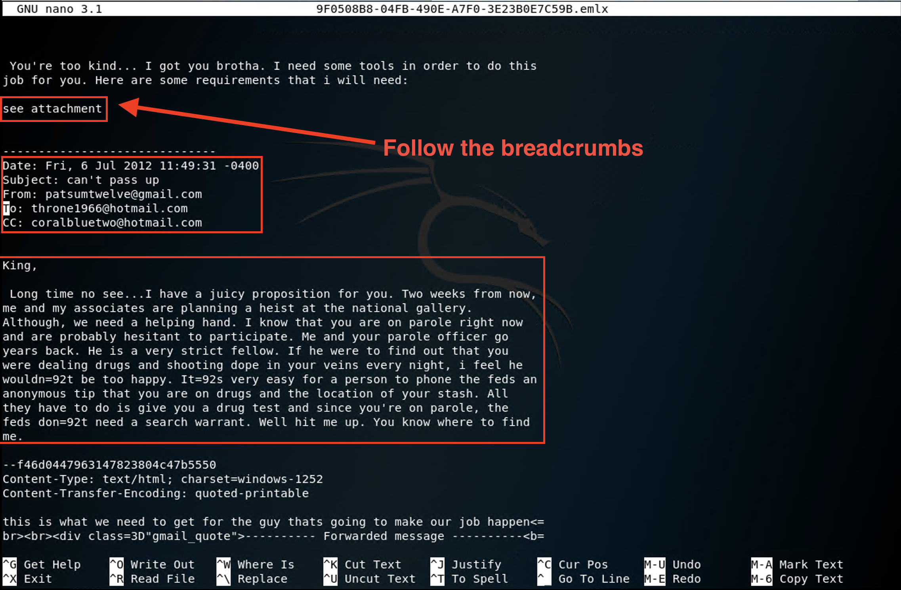
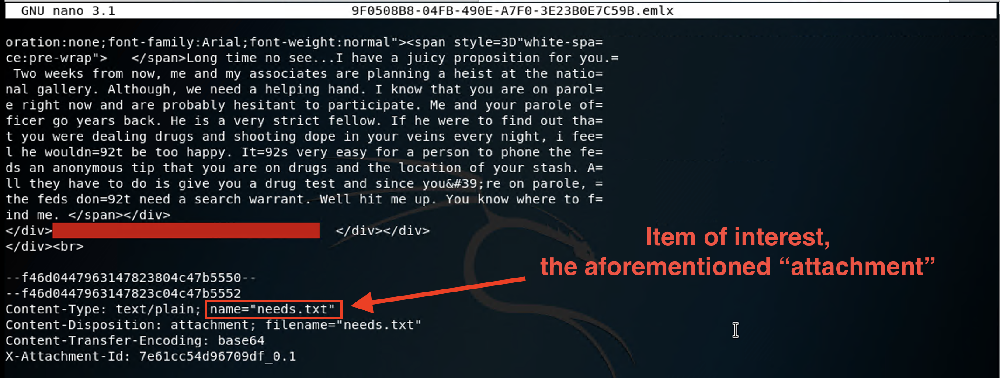
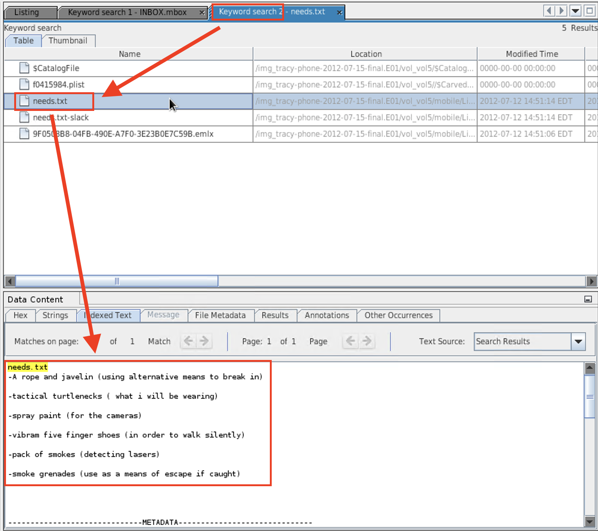

## Solution Guide: Tracy's Email Evidence
 
In the interest of time, we will use this solution guide to examine a single email as an example of how to perform email forensic analysis.
 
 - These principles can be applied across all email files.
 
### Email Forensic Analysis
 
- Open a new terminal window.
 
- Navigate to the directory in Kali Linux that contains the `INBOX.mbox/Messages` folder.
 
- Open the email `9F0508B8-04FB-490E-A7F0-3E23B0E7C59B.emlx`.
  
  - In this file, we will notice several pieces of information that should be documented on your evidence worksheets.
 
  - In the screenshot, we can see the note `see attachment`. This is a critical piece of information. Let's follow the breadcrumbs.
 
   
 
- Scroll down further in the email until we see the attachment.
 
    - The attachment is called `needs.txt`.
 
     
 
- Now that we have a lead, return to Autopsy to locate the `needs.txt` attachment.
 
    - Perform a keyword search for the `needs.txt` attachment.
 
    - Click the `needs.txt` file in the **Listing** pane.
 
    - View the contents of the text document in the **Data Content** > **Indexed Text** window.
 
    - Don't forget to update your Correspondence Evidence Worksheet with your findings.
 
     
 
### Documenting Your Findings
 
- The following document provides the collection of emails that offers evidence to the case. Use may use it as a reference for the continued investigation: 
 
   - [Email Content Worksheet Solutions](https://docs.google.com/document/d/1Np5KQ0dcsmpqgcll321yXXdV9nWYWnxCeyIv8JNJjXA/edit#) 
 
----

&copy; 2020 Trilogy Education Services, a 2U Inc Brand.   All Rights Reserved.
 
