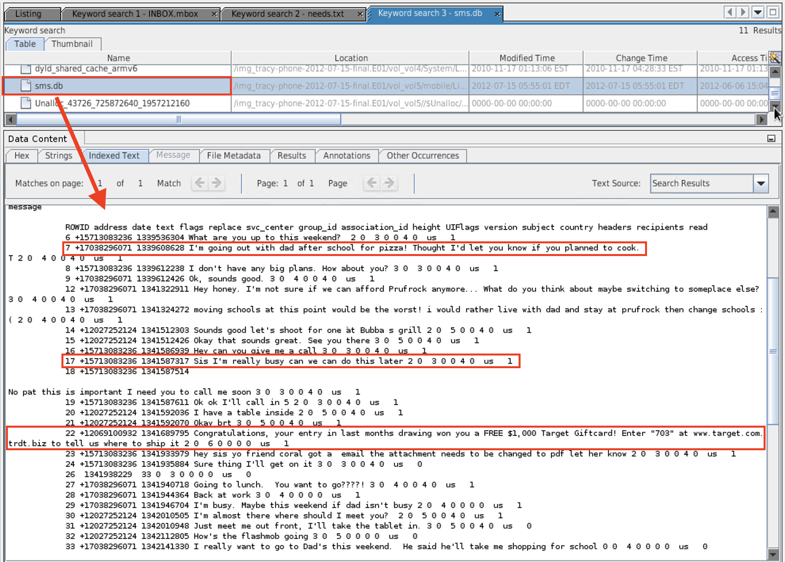

## Solution Guide: Tracy's SMS Messages

1. Use keyword search to find `sms.db`.

2. Add a custom tag called **sms**.

3. View the messages in the **Data Content** pane.

    

4. Analyze the SMS messages and phone numbers to establish connections to the case.

    - What is Terry's phone number?

        - (703) 829-6071. This is evident because she talks about her dad multiple times and Tracy informs her she cannot afford private school anymore.

    - What is Pat's phone number?

        - (571) 308-3236. A text message sent from this number refers to Tracy as "sis," and a response message shows Tracy calling her brother by his name, Pat.

    - What was the fraudulent number that texted about a gift card? Is this relevant to the case? Why or why not?

        - (206) 910-0932. Although messages can be disguised through text messages, here this is not the case. Looking at the website link sent with the message, it's clear this text message is spam.

5. Update your Correspondence Evidence Worksheet with any additional evidence relevant to the case.

    - [Updated Correspondence with SMS](https://docs.google.com/document/d/1AsOqMrKfmU6h3a4Y2OmUuv7SSJo6Ge7_KxKMSQiTkz0/edit#)
----

&copy; 2020 Trilogy Education Services, a 2U Inc Brand. All Rights Reserved.