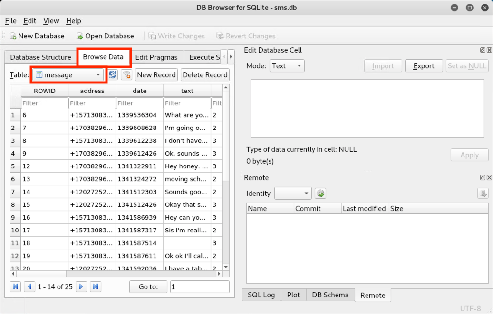

## 21.3 Student Guide: Evidence Acquisition and Reports
 
### Class Overview

Today we will conclude our introduction to digital forensics. You will continue the investigation of Tracy's iPhone by examining emails, text messages, and web history. You will also produce a preliminary log and report on the evidence found.
 
### Class Objectives
 
By the end of class, You will be able to:
 
- Use Autopsy to view and gather evidence from Tracy's emails.
- Use data exports to analyze email messages offline.
- Use data exports to analyze SMS messages offline.
- Use Autopsy to extract GPS data and identify WiFi locations.
- Prepare a preliminary report using evidence worksheets.
 
 
### Lab Environment

In this unit, you will be using the Forensics lab environment located in Microsoft's Azure Lab services. Within this environment, you will find a Windows RDP Host Machine containing a **Kali linux** machine. 

Using RDP, log into the environment with the following credentials:

  - Username: `azadmin`
  - Password: `p4ssw0rd*`

Today's lectures, demonstrations, student activities and reviews will be completed using the **Kali linux** VM. Use the following credentials to log into the **Kali linux** machine:

  - Username: `root`
  - Password: `toor`
  
The lab should already be started, so you should be able to connect immediately. 

- Refer to the [lab setup instructions](https://cyberxsecurity.gitlab.io/documentation/using-classroom-labs/post/2019-01-09-first-access/) for details on setting up the RDP connection.  

### Slideshow
 
- Slides for today's lesson can be found on Google Slides: [21.3 Slides](https://docs.google.com/presentation/d/19MCFJcIUPWK_LpHjLWAUvbKRaa9KvaQLblxKiwN7Ho0/edit).

----
 
### 01. Welcome and Overview 
 
Welcome to the third lesson of the digital forensics units. In the last class, we covered the following:

- Identifying methods used in smartphone forensics.
- Examining databases and file structures of an iPhone directory image.
- Locating and documenting evidence of ownership for an iPhone image.
- Using Autopsy to view and tag evidence of an iPhone image.
- Extracting data for use in other applications (logs, text, pictures, video, audio).

We will begin class with a warm-up activity.

- As a forensic investigator, it's critical that you understand how to use tools such as Autopsy, and how to export data so other team members can perform offline analysis of evidence.
 
- .emlx is a file extension called Mail Message that’s used to store email messages.

- EMLX files are often referred to as Apple Mail files because they are created with Apple's mail program to store plain text files for a single message.
 

### 02. Email Export Activity
 
 
- [Activity File: Email Export](Activities/02_Email_Export/Unsolved/README.md)

### 03.Tracy's Email Evidence 

Now that we exported Tracy's emails to the `Export` directory during the warm-up activity, we'll use offline analysis to uncover details about the plot of the crime and possibly identify the co-conspirators and the roles they played.

#### Importance of Emails

We can extract critical information from emails, such as: 

- Sender's email address
- Sender's IP address
- Internet Service Provider
- User client (email app)
- Location information

All of this information plays an important role in conducting a digital forensics investigation.

#### Examine Emails in Kali Linux 

We will demonstrate how to display email messages in the `INBOX.mbox/Messages` folder.

- These emails were exported to the `INBOX.mbox/Messages` folder in Kali Linux during the warm-up activity.

Open a terminal window and navigate into the directory that contains the `INBOX.mbox` directory.  

- Run `ls -l` to see the full contents of the `Messages` folder. 
  
- Within each of these EMLX files is a single email conversation string.
 
   
  
#### Search for Contact Information

In the next activity, you will continue your investigation by using Nano to view the contents of each EMLX file, as shown below.
  
    

  - You will also look at any email attachments and tag items of interest in Autopsy.
 
The following diagram provides a high-level overview of the threat actor's involvement in the 2012 National Gallery Case.
 
  - You should use this as a road map to tie Tracy's associates to each incident.
 
     
 
 Review the following worksheets:
 
-  The [Correspondence Evidence Worksheet](https://docs.google.com/document/d/1mNnZzKAUVGQxExy8wDBMBWOyaBx7J6t3QLSbv4Eu5tI/edit#heading=h.x6git33zpmpj) is used to document evidence from the communications (i.e., phone calls, emails, text messages) found on Tracy's phone. You should complete this as a group.
  
  - You will fill out the following information:
  
      - Artifact numbers to help organize records
      - Timestamp (time email was sent or received)  
      - Header information
        - These should include names of the individuals involved, their email addresses, and the email subject line.
      - Key information 
        - Summary of the email contents.
      - Evidence location 
        - Source of the data (For example, Email, SMS, Phone call, etc. )
  
    
  
 
### 04. Tracy's Email Evidence Activity
 
 
- [Activity File: Tracy's Email Evidence](Activities/05_Emails/Unsolved/README.md)
- [Correspondence Evidence Worksheet](https://docs.google.com/document/d/1zS-QDGYhMnbZZrwcapIrwdn73fUoh3MSkaZCcX-7LUM/edit#)

### 05. Instructor Review: Tracy's Email Evidence Activity (0:10)

- [Solution Guide: Tracy's Email Evidence](Activities/05_Emails/Solved/README.md)
- [Email Correspondence Evidence Worksheet Solution](https://docs.google.com/document/d/1Np5KQ0dcsmpqgcll321yXXdV9nWYWnxCeyIv8JNJjXA/edit#heading=h.x6git33zpmpj) 

### 06. Tracy's SMS Messages
 
In our last activity, we were able to identify an email attachment called `needs.txt` that contained a list of tools intended to assist with carrying out the crime.
 
We'll continue to search for more evidence by examining Tracy's SMS messages.
 
-  **SMS** messaging are what you know as text messages. 

   - SMS stands for "short message service" and is a person-to-person communication method. 
  
   - SMS messages can be no more than 918 characters.
 
   - SMS messages can and have been used in DoS attacks.
 
   - **Smishing** is the term used to refer to a social engineering attack performed using SMS messages.
 
#### Forensic Analysis of SMS Messages Demonstration
 
Now, we will perform a short demonstration to view the SMS entries contained in the iPhone image.
 
There are four methods we can use to view these entries: 
 
**Method 1**

 1. From the **Tools** menu, select **File Search by Attribute**.
 
 1. Click the box next to **Name** and type `sms.db`.
 
 1. Click the **Search** button.
 
 1. Select `sms.db` from the **Listing** pane.
 
 1. Select the **Indexed Text** tab in the **Data Content** pane to see Tracy's messages.

 
**Method 2**
 
Click the custom tag that you created earlier to load the `sms.db` file. 

   - We can read this in the **Data Content** pane. 

   

**Method 3** 
 
Since this is a database file, we can also use a tool like SQLite Browser to read the messages.

  
 
 - Navigate to **Browse Data** and then the **message** table. 

   
 
**Method 4** 

Alternatively, we can export the file and use the Nano editor to read the messages.  
  
 
 
- In a real case, we'd want to hash everything before exporting and making any changes. 

- For this investigation, you will need to associate phone numbers contained within the SMS messages to specific contacts.
  
 
### 07. Tracy's SMS Messages Activity
 
- [Activity File: Tracy's SMS Messages](Activities/09_SMS/Unsolved/ReadMe.md)
 

### 08. Review Tracy's SMS Messages 

- [Solution Guide: Tracy's SMS Messages](Activities/09_SMS/Solved/ReadMe.md)
- [Updated Correspondence with SMS](https://docs.google.com/document/d/1AsOqMrKfmU6h3a4Y2OmUuv7SSJo6Ge7_KxKMSQiTkz0/edit#)

### 11.  The Final Report 

In this activity, you will conclude your investigation by working in groups to analyze your findings and prepare a final report.
 
 
So far, you've examined quite a bit of information in the iPhone image and worked through the following steps:

  - Performed mobile forensic analysis and compiled details from Tracy's iPhone.
  - Searched through numerous files and directories on the iPhone image.
  - Tagged and categorized evidence relevant to the case.
  - Created custom tags.
  - Extracted data for offline analysis using the export function.
  - Examined and documented Tracy's emails.
  - Examined and documented Tracy's SMS messages.

The following resources will be used for your report: 

- [Activity File: Final Report](Activities/11_Final_Report/README.md)
- [Worksheet: Location Information Worksheet](https://docs.google.com/document/d/19ckQwWc2iPh7qzKVDnBAKoBS-DpVBCb2cFfAbLNrULk/edit#heading=h.x6git33zpmpj)
- [Worksheet: The Final Report](https://docs.google.com/document/d/1H528_nPqhfp_eOCzvyviwx5U3M1NiPTGtIFaoQoANbY/edit#heading=h.w4pkinqwxqi8)
- [Resource: iPhone Forensic Image - Important Files and Databases](https://docs.google.com/document/d/10CWGqTvu09mrSn7Tg7xoKNWBrjeW1wCmXoqB58xYr0k/edit#)
 

----

© 2020 Trilogy Education Services, a 2U Inc Brand. All Rights Reserved.
