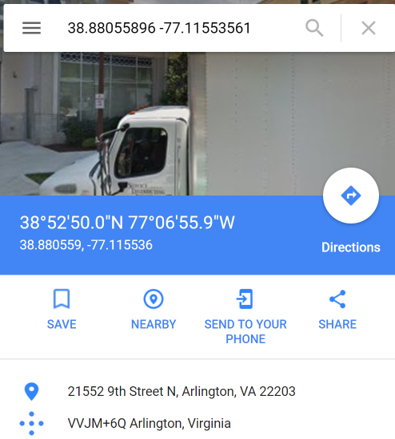
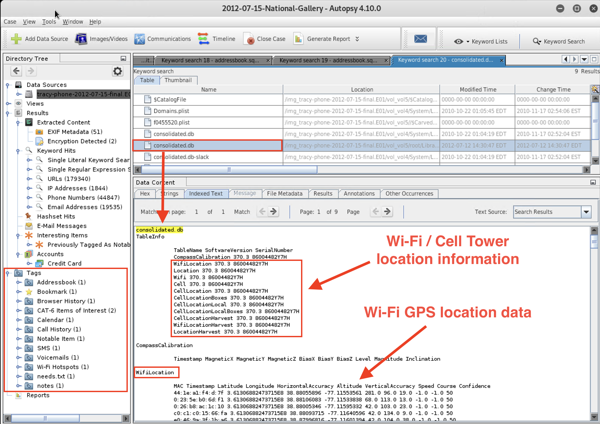

## Week 21 Homework: Digital Forensics

In this week's assignment, you will continue to work with your group to continue the final report you began in class. The instructions are included here again for reference. There is also a bonus activity aimed to sharpen your skills in locating and identifying data in a forensic image.

### Scenario

Just as in a real-world scenario, you will complete a final report to present your findings. You will work with your team to fill out the report.

 - The final report should be submitted as the homework deliverable for this week. Everything your group has completed in class should be included. What you do not finish today can be continued at home.

 - Use the [Final Case Report](https://docs.google.com/document/d/1H528_nPqhfp_eOCzvyviwx5U3M1NiPTGtIFaoQoANbY/edit#heading=h.w4pkinqwxqi8) Google Doc template to complete your report. Make a copy and be sure that each student has editing access. This will allow everyone in the group to access and work on the document at the same time.

  - Each group will turn in one completed report to be graded.

  - Use the following resource to help guide your work:

     - [iPhone Forensics - Important Files and Databases](https://docs.google.com/document/d/10CWGqTvu09mrSn7Tg7xoKNWBrjeW1wCmXoqB58xYr0k/edit#)

### Lab Environnement

- This homework will use the Digital Forensics - Autopsy lab in Kali Linux.

- You will find the `tracy-phone-2012-07-15.final.E01` file located in the `/corpus` directory in Autopsy.

### Instructions

You've examined and documented quite a bit of information from the iPhone image file. Now you will use that documentation to build a final report.

1. First, fill out the following evidence worksheet to document the case's WiFi and GPS locations. You will add this, along with the Correspondence Worksheet, to the final report.

    - [Location Information Worksheet](https://docs.google.com/document/d/19ckQwWc2iPh7qzKVDnBAKoBS-DpVBCb2cFfAbLNrULk/edit#heading=h.x6git33zpmpj)

    Your group can look for WiFi and GPS info the following directories:

     - Find information about WiFi locations in `root/Library/Caches/locationd/consolidated.db`.

       - **Note:** Input GPS coordinates into Google Maps to see the locations.

       - Refer to the image below as an example:

       

     - Find information related to WiFi and cell tower location information in `consolidated.db`.

        

2. Working in your group's copy of the report template, add content and details as indicated in each section.

   - You will rely on the Locations Information and Correspondence Evidence Worksheets you've completed so far. Additionally, you can use the **iPhone Forensics - Important Files and Databases** resource to analyze and find more information to support your case, such as Voicemails and notes from the Notepad iPhone application.

   - Be sure to add to the report the equipment and tools you used to gather and analyze the evidence.

      - For example, Autopsy, the operating system (Kali Linux), text editors (Nano), etc.

   - When including pictures from the iPhone, please use the time stamp of the **Created time** from autopsy. 

 ### Submission Guidelines

 - Each group should submit one version of the completed Final Case Report document.

----

### Bonus Assignment: Russian Tea Room

The goal of this assignment is to sharpen your skills in locating and identifying data in a forensic image.

- These skills are important for tasks related to locating and decoding data, such as executable code or malicious documents embedded in images or network logs.

#### Scenario: The Case of the Little Russian Tea Room

- There was a fire at the Little Russian Tea Room restaurant last week, and the only thing recovered was a hard drive. To start rebuilding the business, the restaurant hired you as a forensics investigator to look at the disk image and reconstruct the menu.

- You'll be working with an EnCase image of the hard drive.

- Luckily, the English and Russian menu are both in the hard drive image. However, only the English menu and two sections of the Russian menu are readable. Your must decode several sections of the Russian menu.

#### Resources:

The strings in the EnCase image are hex and represent the UTF-16 format. You'll need to be familiar with hex and UTF-16 encoding and decoding for this activity.

  - Review this [Unicode Tutorial](Resources/Unicode-Tutorial.md) and the practice exercises. This review will help you locate the menus on the hard drive image.                                      

Below are the files required to complete the assignment:

   - [RussianTeaRoom.zip](Resources/RussianTeaRoom.zip) (560 KB): The Autopsy case file and Encase image file.

   - [menu.pdf](Resources/menu.pdf) (56.0 KB): The Little Russian Tea Room menu.

   - [Google Sheets: Russian Team Room](https://docs.google.com/spreadsheets/d/1GeibalvCi0jnUKay82dSne9V9kdEuUNyOxpaAEBABiU/edit#gid=0)

   - [Unicode-Tutorial.md](Resources/Unicode-Tutorial.md): Short Unicode tutorial.

   The files can also be found in the `/root/autopsy-files/homework` directory in Autopsy.

#### Instructions

Your task is to find, decode, and document six of the menus from the hard drive image using the Unicode Cyrillic and Latin character (cipher) set.

1. Launch Autopsy and select **Open Case**.

   - Open the `RussianTeaRoom` folder and select `RussianTeaRoom.aut`.

    - Add the `Russian-TeamRoom.E01` EnCase image file to the case.

   - This is a sample of the hex data in the Autopsy `RussianTeaRoom` case file:

     

2. Use [Google Sheets: Russian Team Room](https://docs.google.com/spreadsheets/d/1GeibalvCi0jnUKay82dSne9V9kdEuUNyOxpaAEBABiU/edit#gid=0) to document the remaining information from the EnCase image for the investigation.

3. Find and document the complete file locations for the six menu sections in the image.

    - **Hint:** There may be multiple locations for the same file.

4. Document the menu items in Cyrillic (e.g., бифштеке) and English (e.g.,  steak) for the two following menu sections:

    - Pancakes (Menu #3)

    - Meat and Fish (Menu #5)

       - **Hint:** Use the **Hex** and **String** tabs in **Data Content** window in Autopsy to view the data.

       

   Include in your documentation:

   - Starting location in the hex dump.
     - For example: `0x00000010`

   - Hex string for menu name or menu item.
      - For example: `00 42 00 65 00 76 00 65 00 72 00 61 00 67 00 65 00 73`

   - UTF-16 escape sequence for a menu name or menu item.
      - For example: `\u0042\u0065\u0076\u0065\u0072\u0061\u0067\u0065\u0073`

### Submission Guidelines  

- Submit the completed [Google Sheets: Russian Team Room](https://docs.google.com/spreadsheets/d/1GeibalvCi0jnUKay82dSne9V9kdEuUNyOxpaAEBABiU/edit#gid=0)  file.

### Important Note for Certification Prep Week

- In Certification Prep Week, Day 1 you will be using CertMaster Practice in class.

- Make sure you have access to the tool and should be ready to use it during this unit.

### Important Note for Career Prep Week

- After Certification Prep Week, we will move on to Career Prep. You will take a closer look at the cyber career landscape and will learn practical tips on how to prepare for the job hunt, hone their resume, craft their LinkedIn profile, and ace the behavioral and technical interviews.

- Please come to class with a digital copy of your resume which you will be working on and sharing with your fellow peers.

- You must also have a LinkedIn profile set up as well. If you did not set up a LinkedIn account during pre-work, please make sure you do so prior to Career Prep week.
----

&copy; 2020 Trilogy Education Services, a 2U Inc Brand.   All Rights Reserved.
