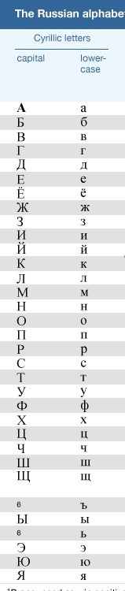

##  21: Digital Forensics Homework: A Short Unicode Tutorial
 
### What is Unicode?
 
The **Unicode character set** maps each character, such as alpha-numeric and special characters of all languages, to a unique number. It ensures that there are no collisions between the alphabets of different languages.
 
- The Unicode standard defines code points to represent characters. 
 
  - Unicode code points are written in hexadecimal preceded by a `U+`. 
  - The `U` indicates a Unicode code point.
 
- The alphabet and special characters of a language can be represented and interpreted by programs such as HTML browsers or word processing applications.
 
  - All you need is the Unicode code point* to decode the character and then display it using a font.
 
- There are several Unicode schemes to indicate how many bites are used to store a character: UTF-8, UTF-16BE, UTF-16LE, and UTF-32. 
 
### UTF-16
 
UTF-16 stores characters in two bytes. 
 
  - UTF-16 can be encoded with little-endian (UTF-16LE) or big-endian (UTF-16BE).
 
LE and BE are distinguishable by a Byte Order Mark (BOM) that appears at the beginning of the string:
    
- **Little-endian** is `FF FE`.
- **Big-endian** is `FE FF`.
 
### UTF-16 Character Set
 
Take a minute to review the [Character List](https://www.fileformat.info/info/charset/UTF-16/list.htm) of UTF-16 for several alphabets.  We can think of this list as a Unicode cipher.
 
- We'll be using the **Cyrillic UTF-16** character set for the Russian Alphabet. The code point starts at **U+0400**.
 
- We'll also use the **Latin UTF-16** character set which is used for the English Alphabet.  The code point starts at **U+0021**
 
  
### How Does Unicode Work?
 
We'll be using the [Dencode App](https://dencode.com/en/) and the [Decode/Encode Unicode Text App](https://www.online-toolz.com/tools/text-unicode-entities-convertor.php) in the following tutorial.
 
#### Unicode: Encode English Text
  
- Open the [Dencode App](https://dencode.com/en/) in a new tab.
 
- First we'll encode the word `Appetizers`.
 
   - Select the `UTF-16 tab`.
  
   - Type the word `Appetizers` in the first text box
  
- The application displays:
  
   - **Hex string:** Remember that this is what is in the Encase image file.
      
      - `00 41 00 70 00 70 00 65 00 74 00 69 00 7A 00 65 00 72 00 73`
      
   - **Unicode escape sequence:** This sequence is used by applications.
      
     -  `\u0041\u0070\u0070\u0065\u0074\u0069\u007a\u0065\u0072\u0073`
      
- Can you see what is similar in both representations? 
      
  - Review the [Character List](https://www.fileformat.info/info/charset/UTF-16/list.htm) to see if you can identify the code points in the list.
 
### Unicode: Decode English Text
  
- Next, let's decode with the **Unicode escape sequence** to display the text.
 
  - Open the [Decode/Encode Unicode Text App](https://www.online-toolz.com/tools/text-unicode-entities-convertor.php) in a new tab.
 
- Enter the **Unicode escape sequence** for `Appetizers`in the **Decode/Unescape** **Unicode Entities** box and click `Convert`.
  
   - `\u0041\u0070\u0070\u0065\u0074\u0069\u007a\u0065\u0072\u0073` 
  
   - The text `Appetizers` appears in the **Result** box. 
  
 
### Unicode: Encode Cyrillic Alphabet
 
- So far, we've seen how Unicode works with the English alphabet. How does it work with other languages?  The same way.
 
  - 
 
- Let's practice using the [Dencode App](https://dencode.com/en/)"
 
  - We'll use the word `ЗАКУСКИ`. That's Russian for `Appetizers`.
 
  - Select the `UTF-16 tab`.
  
  - Paste the word `ЗАКУСКИ` in the first text box.
  
- The application displays:
  
   - **Hex string:** 

      - `04 17 04 10 04 1A 04 23 04 21 04 1A 04 18`
      
   - **Unicode escape sequence:** 
      
      - `\u0417\u0410\u041a\u0423\u0421\u041a\u0418`
      
- Can you spot the similarities in both representations? 
      
- Scroll down to the bottom of the [Character List](https://www.fileformat.info/info/charset/UTF-16/list.htm) to see if you can identify the characters in the list.
  
### Unicode: Decode Cyrillic Alphabet  
 
- Next, decode with the **Unicode escape sequence** to display the text using the  [Decode/Encode Unicode Text app](https://www.online-toolz.com/tools/text-unicode-entities-convertor.php).
 
 - Enter the **Unicode escape sequence** for `ЗАКУСКИ`in the **Decode/Unescape** **Unicode Entities** box and click `Convert`.
 
   - `\u0417\u0410\u041a\u0423\u0421\u041a\u0418`
      
   - The text `ЗАКУСКИ` appears in the **Result** box.
  
### Try it!
 
- Decode the following:
 
  1.  `00 54 00 68 00 69 00 73 00 20 00 69 00 73 00 20 00 61 00 20 00 74 00 65 00 73 00 74 00 2E`
 
  2. `00 4D 00 65 00 61 00 74 00 20 00 70 00 69 00 65 00 73 00 20 00 61 00 6E 00 64 00 20 00 64 00 75 00 6D 00 70 00 6C 00 69 00 6E 00 67 00 73`   
 
  3. `04 1F 04 18 04 20 04 1E 04 16 04 1A 04 18 00 20 04 18 00 20 04 1F 04 15 04 1B 04 1C 04 15 04 1D 04 18`
 
  4. `\u043a\u043e\u0442\u043b\u0435\u0442\u044b`
 
Now that you have a better understanding of Unicode, let's go back to cracking the Russian Tea Room!

----

&copy; 2020 Trilogy Education Services, a 2U Inc Brand.   All Rights Reserved.
                                                                             
