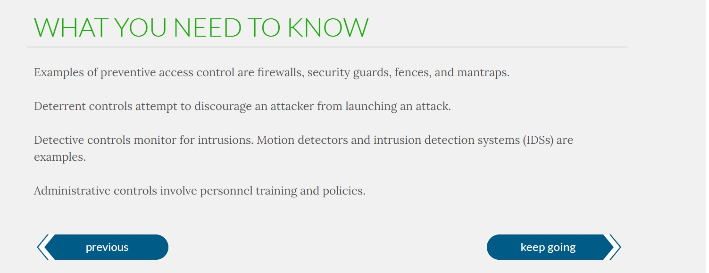
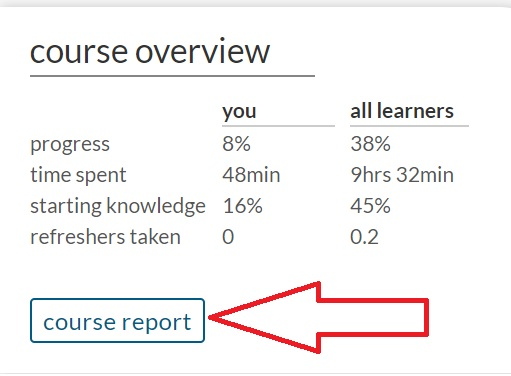

## 22.1 Student Guide: Introduction to Cybersecurity Certifications

### Overview

This week, we will be introducing and preparing for several information security certifications. Today, we will provide an overview of introductory, advanced, and specialized certifications. We will also focus on aspects of the Security+ exam. 

### Class Objectives

By the end of class, you will be able to:

- Explain the value of certifications in your job searches and career development. 

- Map out certification roadmaps based on your specific experience level and field of interest. 

- Use CompTIA's CertMaster tool to begin preparing for the Security+ exam. 

 
### Class Slides: 

- [21.1 Slides](https://docs.google.com/presentation/d/1eUFQTktTJhqzpd3ehYcXlKgoUkZSPWz-tOqXKfHX-Lc/edit#slide=id.g89b3b35bf7_1_2189)

-------

### 01.  Welcome to Certification Prep Week 

As the demand for cybersecurity professionals grows, employers frequently look to information security certifications as a measure of employee qualifications and training.

Over the next week, we will be introducing and preparing you for several information security certifications.

- As of April 2020, 44 different organizations issue certifications. These include over 300 cybersecurity certifications, which cover 25 specialties and paths.
  
While the amount of certifications, issuing organizations, and certification paths may seem overwhelming, this week we will cover:
  - How certifications are beneficial to an infosec professional.
  - The difference between beginner, advanced, and specialized certifications.

  - The order in which certifications should be achieved.
  
This week we will also preparing you for the following certifications:

- **Security+**
  - This course provides a voucher to take the Security+ exam. Therefore, we will spend the most time with this certification.
  - In the first week of this course, we covered the Security+ exam at a high level.
  - This week we will dive deeper and and cover:
    - Test preparation tips.
    - The CompTIA CertMaster study tool. 
    - Performance based questions (PBQ). 
    - Domains on the exam that are not covered in this course's curriculum.

- **Certified Ethical Hacker (CEH)** and **Certified Information Systems Security Professional (CISSP)**
  - We will  briefly cover another beginner certification called Certified Ethical Hacker (CEH) and a popular advanced certification, Certified Information Systems Security Professional (CISSP).

### 02.  Introduction to Information Security Certifications 

Certifications provide prospective professionals an advantage in the information security job market. Point out that there are additional benefits as well:

1. Education 
    - While preparing for a certification, even before the certification is formally awarded, individuals learn new skills related to the subjects covered in the certification.  While achieving credentials is often the objective, the material learned during studying for the exam is also very valuable to job performance.
  
2. Networking 
    - Many certifications have national and local organizations that host meetings, conferences, seminars and social events. These events can provide opportunities to network with peers in your field.   
  
3. Career Advancement
    - Information security certifications can also place more established professionals in a stronger position to obtain a promotion.

Now we'll look at the many different certifications and discuss which certifications individuals new to the infosec field should get first.
  
#### Types of InfoSec Certification   
  
Certifications can be broken into three categories:

1. Beginner information security certifications, which are the first certifications that individuals new to the field should obtain. 
   - These certifications typically do not have minimum work requirements or prerequisite courses.

   - They are typically broad in the subjects that they cover.
   - Examples include **Security+**, **CEH**, and **GSEC**.

  
2. Advanced information security certifications, which should be obtained after working in the industry for several years. While each certification varies, some require working in the industry for 3-5 years. 

   - Many of these certifications focus on security management.

   - These certifications typically have minimum work requirements and prerequisite courses.

   - They are typically broad in the subjects that they cover.

   - Examples include **CISSP** and **CISM**.

3. Specialized information security certifications, which are more advanced certifications that security professionals should obtain after working in the industry for several years.

    - These certifications typically have minimum work requirements and prerequisite courses.

    - They typically cover specific subjects:
        - **GIAC Certified Forensic Examiner (GCFE)** is specific to forensics professionals.

        - **Offensive Security Certified Professional (OSCP)** and **PenTest+** are specific to penetration testers.

    - Specialized certifications can be vendor or non-vendor specific:
        - **OSCP** is a non-vendor-specific penetration testing certification.

        - **Cisco Certified Network Associate (CCNA)** is a vendor-specific certification for Cisco products.

After this boot camp, most of you will begin your certification journey with Security+. But you may be curious where you should go after that.  

- Certification paths will depend on each of your interests.
  
- For example, a penetration tester's certification path will differ from a computer forensics specialist's path.

    - A penetration tester's path might look like this: Security+ >  CEH > CISSP >  OSCP

       - **Note**: We will cover these additional certifications in more detail in the next lesson.

     - A forensic specialist's path might look like this: Security+ > CFCE > GCFA > EnCE
       
       
Each domain has suggested guidance for the best certification path.  
  
- View the following guide from CompTIA detailing several certification paths:

   

### 03. Certifications and Careers

- [Activity File: Certifications and Careers](Activities/03_Certs_and_Careers/Unsolved/README.md)
- [Career and Certifications Spreadsheet](https://docs.google.com/spreadsheets/d/1fFBqz6ThWEekheg0y7Ae_80565T0KSNA5PA2O6yn3NU/edit?usp=sharing)

### 04.  Beginner, Advanced, and Specialized Certifications 

While it is likely that the first certification you will work towards is Security+, there are several other beginner infosec certifications that do not require experience and cover many domain areas.    

**Certified Ethical Hacker (CEH)** is a certification offered by EC Council.

- While the CEH is generally focused on penetration testing topics, it also covers a broad spectrum of topics valuable to information security professionals.

- CEH also offers an advanced certification called **CEH Practical** which tests individuals' skills with hands-on penetration testing tools.

- CEH will be covered in more depth on Day 3 of this unit.
    
**GIAC Security Essentials (GSEC)** is a certification offered by the Global Information Assurance Certification (GIAC).

- GSEC covers a broad spectrum of topics ranging from active defense to cryptography.

- GSEC will not be covered this week. Visit the following link in case you are interested: https://www.giac.org/certification/security-essentials-gsec
    
    
**Systems Security Certified Professional (SSCP)** is a certification offered by (ISC)² ("ISC squared").
- SSCP covers security best practices for setting up, monitoring, and administering IT infrastructure.

- While SSCP is one of the entry-level certifications offered by (ISC)², they do request one year of professional cybersecurity experience.

- SSCP will not be covered this week. Visit the following link in case you are interested: https://www.isc2.org/Certifications/SSCP
  
While it is not recommended for security professionals to obtain multiple beginner cybersecurity certifications, many professionals do obtain the Security+ and the CEH, since they cover different domains.   
            
For many cyber professionals, the next step in advancing a career is obtaining advanced and specialized certifications. 
  
#### Advanced Cybersecurity Certifications

There are several advanced cybersecurity certifications which do not have a specialized focus.

  - Many of these are obtained by cybersecurity managers.
  
The following are advanced certifications:  

**Certified Information Systems Security Professional (CISSP)** is an advanced certification offered by (ISC)².
- It covers a wide variety of cybersecurity topics and is one of the most popular certifications in information security.

- CISSP will be covered in more detail on the Day 3 of this unit.
    
**Certified Information Security Manager (CISM)** is a certification offered by ISACA.
- It covers information security management topics.

- CISM will not be covered this week. Note the following link in case you are interested: https://www.isaca.org/credentialing/cism

#### Specialized Certifications

There are hundreds of specialized certifications available for those interested in mastering their specific cybersecurity domain.

**Offensive Security Certified Pentester (OSCP)** is a specialized pen testing certification offered by Offensive Security. 
- It is a hands-on penetration testing exam consisting of two parts: a 24-hour penetration testing exam, and a documentation report due 24 hours after the exam.

- Note the following link in case you are interested in learning more: https://www.offensive-security.com/pwk-oscp/
    
**Certified Information Privacy Professional (CIPP)** is a specialized privacy certification offered by IAPP.
- It is considered the "gold standard" for those working in privacy.

- Visit the following link in case you are interested in learning more: https://iapp.org/certify/get-certified/cippus/.

**EnCase Certified Examiner (EnCE)** is a vendor-specific specialized certification for computer forensics professionals. 
- It is offered by OpenText and used by law enforcement.

- Vist the following link in case you are interested in learning more: https://www.opentext.com/products-and-solutions/services/training-and-learning-services/encase-training/examiner-certification

The certifications we just covered are only a small part of the vast list of advanced and specialized certifications.

In the next activity, you will have the opportunity to research several advanced and specialized certifications for a domain they are interested in.
  
  
### 05. Advanced and Specialized Certifications 

- [Activity File: Advanced and Specialized Certifications](Activities/06_Advanced_Certs/Unsolved/README.md)
- [Career and Certifications Spreadsheet](https://docs.google.com/spreadsheets/d/1fFBqz6ThWEekheg0y7Ae_80565T0KSNA5PA2O6yn3NU/edit?usp=sharing)
- [Wikipedia: List of Information Security Certifications](https://en.wikipedia.org/wiki/List_of_computer_security_certifications)

### 06. Introduction to Security+

What is the Security+ certification?

- According to [CompTIA](https://www.comptia.org/certifications/security): "Security+ is the first security certification IT professionals should earn. It establishes the core knowledge required of any cybersecurity role and provides a springboard to intermediate-level cybersecurity jobs. Security+ incorporates best practices in hands-on trouble-shooting to ensure security professionals have practical security problem-solving skills. Cybersecurity professionals with Security+ know how to address security incidents—not just identify them."

Which jobs typically require the Security+ certification?

   - Security architects
   - Security engineers
   - Security consultants
   - Security specialists
   - Information security analyst

As of June 2020, the average annual pay for an information security analyst in the United States is $99,944 a year. (Source: [ZipRecruiter](https://www.ziprecruiter.com/Salaries/Information-Security-Analyst-Salary))

What skills and knowledge areas are assessed in this certification?
  
- Attacks, Threats, and Vulnerabilities
- Architecture and Design 
- Implementation 
- Operations and Incident Response 
- Governance, Risk, and Compliance 

What are the details of the exam?

- The exam is comprised of 90 multiple-choice and performance based questions (PBQs).
  - Performance based questions will be covered in more detail at the end of today's class.
- Test takers have 90 minutes to complete the exam.
- The passing score is 750, on a scale of 100-900.
- The cost of the exam is $370.00. 
  - **Note**: You will receive a free exam voucher at the end of the boot camp.
  
  
#### Preparation Tips  

- Use CompTIA's study tools.
  - While there are many books, online resources, study guides, and apps available to prepare for the exam, CompTIA provides the most up-to-date resources for exam prep. 

  - From past students' experiences, the CompTIA CertMaster tool has proven to be the best method for preparing for the exam.

- Organize your study time.
  - Design a structured study plan and stick with it. Block out at least several weeks to focus on studying for the exam. 

  - If possible, find and meet with study groups to help encourage each other during test preparation.

- Focus on your weak spots.
  - Early on, attempt to determine which domains are the most challenging and focus your studies there.

- Use supplemental study tools. 
  - Create study guides and flashcards of common terms and acronyms. Find video content explaining confusing subjects.

  - For example, if you do not understand a term or a concept, search YouTube for a visual explanation of that topic.

- Find a Security+ online community.
  - There are many online blogs, forums (e.g., Reddit), and wiki pages dedicated to preparing for the Security+ exam.
  
  
#### Test-Taking Tips 

- Take care of yourself.
  - Arrive early, well-rested, fed, hydrated, and relaxed. 

- Pay attention.
  - Read each question and answer twice before deciding your answer. 
  
  - Look for keywords in the questions, such as:  "best," "most," or "least."

  - Always stay aware of how much time remains. 

- If you're unsure of an answer, guess. 
  - Eliminate the answers you know are not correct, and select from the remaining answers. You'll receive the same penalty for an incorrect answer as for an unanswered question, so always make a best guess. 

### 07. Security+ CertMaster 

The best study tool for the Security+ is the **CertMaster Practice** tool from CompTIA.
  
  - This boot camp provides you with access to the CertMaster Practice tool.

  - Per CompTIA, CertMaster Practice comes with:
     - Quick knowledge assessment.
     - Adaptive learning that reinforces existing and new knowledge.
     - Personalized feedback.
     - Real-time learning analytics.

 - CertMaster Practice has an easy-to-use interface to access questions for all domains covered on the Security+ exam.

 - Access to the tool is available for one year to assist with exam preparation.
 
We will complete a walkthrough of the CertMaster tool and how to navigate the basic features.

#### CertMaster Practice Walkthrough

Access the following URL. Bookmark this page.
  
  - https://www.comptia.org/training/certmaster-practice
  
  - log in on the right side of the page.
  
    

After you log in with the credentials you were provided, you will be taken to the main dashboard.

   

- This main dashboard contains:

  - The different modules of the Security+ exam (top-left).
  - Your progress based on the percentage of practice completed (top-right). 
  - The course overview comparing your statistics to all other participants using the CertMaster practice tool (bottom).
  
The modules do not have to be completed in a specific order.
  - To select a module, you will need to expand one of the domains.
  
For this walkthrough we will expand the **Governance, Risk, and Compliance** domain.
  - Select the arrow to display the various modules within the "Governance, Risk, and Compliance" domain.
 
    
    
- There are five different modules within the "Governance, Risk, and Compliance" domain.
  - The dashboard provides the following details on each module:
    - Topic of the module
    - Your progress on that specific module

     
  
Select module **5.1 Compare and contrast various types of controls**.
  
  - Select **Begin Learning** under that module.
  
  - Note that questions will be mixed each time you begin a module, so what you and other students see may vary. 
 

You can answer questions in one of two ways: 

  - If you are sure of an answer, you can click the corresponding circle twice to fully fill in the answer. 
   
     

  - If you are unsure, you can click on two answers, each one time, to suggest best but unsure guesses. 
   
    - Note that this option is not available on the actual exam, only the CertMaster Practice tool.
   
      
   
  - After submitting multiple unsure answers, CertMaster will let you know if one of your choices was correct, but will not tell you which. 

       

  - You'll then be able to review your answers.

      
 
  - On the bottom of the answer review page is a summary explaining the answer.
      
  
#### Additional Tips

While you are working on a module, you can view your current progress by clicking the arrow on the top-right of your module.

  
  
 
- After you complete the module, view a summary of the completed modules:
  
  - From the dashboard, select **Course Report**.
  
    
  
  - This provides a summary of all your completed modules.

  - Additionally, this page shows the most challenging questions, which you can return to and re-answer. 
    
   
  
   

### 08.  Security+ CertMaster Activity  

- [Activity File: Security+ CertMaster](Activities/11_CertMaster/Unsolved/README.md)

  
### 09. Security+ PBQ  

The Security+ exam has two types of questions: multiple choice and performance based questions (PBQs). 
    
 - PBQs present test takers with a simulated environment, such as a network, firewall, or terminal. 

 - Since the question environment is simulated and not live, there may be some limitations compared to a real-world environment.

 - PBQs are often the first questions on the Security+ exam. 
  
In the next walkthrough, you will look at Security+ PBQ questions. 

#### PBQ Walkthrough

- Begin by accessing [CompTIA's PBQ simulation](https://simulation.comptia.org/).
  
     
  
- After opening the simulation, note the following:
  
  - This is an interactive question in which page elements can be clicked on.
  
  - Note the interactivity by selecting **Workstation 1**. It will open a Windows command prompt.
  
       

- Scenarios and instructions are displayed on the left side of the screen.
   
  - Always read the scenario and instructions carefully.
    
    

- Read the scenario and instructions:  
  
   - **Scenario**: After experiencing attacks on its servers, Company A hired a cybersecurity analyst to configure a DMZ and increase security measures.  Shortly after the network was reconfigured, an assistant on the second floor reported that one of the executives could not access the internet (more specifically https://comptia.org).  However, he said, they can send internal email, use the intranet, and print on the local area network printer.  
    
  - **Instructions**
    
      - Check the IP addresses and connectivity for each of the workstations to determine which is the affected machine. 

      - Use that information to ensure that the access control list (ACL) is properly configured to allow all workstations access to the internet.

      - The router's ACL implements an implicit deny. Only make changes to correct the connectivity issue.

Now, complete the steps of the PBQ.
  
1. Check the IP addresses and connectivity for each of the workstations to determine which is the affected machine. 

  -  To check the IP address of each machine, run `ipconfig`.
      - Since `C:\` indicates this is a Windows machine, we use `ipconfig` instead of `ifconfig`.

  - Check connectivity to the website https://comptia.org:
     - Run `ping comptia.org`

- Run these commands for each workstation.

  - **Workstation 1**

    

     - Workstation 1's IP address is `192.168.0.68`.
     - Workstation 1 received a successful ping response to comptia.org.
  
  - **Workstation 2**  

    

       - Workstation 1's IP address is `192.168.0.82`.
       - Workstation 1 received a failed ping response to comptia.org.
  
So far, you have determined that Workstation 2, with the IP `192.168.0.82`, is the workstation that can't access the internet.

2. Use that information to ensure that the ACL is properly configured to allow all workstations access to the internet. 

    - Since you need to ensure that the access control list allows all workstations to access the internet, you will:
      - Select the router that connects the workstations to the internet.

      -  View the ACL of that router.
  
   
  
     - This ACL contains the rules for what traffic is allowed in and out of the router.

     - To remove a rule, click the yellow **x** to the right of the rule.
  
    
    
  
  - Since Workstation 2 was the workstation experiencing a connectivity issue, you will first determine which subnet that workstation belongs to.

    - The only subnet `192.168.0.82` can belong to on the list is `192.168.0.80/28`.

    - `/28` means the IP range for this subnet is: `192.168.0.81` - `192.168.0.94`.

    - The rule setup for this subnet explains why the workstation can't access the internet. It is denying all access to any IP with any protocol and any port.

3. The router's ACL implements an implicit deny. Only make changes to correct the connectivity issue.

    - Remove this ACL rule to fix this connectivity issue by clicking the yellow **x**.

    

    - After clicking the yellow **x**, the ACL rule is removed.

   
  

  - Finally, you need to submit our answers. 
  
    - Close the ACL page and select **Submit** on the top-right of the page.

   

  - After selecting Submit, you will receive your score from this simulation.

    
 

### 10. Student Do: Security+ PBQ 

- [Activity File: Security+ PBQ](Activities/14_PBQ/Unsolved/README.md)
- [PBQ Practice Test](https://forms.gle/cqrgQX2jw1MU51t4A)

  
-------

© 2021 Trilogy Education Services, a 2U, Inc. brand. All Rights Reserved.  
