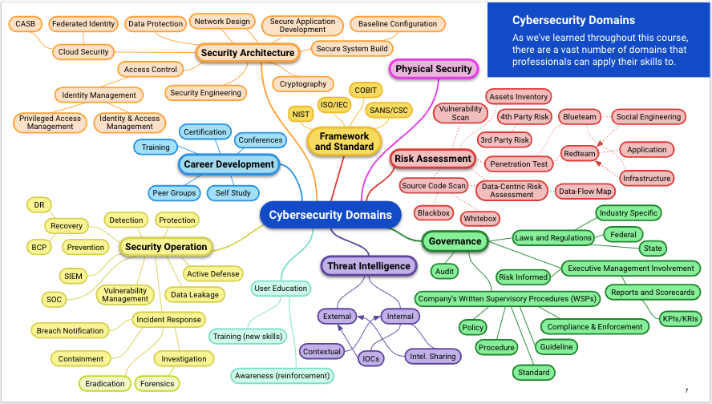
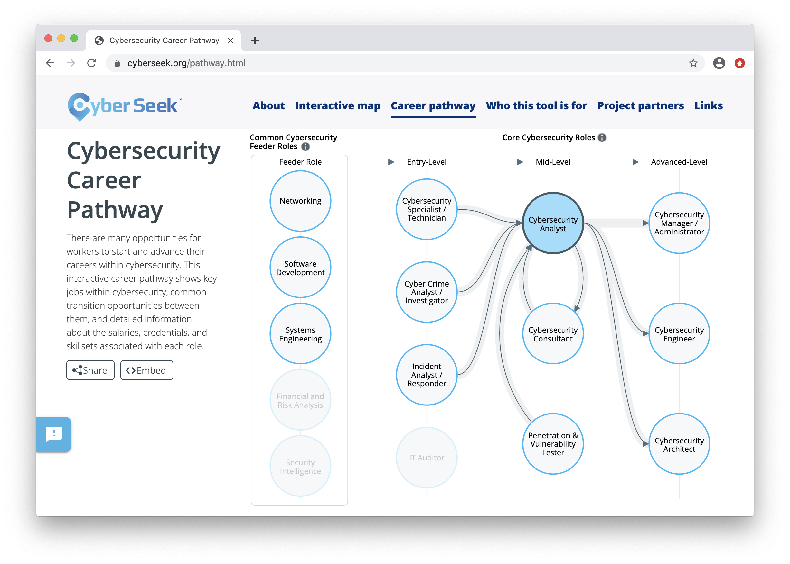
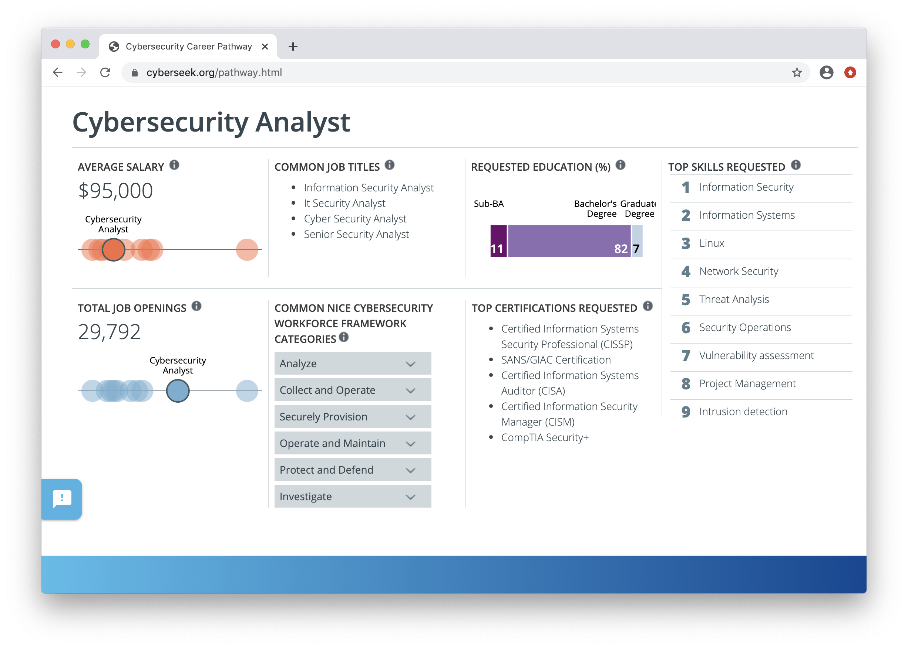
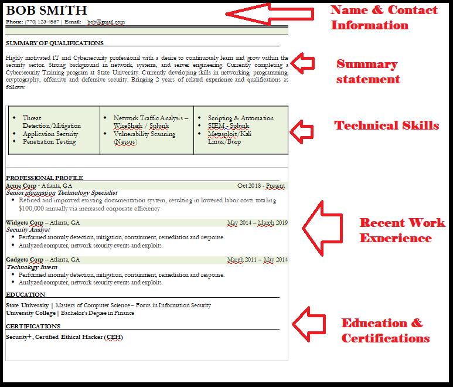

## 23.1 Student Guide: Intro to Career Prep

### Overview

In today's class, you will learn how to optimize your cybersecurity job searches. You will use online resources to map out your desired path and build your professional network. You will also update your resumes and LinkedIn profiles to be better suited for the job hunt. 

### Class Objectives

By the end of class, you will be able to:

- Identify a cyber career field you are interested in and map out a career path towards a desired role. 

- Begin developing your professional network. 

- Update your resumes and LinkedIn profile for the cybersecurity job application process. 

### Slideshow

The lesson slides are available on Google Drive here: [23.1 Slides](https://docs.google.com/presentation/d/17DcYPYUTU832CiVubeKIMjOMG_ETGGtQA31OC4nJyHk/edit#slide=id.g480f0dd0a7_0_1803)

-------

### 01. Welcome to Career Week 

As you approach the conclusion of this boot camp, you should begin preparing for your job search. 

- The skills and tools learned throughout the past 22 weeks have undoubtedly prepared you to begin their cybersecurity career. 

- While it would be nice if organizations were now lined up at the door handing out job offers, a competitive job market requires an additional set of skills. 

- In the coming weeks, you will need to apply job hunting skills that position you to get interviews and, subsequently, job offers.

Over the next two classes, we will cover cybersecurity career prep skills that will help you get interviews and land jobs. Topics include:

- Finding your cybersecurity career path.
- Building your cybersecurity network.
- Non-traditional job searching.
- Building a powerful resume and LinkedIn profile.
- Behavioral and technical interview tips.

### 02. Introduction to Cyber Career Paths 

In the very first week of class, we introduced the vast amount of domains and specialties that exist in the cybersecurity industry.

  

As we moved throughout the course, we highlighted roles relevant to different skills and domains. 

- Hopefully, you have started thinking about which cyber domains and positions you are interested in.
 
Understanding and mapping out career paths is an important way for you to begin your job search.  
 
If you ask a cyber professional how they found their way into the industry, many will share one of following responses:
- They started in careers outside of IT. 
- Before entering a cyber-specific role, they had to work in one or many IT roles. 
  
#### Finding Career Paths

Use the following resources to explore common career paths:

- [Cyberseek](https://www.cyberseek.org/pathway.html) provides information about supply and demand in the cybersecurity job market. 

  - Clicking on any of the featured roles will display helpful information, such as number of job openings, average salaries, and desired skills and certifications.    
   
 
  
 
 

- [LinkedIn](https://www.linkedin.com/) shows real professionals' career pathways and development. 

 
### 03. Activity: Career Paths

- [Activity File: Career Paths](Activities/03_Career_Paths/unsolved/readme.md)

### 04. Activity Review: Career Paths 

### 05. Cyber Networking 

One of the best methods for landing a cybersecurity job is to build and connect with a **cyber network**.

  - The cybersecurity industry, while growing each year, is considered a tight-knit, highly connected group of professionals.
  
Establishing connections and building your network can help with the following:
- Through connections, you can meet other industry professionals, many of whom are actively hiring.
  - Hiring managers often circumvent the traditional job posting process and hire from personal recommendations.

- Networking can provide resources for specific cyber domains.
  - For example, if you need to find a mobile forensic specialist and have a large network, it's likely that your network contains the specialist you need. 

- Connecting with professionals who are associated with trusted third-party companies and vendors can give you access to better pricing and personalized service. 
  - For example, a contact who works for a SIEM vendor could come in handy if you are looking for SIEM products for your organization. 
  
It may feel challenging to break into a cyber network or connect with cyber professionals. 

- But just from joining this class, you already have a cyber network consisting of the other students and the TAs in the class.

- It's recommended that you connect with your classmates on LinkedIn if you haven't already.
  
The best way to build your network is to join local cyber groups, chapters, and professional associations. 

  - Many of these have members who are also very new to the industry.
  
The benefits of joining these local cyber groups include:
- Regional specificity
- Welcoming attitude towards new professionals
- Monthly meetings, trainings, and social events
- Inexpensive or free membership and event cost

While many groups are offered for general cyber networking, there are also groups with specialized focuses, such as:

- Groups that emphasize certain technologies, such as cloud security groups like Cloud Security Alliance (CSA).

- Groups that focus on specific industries, such as banking and finance security groups like Financial Services Information Sharing and Analysis Center (FSISAC).

- Groups that connect people from specific demographics, such as the Women in CyberSecurity (WiCS).

### 06. Activity: Building Your Cyber Network

- [Activity File: Building Your Cyber Network](Activities/06_Cyber_Network/unsolved/readme.md)

### 07. Activity Review: Building Your Cyber Network

### 08. Non-Traditional Job Searching

While networking is an excellent way to increase your chances of landing an interview, it must be combined with additional job searching approaches. 

Job searching requires casting a large net. The wider and more diverse your search, the more likely it is you'll find something. 

#### Traditional Job Search Methods

Traditional job search methods include: 
- Searching websites like Indeed, Dice, and Monster.com.
- Searching for open positions on LinkedIn.
- Working with a recruiter. 

These methods are popular because of their comparatively easy application processes and the clarity of details in job postings.  

- However, this simplicity means you are often one of thousands of applicants. 

- The person reviewing the job applications will only know you by the information on your resume or job profile. 
  

Due to these limitations, many cybersecurity professionals often use non-traditional approaches for finding open positions.    

#### Non-Traditional Job Search Methods

Cybersecurity professionals often use their creative thinking skills to "hack" the traditional approaches to job searching. These hacks include:

- Proposing that an employer create a position for your skills. 
    - You can mention what you observe to be the organization's challenges or areas of need, and how your skills can address them.

    - This is most successful with organizations where you have a personal connection.
    
- Sharing your skills on platforms other than LinkedIn and your resume.
    - Create blogs, custom websites, and videos to advertise your skills and find potential employers.

- Attending cyber events in which the primary purpose of the event is not job searching.

    - Increase your odds by attending cyber trade shows and conferences where you are one of fewer individuals looking for open positions.

- Reach out directly to the real decision maker at an organization. 

#### Contacting the Decision Maker Demonstration

Recruiters and talent acquisition staff often manage an organization's hiring process. But they are the gatekeepers, not the ones who make the final hiring decision.

- The final hiring decisions are typically made by the managers and cybersecurity department leaders.

A quick LinkedIn search can be the first step to finding the decision maker.

  - Go to LinkedIn and run a search with the following format:
    - Cyber Manager [Company] [City]  or Security Director [Company] [City]

    - For example:  Cyber Manager Microsoft Chicago

- Look through the results and try to find someone who looks like they're responsible for hiring, building, and managing the cybersecurity team. 

Once we find this person, we can introduce ourselves with a message similar to the one below. 

  - Note that this is a soft first introduction. There is no specific mention of open positions. That can be discussed in future meetings.

    Hi [First Name]!

      I’m [Your Name], an aspiring cybersecurity professional transitioning from a career in [previous career]. As I make this transition, I am mapping out my job aspirations and pathways—I came across your profile and thought you would be a great person to reach out to for some advice. 

      I recently graduated [or am about to graduate] from the cybersecurity boot camp at [your university], where I studied offensive and defensive security, web application security, and governance and compliance.  I am also currently working [or worked] on some exciting new projects, including [one-line project description].

      I would love to link up and pick your brain about how you got started, what you do at [company they work at], and how you maintain your expertise. Let me know if you’re available to grab some coffee or set up a quick phone or Zoom call sometime.

      Looking forward to hearing from you soon!

      Thanks in advance,

      [Your Name]

            
### 09. Activity: Hacking Your Job Search

- [Activity File: Hacking Your Job Search](Activities/09_Hacking_Your_Search/unsolved/readme.md)

### 10. Activity Review: Hacking Your Job Search

### 11. Break (0:15)

### 12. Intro to Resumes and LinkedIn 

In today's cybersecurity job market, it is typically a requirement for all candidates to have a resume and a LinkedIn profile.
  
 - A resume and LinkedIn profile is essential during a job search, and a poor resume and profile can potentially eliminate you from consideration for a position.

### 13. Resumes  

While employers may like to meet and speak with every potential candidate, it is not an efficient use of their time. Therefore, resumes provide a snapshot of a candidate to help employers decide if they should be pursued.

- A resume is a company's first impression of you.

- You should think of a resume as an opportunity to professionally show off your work experience, education, technical skills, and career accomplishments.

- While having a superior resume can increase your odds of landing an interview, having an inferior resume can quickly eliminate you from consideration, even if you are qualified for a position.

Resumes may seem like a simple concept, especially compared to all the technical skills you've been learning throughout this course. But to be as appealing as possible to job recruiters, you must be thoughtful and precise regarding what you include in your resume. 

#### The Basics of a Resume

Resumes should be: 

- One page in length.
    - Keep resumes concise by including only relevant information.
    - If you have more than 10 years of work experience, only include the most recent 10 years.

- Professional in tone.
    - Resumes are made professional by maintaining grammatical accuracy, making sure all information provided is correct, and using appropriate word choice.

- Aesthetically pleasing.
    - Make sure bullet points align, font types, colors, and sizes are consistent, and the content is easily digestible.

Resumes should follow this structure: 
  - Name and contact information
  - Summary statement
  - Technical skills
  - Recent work experience
  - Educational background
  
 

 
 
 
#### Name and Contact Information
  
While this section is usually straightforward, consider the following: 

- Use the same name that appears on your LinkedIn. Do not use a nickname.

- Do not list a home address.

- Add your phone number and email.  

- Consider using a professional, security-based email provider such as ProtonMail.

- Make sure your email name is also professional and easily identifiable. 
    - For example, xavier.wallace@protonmail.com is professional, while letsgomets1986@protonmail.com is not. 
  
#### Summary Statement

Summary statements are placed at the top of a resume to give the employer a preview of the candidate's expertise and personal motivations.

- The summary statement should show your passion, professional interest, value, and accomplishments. 

- The summary statement should be a short paragraph. Do not include more than four or five sentences.

- When faced with thousands of resumes, sometimes recruiters will only read the personal statements before deciding to continue reading or move on to the next candidate. Be sure to make an impact by speaking directly and personally. 
  
#### Technical Skills
  
For cybersecurity job seekers, the technical skills section can be considered the most important part of a resume.
 
- Companies use algorithms to search through resumes for matching keywords. 

- Having the correct skills to match these keyword searches can greatly impact the success of your resume. 

This process is known as "optimizing your resume."

- From this course alone, you have a lot more skills then you may realize.

- You should write down all the topics, tools, and skills you've learned while still fresh in your memory, if you haven't already. 

- Include valuable non-technical skills as well. 

  - For example, communication and presentation skills are highly valuable to employers. Think about projects that you’ve had in class that showcase these skills. 

  
#### Recent Work Experience
  
This section is comprised of the your most recent and relevant work experience. Each role's description should include:

- Job title, employer, start and end date, and location (optional).

  - If you're still employed, write "Present" instead of an end date.

- Job responsibilities should be described using bullet points that emphasize hard skills, responsibilities, and quantifiable achievements during employment.

Work experience should start with your most recent employer and continue in reverse chronological order.

Some important notes: 

- Each responsibility or description should begin with an action word.

  - For your current job, these action words should be in simple present tense, e.g., manage, organize, operate.

  - For past jobs, these action words should be in simple past tense, e.g., managed, organized, operated.

- Unless your experience is limited, do not include work experience unrelated to the position you are applying to.  

Even if you have a lot of experience, you should still emphasize the specific aspects of each past role that will be most relevant to your desirable field. 

- Craft bullet points with the following in mind:
  - Think about the specific results of the work you did.

  - If you have quantitative information to support your results, be sure to include that. 

  - Be as specific as possible, especially with numerical data.

- Consider the following questions when writing about your past experience: 
  - Have you improved or created a process or product that led to increased productivity or the success of a project?

  - Have you achieved something tangible with limited resources or time? 

  - Have you managed or led a team, or brought a diverse group of people together to achieve a goal? 
  
  - Have you presented complex information clearly to relevant stakeholders?

  - Have you received awards, a promotion, or positive reviews because of your work?

Consider the following bullet points that insufficiently describe a task or role: 
  - Barista: Made drinks for Starbucks customers during rush hours.

  
  - Special education teacher: Made lesson plans.
  
  - Graphic designer: Created award-winning logo.

Now consider the following improved descriptions that articulate specific accomplishments, awards, and quantitative results: 

- Increased Starbucks’ rush hour sales by 14% over six months using suggestive up-selling strategies.

- Designed and taught year-long curriculum for English Language Arts for students in grades 7-12.

- Won an American Graphic Design Award from Graphic Design USA for Mudd Valley logo that was featured in Graphic Design USA December 2015 issue, seen by over 100,000 working design professionals.
    
#### Educational Background

The educational background section should include the following:
 - This cybersecurity program and the city and state.
    - This is especially important if you do not have a college degree.
    - Include relevant coursework, tools, and projects.

- College or university and the city and state.
    - Any completed degrees.
    - If you completed some coursework but didn't finish the degree, write: "Coursework completed towards a BA in [degree program]." 
    - Include GPA if above 3.3, and graduation year if within the last 10 years.
     

As a final review, check the following: 

- Words that are repeated throughout the document.

- Consistent formatting and tense. All past jobs should be in past tense, and current jobs in present tense. 

- Spelling, grammar, and punctuation. 

Lastly, it is important to know the content of your resume when interviewing. You should be able to confidently talk about your past work experience without consulting your resume. 

As you learn more or remember additional past experience, you should continue to update your resume and modify it for each job application.

### 14. Activity: Crafting Your Resume 

- [Activity File: Crafting Your Resume](Activities/14_Crafting_Your_Resume/unsolved/readme.md)

### 15. Activity Review: Crafting Your Resume

### 16. LinkedIn Profiles

Like resumes, LinkedIn profiles are very important during the job search and career development process. 

  - Your LinkedIn profile is often the first impression for recruiters or hiring managers searching for potential candidates online.

  - Similar to your resume, you can use your LinkedIn profile to show off your work history, skills, certifications, and recommendations.

  - Having a LinkedIn profile with many connections and recommendations can help you build trust and credibility with employers and recruiters.

  - You can use LinkedIn to research and apply for open positions directly.
  
#### Building your LinkedIn Profile

A LinkedIn profile should include the following sections: 
- Picture
  - If possible, use a professionally shot image. 

  - The photo should have a minimum resolution of 72 DPI, minimum 400x400 pixel size, and be no larger than 8 MB.  
  
  - Do not have anything distracting in the background. 
  
  - Avoid photos where you are doing activities. 

- Headline
    - Your headline is the most visible part of your profile. 

    - It will be displayed when you post on a feed or apply to jobs. 

    - LinkedIn algorithms use the headline to find individuals in searches.

    - Placing specific keywords in the headline can help  optimize your profile.

   - Keep it simple, clear, and concise.

- Summary
    - Similar to your resume statement, your LinkedIn summary should show your passion and key skills that reflect the position you are looking for.

- Work Experience
    - This section can also be pulled from your resume. 

    - Roles included on your resume should be consistent with the roles included on your LinkedIn profile. 

    - Include only the last 10 years of work experience.

    - Use common titles that match the industry you are entering, to help appear in search results. For example:

      - You would change **SEM Ninja** > **Search Engine Marketing (SEM) Analyst**

      - You would change **Support Hero** > **Customer Support Representative**

- Education and Certifications
    - Add all higher education.

    - If you started a degree but no degree was awarded, list relevant courses completed.

    - Add all obtained certifications.

    - Add the Credential ID for your certification where applicable.

- Skills

  - The skills section is also searched by recruiter search tools.
  
  - Add skills mentioned in your resume. 
  
  - Research the exact skills and their phrasing in job descriptions from the organizations you are interested in. 
  
  - Only include skills you can demonstrate in the interview process. 
  
  - Include a combination of high-level topics and specific technical skills. For example:
      - Penetration testing
      - Wireshark
      - Threat and vulnerability management
      - Bash and PowerShell scripting   
  
- Recommendations and Endorsements

  - Ask coworkers and classmates to endorse you and return the favor by endorsing them back.

  - You should also reach out to Career Services to have your resumes and LinkedIn profiles reviewed. 

  - Career Services can provide more guidance and tips that were not covered in today's lesson to help maximize their chances of landing a cyber position.

### 17. Activity: Crafting Your LinkedIn Profile

- [Activity File: Crafting Your LinkedIn Profile](Activities/17_Crafting_Your_LinkedIn/unsolved/readme.md)

### 18. Activity Review: Crafting Your LinkedIn Profile

-------

© 2020 Trilogy Education Services, a 2U, Inc. brand. All Rights Reserved.  

