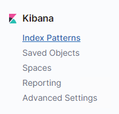
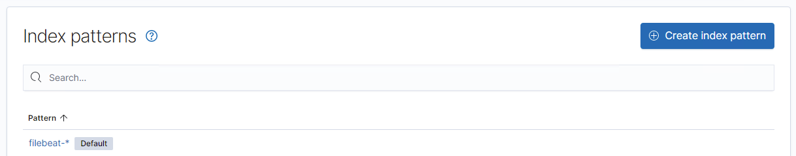
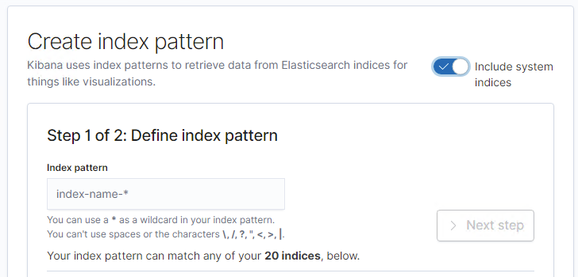
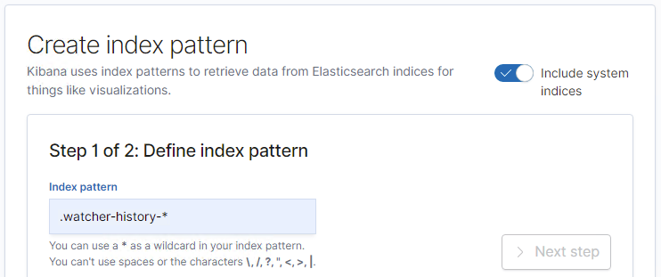
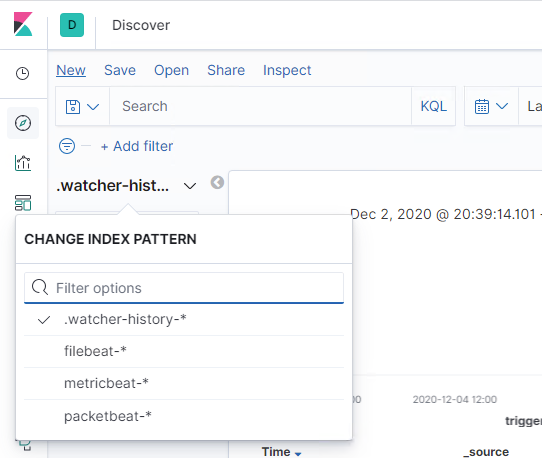
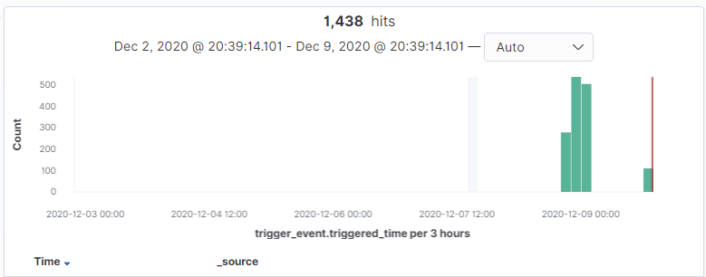

# Activity File: Alert and Attacking Target 1

## Overview

You are working as a Security Engineer for X-CORP, supporting the SOC infrastructure. The SOC analysts have noticed some discrepancies with alerting in the Kibana system and the manager has asked the Security Engineering team to investigate. 

To start, your team needs to confirm that newly created alerts are working. Once the alerts are verified to be working, you will monitor live traffic on the wire to detect any abnormalities that aren't reflected in the alerting system. 

You will then report back all your findings to both the SOC manager and the Engineering Manager with appropriate analysis.

You have two class days to complete this activity.

## Instructions

Start by configuring new alerts in Kibana. Once configured, you will test them by attacking a system.

Open the [Defensive Report Template](../../../Resources/DefensiveTemplate.md) and complete it as you progress through the activity.

### Configuring Alerts

Complete the following to configure alerts in Kibana:

1.  Access Kibana at `192.168.1.100:5601`

2. Click on **Management** > **License Management** and enable the Kibana Premium Free Trial.

3. Click **Management** > **Watcher** > **Create Alert** > **Create Threshold Alert**

4. Implement three of the alerts you designed at the end of Project 2.

You can configure any alerts you'd like, but you are recommended to start with the following:

- **Excessive HTTP Errors**
  - Select the **packetbeat** indice

  ```kql
  WHEN count() GROUPED OVER top 5 'http.response.status_code' IS ABOVE 400 FOR THE LAST 5 minutes
  ```
  
- **HTTP Request Size Monitor**
  - Select the **packetbeat** indice

  ```kql
  WHEN sum() of http.request.bytes OVER all documents IS ABOVE 3500 FOR THE LAST 1 minute
  ```

- **CPU Usage Monitor**
  - Select the **metricbeat** indice

  ```kql
  WHEN max() OF system.process.cpu.total.pct OVER all documents IS ABOVE 0.5 FOR THE LAST 5 minutes
  ```

#### Viewing Logs Messages  

There are a few way to to view these log messages and their associated data options. 

- First, you can see when alerts are firing directly from the Watcher screen.

- As you attack Target 1, keep the watcher page open to view your alerts fire in real time.

   

- To view network traffic associated with these messages, we need to create a new `Index Pattern`:

- Click on **Management > Index Patterns** and click on the button for `Create Index Pattern`.
   
   
   

- Make sure to turn on the toggle button labeled `Include System Indices` on the top right corner.

    

- Create the pattern `.watcher-history-*`.

   

- After you have this new index pattern, you can search through it using the `Discovery` page.
   

- Enter `result.condition.met` in as search filter to see all the traffic from your alerts.

   
   

### Attacking Target 1

Open the [Offensive Report Template](../../../Resources/OffensiveTemplate.md) and complete it while you progress this activity.

You will need to run a few commands on `Target 1` in order to ensure that it forwards logs to Kibana. Follow the steps below:

- Open the Hyper-V Manager.
- Connect to `Target 1`.
- Log in with username `vagrant` and password `vagrant`.
- Escalate to `root` with `sudo -s`.
- Run `/opt/setup`.

This enables Filebeat, Metricbeat, and Packetbeat on the Target VM if they are not running already.

Now that you've configured alerts, you'll attack the `Target 1` vulnerable VM on this network. 

**Note**: Ignore the `Target 2` machine at this time. If you complete the entire project with time to spare, ask your instructor for directions on attacking Target 2 and integrating it into your project.

Complete the following steps:

1. Scan the network to identify the IP addresses of Target 1.

2. Document all exposed ports and services.

3. Enumerate the WordPress site. One flag is discoverable after this step.
     - **Hint**: Look for the `Users` section in the output.

4. Use SSH to gain a user shell. Two flags can be discovered at this step.

     - **Hint**: Guess `michael`'s password. What's the most obvious possible guess?

5. Find the MySQL database password.
     - **Hint**: Look for a `wp-config.php` file in `/var/www/html`.

6. Use the credentials to log into MySQL and dump WordPress user password hashes.

7. Crack password hashes with `john`.
     - **Hint**: Start by creating a wp_hashes.txt with Steven and Michael's hashes, formatted as follows

      ```bash
      user1:$P$hashvalu3
      user2:$P$hashvalu3
      ```

8. Secure a user shell as the user whose password you cracked.

9. Escalate to `root`. One flag can be discovered after this step.
    - **Hint**:  Check sudo privileges. Is there a python command you can use to escalate to sudo?

Try to complete all of these steps. However, you may move on after capturing only _two_ of the four flags if you run out of time.

---

© 2021 Trilogy Education Services, a 2U, Inc. brand. All Rights Reserved.
